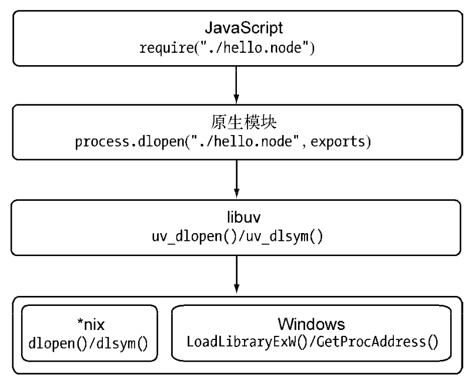
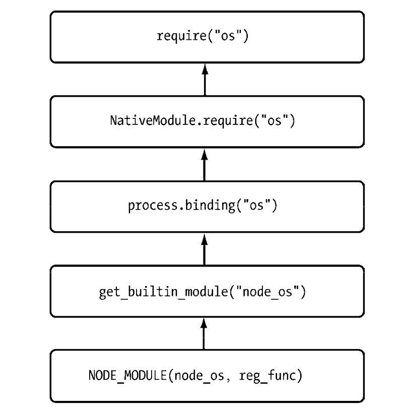

引入模块需要三步：

1. 路径分析
2. 文件定位
3. 编译执行

模块分为核心模块和文件模块

- 核心模块：Node 提供，与 Node 源代码一起编译进二进制文件，Node 进程启动时直接加载到内存中，require 时省略文件定位和编译执行，而且路径分析时会优先判断，所以加载速度最快
- 文件模块：用户编写的模块，运行时动态加载

模块引入时优先从缓存中引入，缓存中没有就用 fs 模块同步读取引入并加到缓存中

```js
// 每一个模块都是一个对象
function Module(id, parent) {
  this.id = id;
  this.exports = {};
  this.parent = parent;
  if (parent && parent.children) {
    parent.children.push(this);
  }
  this.filename = null;
  this.loaded = false;
  this.children = [];
}
```

## 用户模块

```js
// > console.log(module)
// Module {
//   id: '<repl>',
//   path: '.',
//   exports: {},
//   parent: undefined,
//   filename: null,
//   loaded: false,
//   children: [],
//   paths: [
//     ...
//     '/Users/ahabhgk/node_modules',
//     '/Users/node_modules',
//     '/node_modules',
//     ...
//   ]
// }

// > console.log(require)
// [Function: require] {
//   resolve: [Function: resolve] { paths: [Function: paths] },
//   main: undefined,
//   extensions: [Object: null prototype] {
//     '.js': [Function],
//     '.json': [Function],
//     '.node': [Function],
//     '.mjs': [Function]
//   },
//   cache: [Object: null prototype] {}
// }

// Native extension for .json
Module._extensions['.json'] = function(module, filename) {
  var content = NativeModule.require('fs').readFileSync(filename, 'utf8');
  try {
    module.exports = JSON.parse(stripBOM(content));
  } catch (err) {
    err.message = filename + ': ' + err.message; throw err;
  }
};

// Native extension for .js
Module._extensions['.js'] = function(module, filename) {
  var content = NativeModule.require('fs').readFileSync(filename, 'utf8');
  try {
    content = '(function (exports, require, module, __filename, __dirname) {' + content + '});'
    var fn = vm.runInThisContext(content) // 类似 eval，只是具有明确上下文，不会污染全局
    fn(exports, require, module, filename, dirname)
  } catch (err) {
    err.message = filename + ': ' + err.message; throw err;
  }
};

//Native extension for .node (C/C++ 扩展模块)
Module._extensions['.node'] = process.dlopen;
```

C/C++ 扩展模块通过 node-gyp 编译成 .node 文件，.node 在 *nix 平台就是 .so 文件，Windows 平台就是 .dll 文件，通过 libuv 实现跨平台



`process.dlopen('./hello.node', exports)` 把扩展模块返回结果放到 exports 空对象中

## 核心模块

由 C/C++ 编写的称为 buildin module 内建模块（比如 node_os、node_fs、node_buffer、node_crypto、node_http_parser、node_zlib），会放在 node_module_list 数组中，加载内建模块时会先建一个 exports 空对象，从 node_module_list 取出内建模块填充 exports

核心模块 .js 文件编译时会先把 js 代码转换为 C/C++ 代码，引入时通过 `process.binding()` 取出 `'(function (exports, require, module, __filename, __dirname) {' + content + '});'` 包裹后的代码并进行缓存

核心模块 .js 文件和内建模块的关系是全部或部分是依赖于内建模块，.js 文件通过 node_module_list 取出内建模块，用户 require 时通过 process.binding 取出


