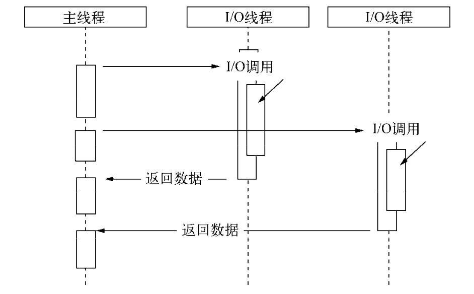
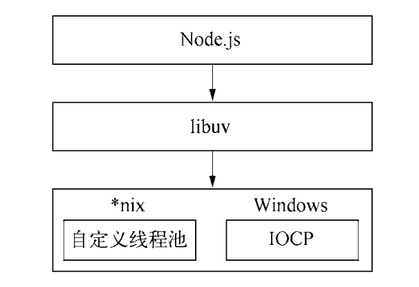

为什么要异步 I/O？

1. 用户体验
2. 资源分配
    - 单线程串行：阻塞，CPU 利用效率低
    - 多线程并行：创建线程和执行期线程上下文切换开销较大；锁、状态同步等问题
    - 异步 I/O：利用单线程远离锁、状态同步等问题；同时让单线程远离阻塞

阻塞/非阻塞与同步/异步（[怎样理解阻塞非阻塞与同步异步的区别？- 知乎](https://www.zhihu.com/question/19732473/answer/20851256)）

- 操作系统对于 I/O 只有两种方式：阻塞和非阻塞
  - 阻塞 I/O 调用之后要等系统内核完成所有操作后，调用才结束
  - 非阻塞 I/O 调用之后会立即返回
    - OS 将计算机所有输入输出设备抽象为文件，内核在 I/O 操作时通过文件描述符进行管理，文件描述符类似于应用程序与系统内核之间的凭证
    - 非阻塞 I/O 返回之后，CPU 可以用来处理其他事务
    - 完整 I/O 没有完成，业务层为了得到完整的数据，需要进行轮询（poll、epoll）
- 理想的非阻塞异步 I/O：在 I/O 完成后通过信号或回调将数据传递给应用程序
- 现实的异步 I/O：让部分线程进行阻塞 I/O 或非阻塞 I/O + 轮询来完成数据获取，让主线程进行数据处理，通过线程之间的通信传递 I/O 得到的数据，模拟异步 I/O

    

## Node 的异步 I/O



libuv 在 *uix 和 Windows 上都是通过线程池实现的异步 I/O，所以 Node 并不是单线程架构

```text
lib/fs.js          ( fs.open()    )
src/node_file.cc   ( Open         )
deps/uv/unix/fs.c  ( uv_fs_open() )
```

1. uv_fs_open 调用过程中会创建一个请求对象，把传入的 callback 放到这个请求对象上
2. 组装好请求对象后会放入 I/O 线程池中
3. 线程池中的 I/O 完毕后，把结果放到请求对象上，并通过 I/O 观察者（每次 Tick 会检查线程池中是否有执行完的请求）把请求对象放到任务队列中，将其当作事件处理

```text
   ┌───────────────────────────┐
┌─>│           timers          │  (setTimeout, setInterval)
│  └─────────────┬─────────────┘
│  ┌─────────────┴─────────────┐
│  │     pending callbacks     │  (I/O callbacks deferred to the next loop)
│  └─────────────┬─────────────┘
│  ┌─────────────┴─────────────┐
│  │       idle, prepare       │  (only use internally, process.nextTick)
│  └─────────────┬─────────────┘      ┌───────────────┐
│  ┌─────────────┴─────────────┐      │   incoming:   │
│  │           poll            │<─────┤  connections, │  (retrieve new I/O events; execute I/O related callbacks (almost all with the exception of close callbacks, the ones scheduled by timers, and setImmediate()); node will **block** here when appropriate)
│  └─────────────┬─────────────┘      │   data, etc.  │
│  ┌─────────────┴─────────────┐      └───────────────┘
│  │           check           │  (setImmediate)
│  └─────────────┬─────────────┘
│  ┌─────────────┴─────────────┐
└──┤      close callbacks      │  (some close callbacks)
   └───────────────────────────┘
```

**每个阶段都有一个 FIFO 队列**来执行回调

```c
// [uv_run 事件循环源码](https://github.com/nodejs/node/blob/master/deps/uv/src/unix/core.c#L365)
while (r != 0 && loop->stop_flag == 0) {
  uv__update_time(loop);
  uv__run_timers(loop);
  ran_pending = uv__run_pending(loop);
  uv__run_idle(loop);
  uv__run_prepare(loop);

  timeout = 0;
  if ((mode == UV_RUN_ONCE && !ran_pending) || mode == UV_RUN_DEFAULT)
    timeout = uv_backend_timeout(loop);

  uv__io_poll(loop, timeout);
  
  // ...

  uv__run_check(loop);
  uv__run_closing_handles(loop);
  
  // ...
}
```

uv\_\_io\_poll 之前会调用 uv\_backend\_timeout 回去 timeout，uv\_backend\_timeout 中检测 uv\_\_has\_active\_handles、uv\_\_has\_active\_reqs、idle\_handles、pending\_queue、closing\_handles 都没有就返回 0，否则 uv\_\_next\_timeout 获取 timeout

uv\_\_next\_timeout 中获取**距离此时此刻最先到期的一个 timer 的时间**

1. 没有 timer 就返回 -1，表示将在 poll 阶段无限制阻塞，以实现之后有异步 I/O 完成可以立即响应
2. 最近计时器时间节点小于等于事件循环开始时间，表明有过期的 timer，则返回 0 不进行阻塞，以尽快进入下一循环执行过期的 timer
3. 最近计时器时间节点大于事件循环开始时间，则计算这两个的差值，进行适当时间的阻塞（差值或 INT_MAX），以实现尽可能快的处理异步 I/O 事件

推荐阅读：

- [从 libuv 看 nodejs 事件循环](https://set.sh/post/200317-how-nodejs-event-loop-works)
- [The Node.js Event Loop, Timers, and process.nextTick()](https://nodejs.org/zh-cn/docs/guides/event-loop-timers-and-nexttick/)

## process.nextTick 和 setImmediate 区别

nextTick 的回调函数保存在数组上，setImmediate 的回调函数保存在链表上，nextTick 会在每轮循环将数组中所有的回调全部执行完，setImmediate 每轮循环只执行链表中的一个回调函数

nextTick 在 idle 阶段，setImmediate 在 check 阶段，优先级 idle > poll > check

实际上这两个名字换一下更合适，但这是过去遗留问题不能随意改变

## 浏览器上的事件循环

- [深入解析你不知道的 EventLoop 和浏览器渲染、帧动画、空闲回调（动图演示）](https://juejin.im/post/6844904165462769678)
- [WHATWG spec](https://html.spec.whatwg.org/multipage/webappapis.html#event-loops)
