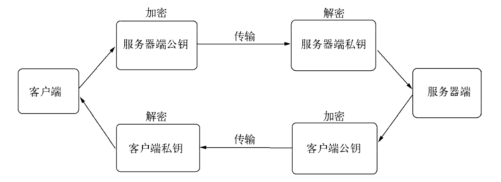

## WebSocket

客户端建立连接，发送

```http
GET /chat HTTP/1.1
Host: server.example.com
Upgrade: websocket
Connection: Upgrade
Sec-WebSocket-Key: dGhlIHNhbXBsZSBub25jZQ==
Sec-WebSocket-Protocol: chat, superchat
Sec-WebSocket-Version: 13
```

服务端收到后取 Sec-WebSocket-Key 的值与 258EAFA5-E914-47DA-95CA-C5AB0DC85B11 相连得到 res，经过 `Base64(sha1(res))` 后返回客户端

```http
HTTP/1.1 101 Switching Protocols
Upgrade: websocket
Connection: Upgrade
Sec-WebSocket-Accept: s3pPLMBiTxaQ9kYGzzhZRbK+xOo=
Sec-WebSocket-Protocol: chat
```

http server 通过监听 upgrade 事件进行协议升级

## 网络服务与安全

node 在网络安全的模块有 crypto、tls、https，crypto 用于加密解密，tls 提供了与 net 类似功能，区别是建立在 TLS/SSL 加密的 TCP 连接上，https 接口完全与 http 一致，区别在建立在安全的连接之上

### TLS/SSL



为了防止中间人，引入数字证书来进行认证，数字证书中包含了服务器名称和主机名、服务器公钥、签名颁发机构名称、来自签名颁发机构的签名，在连接建立前，会通过证书中的签名确认收到的公钥是来自目标服务器的，从而产生信任关系

CA 来颁发证书，证书中有 CA 通过自己公钥和私钥实现的签名。小厂一般使用自签名证书（自己当 CA 给自己签）

服务端需要向 CA 申请签名证书，客户端在发起安全连接之前会去获取服务端的证书，并通过 CA 的证书验证服务端证书的真伪

知名 CA 机构的证书一般预装在浏览器中，自签名证书需要客户端安装

服务端证书 -> 子 CA 证书验证 -> 父 CA 证书验证 -> 根 CA 证书验证

### TLS server

```js
// server
var tls = require('tls');
var fs = require('fs');

var options = {
  key: fs.readFileSync('./keys/server.key'), // 私钥
  cert: fs.readFileSync('./keys/server.crt'), // 证书
  requestCert: true,
  ca: [fs.readFileSync('./keys/ca.crt')], // CA 证书
};

var server = tls.createServer(options, function (stream) {
  console.log('server connected', stream.authorized ? 'authorized' : 'unauthorized');
  stream.write("welcome!\n");
  stream.setEncoding('utf8');
  stream.pipe(stream);
});
server.listen(8000)
```

```js
// client
var tls = require('tls');
var fs = require('fs');

var options = {
  key: fs.readFileSync('./keys/client.key'), // 私钥
  cert: fs.readFileSync('./keys/client.crt'), // 证书
  ca: [fs.readFileSync('./keys/ca.crt')], // CA 证书
};

var stream = tls.connect(8000, options, function () {
  console.log('client connected', stream.authorized ? 'authorized' : 'unauthorized');
  process.stdin.pipe(stream);
});
stream.setEncoding('utf8');
stream.on('data', function(data) {
  console.log(data);
});
stream.on('end', function() {
  server.close();
});
```

### https

```js
// server
var https = require('https');
var fs = require('fs');

var options = {
  key: fs.readFileSync('./keys/server.key'),
  cert: fs.readFileSync('./keys/server.crt'),
};

https.createServer(options, function (req, res) {
  res.writeHead(200);
  res.end("hello world\n");
}).listen(8000);
```

```js
// request
var https = require('https');
var fs = require('fs');

var options = {
  hostname: 'localhost',
  port: 8000,
  path: '/',
  method: 'GET',
  key: fs.readFileSync('./keys/client.key'),
  cert: fs.readFileSync('./keys/client.crt'),
  ca: [fs.readFileSync('./keys/ca.crt')]
};
options.agent = new https.Agent(options);

var req = https.request(options, function(res) {
  res.setEncoding('utf-8');
  res.on('data', function(d) {
    console.log(d);
  });
});

req.end();
req.on('error', function(e) {
  console.log(e);
});
```
