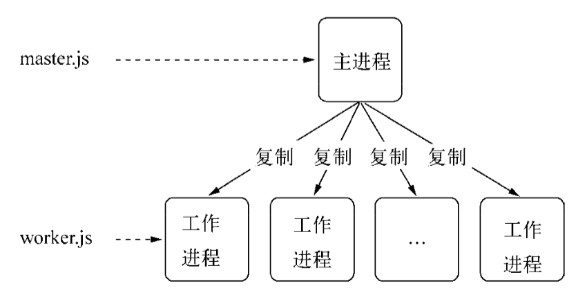
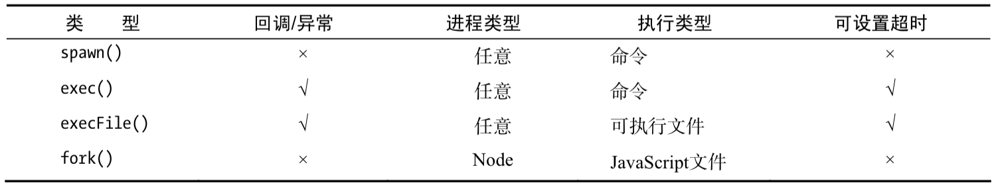
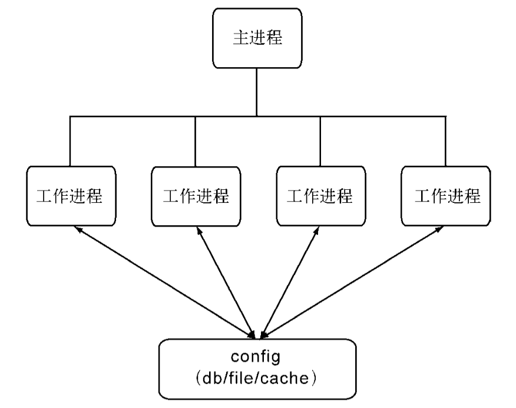

1. 同步
2. 复制进程：占用资源大，不能共享状态
3. 多线程：上下文切换
4. 事件驱动

## 多进程

```js:title=worker.js
var http = require('http');

http.createServer(function (req, res) {
  res.writeHead(200, {'Content-Type': 'text/plain'});
  res.end('Hello World\n');
}).listen(Math.round((1 + Math.random()) * 1000), '127.0.0.1');
```

```js:title=master.js
var fork = require('child_process').fork;
var cpus = require('os').cpus();

for (var i = 0; i < cpus.length; i++) {
  fork('./worker.js');
}
```

`ps aux | grep worker.js` 查看进程数量



主从模式，主进程负责调度管理工作进程，工作进程负责业务

### 创建子进程



可执行文件是 js 时，首行必须有 `#!/usr/bin/env node`

### 进程间通信

创建子进程时，父子进程间会创建 IPC 通道，父子进程间通过 IPC 通道和 message 事件、send 方法通信

IPC（Inter-Process Communication）由 libuv 提供，libuv 根据平台进行封装

父进程会先创建 IPC 通道并监听它，然后创建子进程，并通过环境变量（NODE_CHANNEL_FD）告诉子进程这个 IPC 通道的文件描述符，子进程启动时，通过这个文件描述符连接 IPC 通道，从而实现进程通信

### 句柄传递

通过代理可以避免重复监听造成的冲突问题，还可以做负载均衡，但是每次会用到两个文件描述符，操作系统的文件描述符有限

为了解决上述问题，Node 引入进程间发送句柄的功能，句柄是一种可以用来标记资源的引用

```js:title=master.js
var child = require('child_process').fork('child.js');

// Open up the server object and send the handle
var server = require('net').createServer();

server.on('connection', function (socket) {
  socket.end('handled by parent\n');
});
server.listen(1337, function () {
  child.send('server', server); // 第二个参数，发送句柄
});
```

```js
process.on('message', function (m, server) {
  if (m === 'server') {
    server.on('connection', function (socket) {
      socket.end('handled by child\n');
    });
  }
});
```

子进程可以发送的句柄有 net.Socket、net.Server、net.Native、dgram.Socket、dgram.Native

send 会把 `message = { cmd: 'NODE_HANDLE', type: 'net.Server', msg: message }` 和句柄文件描述符经过 JSON.stringfy 发送到 IPC 中，接收后经过 parse 根据 message.type 和文件描述符一起还原出对应的对象


以发送的 TCP 服务器句柄为例，子进程收到消息后的还原过程代码如下：

```js
function(message,handle,emit){
  var self = this;

  var server = new net.Server();
  server.listen(handler,function(){
    emit(server);
  });
}
```

Node 进程间只有消息通信，不会真正的传递对象

> 进程间通信是利用内核管理一块内存，不同进程可以读写这块内容，进而可以互相通信

## 集群

### 进程事件

error, exit, close, disconnect

```js
// 子进程
child.kill([signal]);
// 当前进程
process.kill(pid, [signal]);
```

signal 是 POSIX 标准中的，有不同含义，进程收到后应作出约定的行为

```js
process.on('SIGTERM', function() {
  console.log('Got a SIGTERM, exiting...');
  process.exit(1);
});

console.log('server running with PID: ', process.pid)
process.kill(process.pid, 'SIGTERM')
```

### 自动重启

```js:title=master.js
var fork = require('child_process').fork;
var cpus = require('os').cpus();
var server = require('net').createServer();

server.listen(1337);

// 重启次数
var limit = 10;
// 时间单位
var during = 60000;
var restart = [];
var isTooFrequently = function () {
  // 记录重启时间
  var time = Date.now();
  var length = restart.push(time);
  if (length > limit) {
    restart = restart.slice(limit * -1);
  }
  return restart.length >= limit && restart[restart.length - 1] - restart[0] < during;
};

var workers = {};
var createWorker = function () {
  if (isTooFrequently()) {
    // 触发 giveup 事件后，不再重启
    process.emit('giveup', length, during);
    return;
  }
  var worker = fork(__dirname + '/worker.js');
  // 启动新的进程
  worker.on('message', function (message) {
    if (message.act === 'suicide') { // uncaughtException 时自杀重启
      createWorker();
    }
  });
  worker.on('exit', function () {
    console.log('Worker ' + worker.pid + ' exited.');
    delete workers[worker.pid];
  });
  // 句柄转发
  worker.send('server', server);
  workers[worker.pid] = worker;
  console.log('Create worker. pid: ' + worker.pid);
};

for (var i = 0; i < cpus.length; i++) {
  createWorker();
}

// 进程自己退出时让所有工作进程退出
process.on('exit', function () {
  for (var pid in workers) {
    workers[pid].kill();
  }
});
```

```js
// worker.js
var http = require('http');
var server = http.createServer(function (req, res) {
  res.writeHead(200, {'Content-Type': 'text/plain'});
  res.end('handled by child, pid is ' + process.pid + '\n');
});

var worker;
process.on('message', function (m, tcp) {
  if (m === 'server') {
    worker = tcp;
    worker.on('connection', function (socket) {
      server.emit('connection', socket);
    });
  }
});
process.on('uncaughtException', function (e) {
  // 记录日志
  logger.error(e)
  // 自杀
  process.send({act: 'suicide'});
  // 停止接收所有新的连接
  worker.close(function () {
    // 所有已有连接断开后，退出进程
    process.exit(1);
  });
  // 连接可能是长连接，等待断开可能需要较长时间，设置一个超时时间
  setTimeout(() => process.exit(1), 5000)
});
```

### 负载均衡

Round-Robin：每次选择第 i = (i + 1) % n 个进程

### 状态共享

进程间不能共享数据

1. 第三方数据存储：redis

    

    不能即时同步状态，需要轮询

2. 主动通知

    

    在 redis 和工作进程之间加一个 pub/sub

### cluster

cluster 是 child_process 和 net 的组合应用，cluster 启动时，会在内部启动 TCP 服务器，在 cluster.fork 子进程时，将这个 TCP 服务器端 socket 的文件描述符发送给工作线程，如果进程是 fork 出来的，进程的环境变量里就有 NODE_UNIQUE_ID，如果工作进程中有 listen 监听端口调用，进程就能拿到文件描述符，通过 SO_REUSEADDR 端口重用，从而实现多个子进程共享端口，对于普通方式启动的进程，则不存在文件描述符共享传递的等事情
