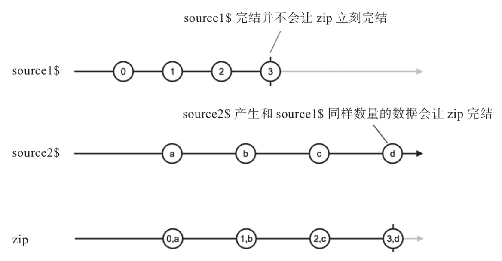
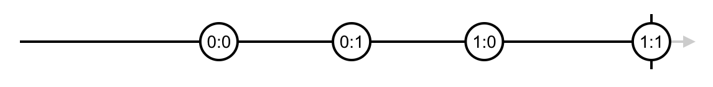

## 合并类操作符

### concat 首尾相连

concat 先从第一个 Observable 对象获取数据，第一个 Observable 就是调用 concat 的那个对象（类似 `[1, 2].concat([3, 4])`），第一个 complete 之后 concat 会订阅第二个 Observable 以此类推，直至最后一个 Observable complete，concat 的 Observable 才完结

因此前一个 Observable 不 complete，后一个 Observable 就不会开始

```ts
const oba1$ = of(1, 2, 3)
const oba2$ = of(4, 5, 6)
of().pipe(concat(oba1$, oba2$)).subscribe(console.log)
```

### merge 先到先得快速通过

merge 会同时订阅所有的上游对象，一般用于异步数据流

```ts
const source1$ = timer(0, 1000).pipe(map((n) => `A${n}`))
const source2$ = timer(500, 1000).pipe(map((n) => `B${n}`))
merge(source1$, source2$).subscribe(console.log)
// A0
// B0
// A1
// B1
// ...
```

merge 同时订阅是相对于异步来说，实际上仍然是依次订阅，由于订阅 `of(1, 2, 3)` 后还没有来得及订阅后一个，就已经吐出数据，所以输出与 concat 一样

```ts
merge(of(1, 2, 3), of(4, 5, 6)).subscribe(console.log) // 1 2 3 4 5 6
```

有一个 concurrent: number 可选参数用来限流

```ts
const source1$ = time(0, 1000)
const source2$ = time(500, 1000)
const source3$ = time(1000, 1000)
merge(source1$, source2$, source3$, 2).subscribe(console.log)
```

这样 source3$ 就不会进行订阅，除非 source1$ 或 source2$ complete

例子：因为在移动设备上 touchend 事件出现得比 click 更早，这两个事件的处理是一模一样的但是 fromEvent 不能同时获得两个事件的数据流，这时候就要借助 merge 的力量

```ts
const click$ = fromEvent(element, 'click')
const touchend$ = fromEvent(element, 'touchend')
merge(click$, touchend$).subscribe(eventHandler)
```

### zip 拉链式组合

就像拉链一样组合

```ts
const age$ = of<number>(27, 25, 29)
const name$ = of<string>('Foo', 'Bar', 'Beer')
const isDev$ = of<boolean>(true, true, false)

zip(age$, name$, isDev$).subscribe(console.log)
// [27, 'Foo', true]
// [25, 'Bar', true]
// [29, 'Beer', false]
```

对于步调不一致时或数量不一致时，会把提前的自动延后，多的删减成少的

```ts
const source1$ = interval(3000)
const source2$ = timer(3000, 1000)
zip(source1$, source2$).subscribe(console.log)
```



数据积压问题：如果一个吐出速度过慢，zip 会保存吐出速度过快的数据，等待另一个吐出数据，这时如果保存数据量过大，就会占用大量内存，zip 自身解决不了，会有其他方式解决

### combineLatest 合并最后一个数据

> Whenever any input Observable emits a value, it computes a formula using the latest values from all the inputs, then emits the output of that formula.


```ts
import { combineLatest, timer } from 'rxjs';

const firstTimer = timer(0, 1000); // emit 0, 1, 2... after every second, starting from now
const secondTimer = timer(500, 1000); // emit 0, 1, 2... after every second, starting 0,5s from now
const combinedTimers = combineLatest(firstTimer, secondTimer);
combinedTimers.subscribe(value => console.log(value));
// Logs
// [0, 0] after 0.5s
// [1, 0] after 1s
// [1, 1] after 1.5s
// [2, 1] after 2s
```

对于同步的，类似于 merge

```ts
const source1$ = of('a', 'b', 'c')
const source2$ = of(1, 2, 3)
const source3$ = of('x', 'y')
source1$.combineLatest(source2$, source3$)
  .subscribe(console.log, null, () => console.log('complete')
// ['c', 3, 'x']
// ['c', 3, 'y']
// 'complete'
```

最后一个参数可以是一个 resultSelector 函数，相当于 `.pipe(map(/* codes */))`

对于多重依赖的 source，就像 cpp 中的多重继承一样，会出现一些反常识的问题

```ts
const original$ = timer(0, 1000)
const source1$ = original$.pipe(map(x => `${x}a`))
const source2$ = original$.pipe(map(x => `${x}b`))
combineLatest(source1$, source2$).subscribe(
  console.log,
  null,
  () => console.log('complete')
)
// ['0a', '0b']
// ['1a', '0b']
// ['1a', '1b']
// ['2a', '1b']
// ['2a', '2b']

// 对于完全正统的 FRP 的定义，应该是这样
// ['0a', '0b']
// ['1a', '1b']
// ['2a', '2b']
```


如果想要纯正的输出，可以使用 withLatestFrom

### withLatestFrom

> Whenever the source Observable emits a value, it computes a formula using that value plus the latest values from other input Observables, then emits the output of that formula.

```ts
const source1$ = timer(0, 2000).pipe(map(x => 100 * x))
const source2$ = timer(500, 1000)
source1$.pipe(
  withLatestFrom(source2$, (a, b) => a + b),
).subscribe(
  console.log,
  null,
  () => console.log('complete'),
)
// 101
// 203
// 305
// ...
```


```ts
const original$ = timer(0, 1000)
const source1$ = original$.pipe(map(x => `${x}a`))
const source2$ = original$.pipe(map(x => `${x}b`))
source1$.pipe(
  withLatestFrom(source2$),
).subscribe(
  console.log,
  null,
  () => console.log('complete'),
)
// ['0a', '0b']
// ['1a', '1b']
// ['2a', '2b']
// ['3a', '3b']
```

所以如果要合并完全独立的 Observable 对象，使用 combineLatest，如何要把一个Observable对象“映射”成新的数据流，同时要从其他 Observable 对象获取“最新数据”，就是用 withLatestFrom

### race 胜者通吃

```ts
race(
  from(sleep(500).then(() => 1)),
  from(sleep(1000).then(() => 2)),
).subscribe(
  console.log,
  null,
  () => console.log('on complete'),
)
// 1
// 'on complete'
```

### startWith

```ts
of("from source")
  .pipe(startWith("first", "second"))
  .subscribe(x => console.log(x))
// 'first'
// 'second'
// 'from source'
```

startWith 的所有参数都是同步吐出的，如果需要异步吐出参数，那还是只能利用 concat

### forkJoin

```ts
const observable = forkJoin({
  foo: of(1, 2, 3, 4),
  bar: Promise.resolve(8),
  baz: timer(4000),
})
observable.subscribe({
 next: value => console.log(value),
 complete: () => console.log('This is how it ends!'),
})

// Logs:
// { foo: 4, bar: 8, baz: 0 } after 4 seconds
// "This is how it ends!" immediately after
```

```ts
const observable = forkJoin([
  of(1, 2, 3, 4),
  Promise.resolve(8),
  timer(4000),
])
observable.subscribe({
 next: value => console.log(value),
 complete: () => console.log('This is how it ends!'),
})

// Logs:
// [4, 8, 0] after 4 seconds
// "This is how it ends!" immediately after
```

## 高阶 Observable

`HO$::$ -> $`

```ts
interval(1000).pipe(
  take(2),
  map(x => interval(2000).pipe(
    take(2),
    map(y => `${x}:${y}`),
  )),
)
```

每产生一个数据，就对应产成一个 $


### HO$ 的意义

用 Observable 来管理多个 Observable

数据流管理的是数据，但数据流本身也可以看作一种数据，使 Observable 对象通过 Observable 对象来管理

> 过程对数据进行抽象，同时过程也是数据，通过高阶过程对过程进行抽象

### 操作高阶 Observable 的合并类操作符

* concatAll

  > Flattens an Observable-of-Observables by putting one inner Observable after the other.

  ```ts
  interval(1000).pipe(
    take(2),
    map(x => interval(2000).pipe(
      take(2),
      map(y => `${x}:${y}`),
    )),
  ).pipe(concatAll())
  ```

  

  当第一个 Observable 对象完结的时候，才会去订阅第二个内部 Observable 对象。虽然高阶 Observable 对象已经产生了第二个 Observable 对象，不代表 concatAll 会立刻去订阅它

* mergeAll

  > Flattens an Observable-of-Observables.

  ```ts
  interval(1000).pipe(
    take(2),
    map(x => interval(2000).pipe(
      take(2),
      map(y => `${x}:${y}`),
    )),
  ).pipe(mergeAll())
  ```

  

* zipAll

  ```ts
  interval(1000).pipe(
    take(2),
    map(x => interval(2000).pipe(
      take(2),
      map(y => `${x}:${y}`),
    )),
  ).pipe(zipAll())
  ```

  

  ```ts
  const ho$ = interval(1000).pipe(
    take(2),
    concat(Observable.never()),
    map(x => interval(1500).pipe(
      map(y => x+':'+y),
      take(2),
    )),
  )
  const concated$ = ho$.pipe(zipAll())
  ```

  现在，zipAll 的上游是一个永不完结的 Observable，当它拿到 2 个内部 Observable 的时候，无法确定是不是还有新的内部 Observable 产生，而根 据“拉链”的工作方式，来自不同数据源的数据要一对一配对，这样一来，zipAll就只能等待，等待上游高阶 Observable 完结，这样才能确定内部 Observable对象的数量。如果上游的高阶 Observable 不完结，那么 zipAll 就不会开始工作

* combineAll（combineLatestAll 有点啰嗦）

  ```ts
  interval(1000).pipe(
    take(2),
    map(x => interval(2000).pipe(
      take(2),
      map(y => `${x}:${y}`),
    )),
  ).pipe(combineAll())
  ```

  

  combineAll 和 zipAll 一样，必须上游高阶 Observable 完结之后才能开始给下游产生数据，因为只有确定了作为输入的内部 Observable 对象的个数，才能拼凑出第一个传给下游的数据

没有 withLatestFromAll 是因为以上 All 后缀的操作符中所有 Observable 地位都是平等的，而 withLatestFrom 会有一个 Observable 来控制节奏，其他的只是提供数据，并不是平等的

### 进化的高阶 Observable 处理

* switchAll

  总是切换到最新的内部 Observable 对象获取数据。每当 switch 的上游高阶 Observable 产生一个内部 Observable 对象，switch 都会立刻订阅最新的内部 Observable 对象上，如果已经订阅了之前的内部 Observable 对象，就会退订那个过时的内部 Observable 对象

  ```ts
  interval(1000).pipe(
    take(3),
    map(x => interval(700).pipe(
      take(2),
      map(y => `${x}:${y}`),
    )),
  ).pipe(switchAll())
  ```

  

* exhaust

  在耗尽当前内部 Observable 的数据之前不会切换到下一个内部 Observable 对象

  ```ts
  interval(1000).pipe(
    take(3),
    map(x => interval(700).pipe(
      take(2),
      map(y => `${x}:${y}`),
    )),
  ).pipe(exhaust())
  ```

  

上游高阶 Observable 完结并且当前内部 Observable 也完结，switchAll、exhaust 产生的 Observable 对象才会完结
  
如果上游高阶 Observable 对象没有完结，意味着可能会有新的内部 Observable 产生；如果内部 Observable 没有完结，毫无疑问应该继续产生数据

产生的数据依然是 Observable 对象的 Observable，称为高阶 Observable，RxJS 提供了合并高阶 Observable 对象中数据的操作符，实际上只是把多个 Observable 对象参数改成了一个高阶 Observable 对象
