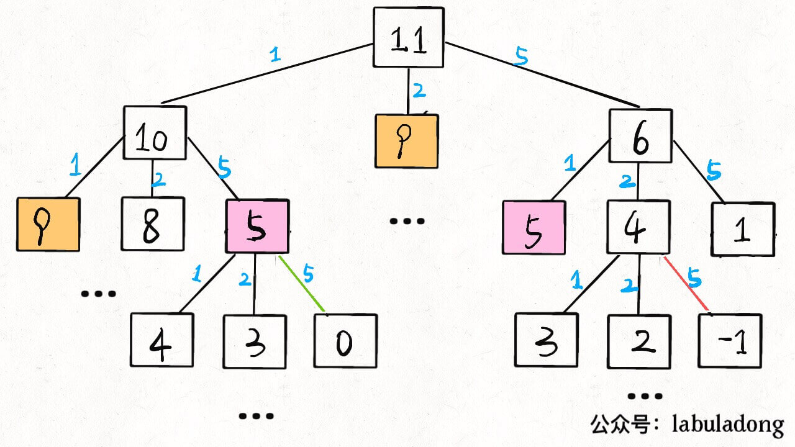
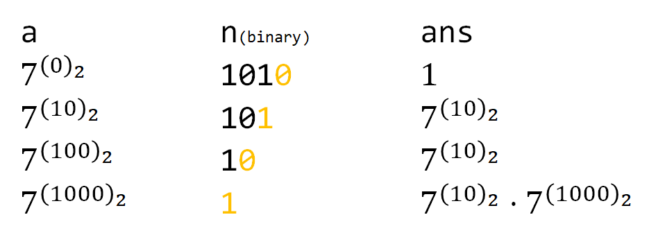

## 记录

| 2020-07-14 | 2020-07-17 | 2020-07-19 | 2020-07-23 |
|--|:--:|:--:|:--:|:--:|
| [283. 移动零](https://leetcode-cn.com/problems/move-zeroes/) | ✅ | ✅ | ✅ |
| [11. 盛最多水的容器](https://leetcode-cn.com/problems/container-with-most-water/) | ✅ | ✅ | ✅ |
| [1. 两数之和](https://leetcode-cn.com/problems/two-sum/) | ✅ | ✅ | ✅ |
| [15. 三数之和](https://leetcode-cn.com/problems/3sum/) | ✅ | ✅ | ✅ |

> 16 号 ✌️ 跟 LJ 去修电脑，吃了小吃街嘻嘻

| 2020-07-15 | 2020-07-17 | 2020-07-20 | 2020-07-27 |
|--|:--:|:--:|:--:|:--:|
| [206. 反转链表](https://leetcode-cn.com/problems/reverse-linked-list/) | ✅ | ✅ | ✅ |
| [92. 反转链表 II](https://leetcode-cn.com/problems/reverse-linked-list-ii/) | ✅ | ✅ | ✅ |
| [24. 两两交换链表中的节点](https://leetcode-cn.com/problems/swap-nodes-in-pairs/) | ✅ | ✅ | ✅ |
| [141. 环形链表](https://leetcode-cn.com/problems/linked-list-cycle/) | ✅ | ✅ | ✅ |

| 2020-07-17 | 2020-07-19 | 2020-07-22 | 2020-07-26 |
|--|:--:|:--:|:--:|:--:|
| [142. 环形链表 II](https://leetcode-cn.com/problems/linked-list-cycle-ii/) | ✅ | ✅ | |
| [25. K 个一组翻转链表](https://leetcode-cn.com/problems/reverse-nodes-in-k-group/) | ✅ | ✅ | |
| [20. 有效的括号](https://leetcode-cn.com/problems/valid-parentheses/) | ✅ | ✅ | |
| [155. 最小栈](https://leetcode-cn.com/problems/min-stack/) | ✅ | ✅ | |

| 2020-07-18 | 2020-07-20 | 2020-07-23 | 2020-07-27 |
|--|:--:|:--:|:--:|:--:|
| [622. 设计循环队列](https://leetcode-cn.com/problems/design-circular-queue/) | ✅ | ✅ | |
| [641. 设计循环双端队列](https://leetcode-cn.com/problems/design-circular-deque/) | ✅ | ✅ | |
| [84. 柱状图中最大的矩形](https://leetcode-cn.com/problems/largest-rectangle-in-histogram/) | ✅ | ✅ | ✅ |
| [239. 滑动窗口最大值](https://leetcode-cn.com/problems/sliding-window-maximum/) | ✅ | ✅ | ✅ |

| 2020-07-19 | 2020-07-21 | 2020-07-24 | 2020-08-09 |
|--|:--:|:--:|:--:|:--:|
| [242. 有效的字母异位词](https://leetcode-cn.com/problems/valid-anagram/) | ✅ | ✅ | |
| [49. 字母异位词分组](https://leetcode-cn.com/problems/group-anagrams/) | ✅ | ✅ | |
| [94. 二叉树的中序遍历](https://leetcode-cn.com/problems/binary-tree-inorder-traversal/) | ✅ | ✅ | ✅ |
| [144. 二叉树的前序遍历](https://leetcode-cn.com/problems/binary-tree-preorder-traversal/) | ✅ | ✅ | ✅ |

| 2020-07-20 | 2020-07-22 | 2020-07-25 | 2020-08-09 |
|--|:--:|:--:|:--:|:--:|
| [590. N 叉树的后序遍历](https://leetcode-cn.com/problems/n-ary-tree-postorder-traversal/) | ✅ | ✅ | |
| [589. N 叉树的前序遍历](https://leetcode-cn.com/problems/n-ary-tree-preorder-traversal/) | ✅ | ✅ | |
| [429. N 叉树的层序遍历](https://leetcode-cn.com/problems/n-ary-tree-level-order-traversal/) | ✅ | ✅ | ✅ |
| [22. 括号生成](https://leetcode-cn.com/problems/generate-parentheses/) | ✅ | ✅ | ✅ |

| 2020-07-21 | 2020-07-23 | 2020-07-26 | 2020-07-30 |
|--|:--:|:--:|:--:|:--:|
| [226. 翻转二叉树](https://leetcode-cn.com/problems/invert-binary-tree/) | ✅ | ✅ | |
| [98. 验证二叉搜索树](https://leetcode-cn.com/problems/validate-binary-search-tree/) | ✅ | ✅ | |
| [104. 二叉树的最大深度](https://leetcode-cn.com/problems/maximum-depth-of-binary-tree/) | ✅ | ✅ | |
| [111. 二叉树的最小深度](https://leetcode-cn.com/problems/minimum-depth-of-binary-tree/) | ✅ | ✅ | ✅ |

> 22 号 ✌️ 去拿电脑了，生产力回来了，LJ 去超市跟零食告别 👋
>
> 开始写项目了，后面随缘刷题了，等写好项目再好好刷

| 2020-07-28 | 2020-08-09 | 2020-10-14 | 2020- | 2020- |
|--|:--:|:--:|:--:|:--:|
| [297. 二叉树的序列化与反序列化](https://leetcode-cn.com/problems/serialize-and-deserialize-binary-tree/) | ✅ | ✅ | | |
| [235. 二叉搜索树的最近公共祖先](https://leetcode-cn.com/problems/lowest-common-ancestor-of-a-binary-search-tree/) | ✅ | ✅ | | |
| [236. 二叉树的最近公共祖先](https://leetcode-cn.com/problems/lowest-common-ancestor-of-a-binary-tree/) | ✅ | ✅ | | |

| 2020-07-29 | 2020-08-09 | 2020- | 2020- | 2020- |
|--|:--:|:--:|:--:|:--:|
| [105. 从前序与中序遍历序列构造二叉树](https://leetcode-cn.com/problems/construct-binary-tree-from-preorder-and-inorder-traversal/) | ✅ | | | |
| [77. 组合](https://leetcode-cn.com/problems/combinations/) | ✅ | ✅ | | |
| [46. 全排列](https://leetcode-cn.com/problems/permutations/) | ✅ | ✅ | | |
| [47. 全排列 II](https://leetcode-cn.com/problems/permutations-ii/) | ✅ |✅ | | |

| 2020-08-19 | 2020-10-15 | 2020- | 2020- | 2020- |
|--|:--:|:--:|:--:|:--:|
| [78. 子集](https://leetcode-cn.com/problems/subsets/) | ✅ | | | |
| [50. Pow(x, n)](https://leetcode-cn.com/problems/powx-n/) | ✅ | | | |

| 2020-08-20 | 2020-10-16 | 2020- | 2020- | 2020- |
|--|:--:|:--:|:--:|:--:|
| [169. 多数元素](https://leetcode-cn.com/problems/majority-element/) | ✅ | | | |
| [51. N 皇后](https://leetcode-cn.com/problems/n-queens/) | ✅ | | | |
| [17. 电话号码的字母组合](https://leetcode-cn.com/problems/letter-combinations-of-a-phone-number/) | ✅ | | | |

| 2020-08-21 | 2020- | 2020- | 2020- | 2020- |
|--|:--:|:--:|:--:|:--:|
| [102. 二叉树的层序遍历](https://leetcode-cn.com/problems/binary-tree-level-order-traversal/) | ✅ | | | |
| [515. 在每个树行中找最大值](https://leetcode-cn.com/problems/find-largest-value-in-each-tree-row/) | ✅ | | | |

> Vue3 源码看完了，继续刷题，准备面试

| 2020-10-11 | 2020- | 2020- | 2020- | 2020- |
|--|:--:|:--:|:--:|:--:|
| [752. 打开转盘锁](https://leetcode-cn.com/problems/open-the-lock/) | ✅ | | | |
| [433. 最小基因变化](https://leetcode-cn.com/problems/minimum-genetic-mutation/) | ✅ | | | |
| [127. 单词接龙](https://leetcode-cn.com/problems/word-ladder/) | ✅ | | | |

| 2020-10-12 | 2020- | 2020- | 2020- | 2020- |
|--|:--:|:--:|:--:|:--:|
| [200. 岛屿数量](https://leetcode-cn.com/problems/number-of-islands/) | ✅ | | | |
| [529. 扫雷游戏](https://leetcode-cn.com/problems/minesweeper/) | | | | |

| 2020-10-13 | 2020- | 2020- | 2020- | 2020- |
|--|:--:|:--:|:--:|:--:|
| [455. 分发饼干](https://leetcode-cn.com/problems/assign-cookies/) | ✅ | | | |
| [860. 柠檬水找零](https://leetcode-cn.com/problems/lemonade-change/) | | | | |

| 2020-10-15 | 2020- | 2020- | 2020- | 2020- |
|--|:--:|:--:|:--:|:--:|
| [121. 买卖股票的最佳时机](https://leetcode-cn.com/problems/best-time-to-buy-and-sell-stock/) | ✅ | | | |
| [122. 买卖股票的最佳时机 II](https://leetcode-cn.com/problems/best-time-to-buy-and-sell-stock-ii/) | ✅ | | | |

| 2020-10-16 | 2020- | 2020- | 2020- | 2020- |
|--|:--:|:--:|:--:|:--:|
| [55. 跳跃游戏](https://leetcode-cn.com/problems/jump-game/) | | | | |
| [45. 跳跃游戏 II](https://leetcode-cn.com/problems/jump-game-ii/) | | | | |

| 2020-10-17 | 2020- | 2020- | 2020- | 2020- |
|--|:--:|:--:|:--:|:--:|
| [69. x 的平方根](https://leetcode-cn.com/problems/sqrtx/) | | | | |
| [367. 有效的完全平方数](https://leetcode-cn.com/problems/valid-perfect-square/) | | | | |

| 2020-10-20 | 2020- | 2020- | 2020- | 2020- |
|--|:--:|:--:|:--:|:--:|
| [33. 搜索旋转排序数组](https://leetcode-cn.com/problems/search-in-rotated-sorted-array/) | | | | |
| [34. 在排序数组中查找元素的第一个和最后一个位置](https://leetcode-cn.com/problems/find-first-and-last-position-of-element-in-sorted-array/) | | | | |
| [74. 搜索二维矩阵](https://leetcode-cn.com/problems/search-a-2d-matrix/) | | | | |

| 2020-10-22 | 2020- | 2020- | 2020- | 2020- |
|--|:--:|:--:|:--:|:--:|
| [62. 不同路径](https://leetcode-cn.com/problems/unique-paths/) | | | | |
| [63. 不同路径 II](https://leetcode-cn.com/problems/unique-paths-ii/) | | | | |
| [1143. 最长公共子序列](https://leetcode-cn.com/problems/longest-common-subsequence/) | | | | |

| 2020-10-23 | 2020- | 2020- | 2020- | 2020- |
|--|:--:|:--:|:--:|:--:|
| [120. 三角形最小路径和](https://leetcode-cn.com/problems/triangle/) | | | | |
| [53. 最大子序和](https://leetcode-cn.com/problems/maximum-subarray/) | | | | |
| [152. 乘积最大子数组](https://leetcode-cn.com/problems/maximum-product-subarray/) | | | | |

| 2020-10-24 | 2020- | 2020- | 2020- | 2020- |
|--|:--:|:--:|:--:|:--:|
| [198. 打家劫舍](https://leetcode-cn.com/problems/house-robber/) | | | | |
| [337. 打家劫舍 III](https://leetcode-cn.com/problems/house-robber-iii/) | | | | |

| 2020-10-25 | 2020- | 2020- | 2020- | 2020- |
|--|:--:|:--:|:--:|:--:|
| [714. 买卖股票的最佳时机含手续费](https://leetcode-cn.com/problems/best-time-to-buy-and-sell-stock-with-transaction-fee/) | | | | |
| [309. 最佳买卖股票时机含冷冻期](https://leetcode-cn.com/problems/best-time-to-buy-and-sell-stock-with-cooldown/) | | | | |

| 2020-10-26 | 2020- | 2020- | 2020- | 2020- |
|--|:--:|:--:|:--:|:--:|
| [208. 实现 Trie (前缀树)](https://leetcode-cn.com/problems/implement-trie-prefix-tree/) | | | | |
| [212. 单词搜索 II](https://leetcode-cn.com/problems/word-search-ii/) | | | | |
| [79. 单词搜索](https://leetcode-cn.com/problems/word-search/) | | | | |

| 2020-10-27 | 2020- | 2020- | 2020- | 2020- |
|--|:--:|:--:|:--:|:--:|
| [547. 朋友圈](https://leetcode-cn.com/problems/friend-circles/) | | | | |
| [130. 被围绕的区域](https://leetcode-cn.com/problems/surrounded-regions/) | | | | |

| 2020-10-29 | 2020- | 2020- | 2020- | 2020- |
|--|:--:|:--:|:--:|:--:|
| [146. LRU 缓存机制](https://leetcode-cn.com/problems/lru-cache/) | | | | |

| 2020-11-10 | 2020- | 2020- | 2020- | 2020- |
|--|:--:|:--:|:--:|:--:|
| [1122. 数组的相对排序](https://leetcode-cn.com/problems/relative-sort-array/) | | | | |

| 2020-11-11 | 2020- | 2020- | 2020- | 2020- |
|--|:--:|:--:|:--:|:--:|
| [56. 合并区间](https://leetcode-cn.com/problems/merge-intervals/) | | | | |

| 2020-11-14 | 2020- | 2020- | 2020- | 2020- |
|--|:--:|:--:|:--:|:--:|
| [771. 宝石与石头](https://leetcode-cn.com/problems/jewels-and-stones/) | | | | |
| [8. 字符串转换整数 (atoi)](https://leetcode-cn.com/problems/string-to-integer-atoi/) | | | | |

| 2020-11-16 | 2020- | 2020- | 2020- | 2020- |
|--|:--:|:--:|:--:|:--:|
| [541. 反转字符串 II](https://leetcode-cn.com/problems/reverse-string-ii/) | | | | |
| [917. 仅仅反转字母](https://leetcode-cn.com/problems/reverse-only-letters/) | | | | |
| [125. 验证回文串](https://leetcode-cn.com/problems/valid-palindrome/) | | | | |
| [680. 验证回文字符串 Ⅱ](https://leetcode-cn.com/problems/valid-palindrome-ii/) | | | | |
| [5. 最长回文子串](https://leetcode-cn.com/problems/longest-palindromic-substring/) | | | | |

## 数组、链表、跳表

- [283. 移动零](https://leetcode-cn.com/problems/move-zeroes/)：双指针
- [11. 盛最多水的容器](https://leetcode-cn.com/problems/container-with-most-water/)：双指针，left > right 时，如果 left 不论右移多少，都比原来小，所以可以从两边双指针试
- [1. 两数之和](https://leetcode-cn.com/problems/two-sum/)：利用 Map 对一遍历过的数进行存储，如果 `map.get(target - nums[i]) != null` 就得到结果
- [15. 三数之和](https://leetcode-cn.com/problems/3sum/)：先排序，排序是为了去重，`nums[i] === nums[i - 1]` 就 continue，然后对于 `i + 1` 和 `nums.length - 1` 做双指针，当三数之和为 0 时就移动双指针，sum < 0 时就移动左指针，sum > 0 时就移动右指针
- [206. 反转链表](https://leetcode-cn.com/problems/reverse-linked-list/)：迭代、递归
- [92. 反转链表 II](https://leetcode-cn.com/problems/reverse-linked-list-ii/)：迭代，双指针保留 m 和 m - 1，m 到 n 反转后进行连接
- [24. 两两交换链表中的节点](https://leetcode-cn.com/problems/swap-nodes-in-pairs/)：迭代、递归
- [141. 环形链表](https://leetcode-cn.com/problems/linked-list-cycle/)：双指针、哈希表
- [142. 环形链表 II](https://leetcode-cn.com/problems/linked-list-cycle-ii/)：双指针、哈希表
- [25. K 个一组翻转链表](https://leetcode-cn.com/problems/reverse-nodes-in-k-group/)：迭代、递归

## 栈、队列

- [20. 有效的括号](https://leetcode-cn.com/problems/valid-parentheses/)
- [155. 最小栈](https://leetcode-cn.com/problems/min-stack/)
- [622. 设计循环队列](https://leetcode-cn.com/problems/design-circular-queue/)
- [641. 设计循环双端队列](https://leetcode-cn.com/problems/design-circular-deque/)
- [84. 柱状图中最大的矩形](https://leetcode-cn.com/problems/largest-rectangle-in-histogram/)：单调栈
- [239. 滑动窗口最大值](https://leetcode-cn.com/problems/sliding-window-maximum/)

## 哈希表

- [242. 有效的字母异位词](https://leetcode-cn.com/problems/valid-anagram/)
- [49. 字母异位词分组](https://leetcode-cn.com/problems/group-anagrams/)

## 树

- [94. 二叉树的中序遍历](https://leetcode-cn.com/problems/binary-tree-inorder-traversal/)
- [144. 二叉树的前序遍历](https://leetcode-cn.com/problems/binary-tree-preorder-traversal/)
- [590. N 叉树的后序遍历](https://leetcode-cn.com/problems/n-ary-tree-postorder-traversal/)
- [589. N 叉树的前序遍历](https://leetcode-cn.com/problems/n-ary-tree-preorder-traversal/)
- [429. N 叉树的层序遍历](https://leetcode-cn.com/problems/n-ary-tree-level-order-traversal/)
- [226. 翻转二叉树](https://leetcode-cn.com/problems/invert-binary-tree/)：迭代、递归
- [98. 验证二叉搜索树](https://leetcode-cn.com/problems/validate-binary-search-tree/)：递归、中序遍历
- [104. 二叉树的最大深度](https://leetcode-cn.com/problems/maximum-depth-of-binary-tree/)
- [111. 二叉树的最小深度](https://leetcode-cn.com/problems/minimum-depth-of-binary-tree/)：递归（DFS）、迭代（BFS 层序遍历、DFS）
- [297. 二叉树的序列化与反序列化](https://leetcode-cn.com/problems/serialize-and-deserialize-binary-tree/)：前序遍历、JSON 偷懒
- [235. 二叉搜索树的最近公共祖先](https://leetcode-cn.com/problems/lowest-common-ancestor-of-a-binary-search-tree/)
- [236. 二叉树的最近公共祖先](https://leetcode-cn.com/problems/lowest-common-ancestor-of-a-binary-tree/)：分治
- [105. 从前序与中序遍历序列构造二叉树](https://leetcode-cn.com/problems/construct-binary-tree-from-preorder-and-inorder-traversal/)

## 回溯

- **[22. 括号生成](https://leetcode-cn.com/problems/generate-parentheses/)：回溯（DFS）、BFS、动态规划**
- [77. 组合](https://leetcode-cn.com/problems/combinations/)：回溯
- [46. 全排列](https://leetcode-cn.com/problems/permutations/)：回溯
- **[47. 全排列 II](https://leetcode-cn.com/problems/permutations-ii/)：回溯（dfs）+ 剪枝**
- [78. 子集](https://leetcode-cn.com/problems/subsets/)：回溯
- [50. Pow(x, n)](https://leetcode-cn.com/problems/powx-n/)：快速幂
- **[169. 多数元素](https://leetcode-cn.com/problems/majority-element/)：哈希表、分治、投票**
- [51. N 皇后](https://leetcode-cn.com/problems/n-queens/)：回溯
- [17. 电话号码的字母组合](https://leetcode-cn.com/problems/letter-combinations-of-a-phone-number/)：回溯

## DFS、BFS

- [102. 二叉树的层序遍历](https://leetcode-cn.com/problems/binary-tree-level-order-traversal/)
- [515. 在每个树行中找最大值](https://leetcode-cn.com/problems/find-largest-value-in-each-tree-row/)
- [752. 打开转盘锁](https://leetcode-cn.com/problems/open-the-lock/)：BFS、DFS
- [433. 最小基因变化](https://leetcode-cn.com/problems/minimum-genetic-mutation/)：BFS、DFS
- [127. 单词接龙](https://leetcode-cn.com/problems/word-ladder/)：BFS、DFS（超时）
- **[200. 岛屿数量](https://leetcode-cn.com/problems/number-of-islands/)：BFS、DFS、[并查集](https://zh.wikipedia.org/wiki/%E5%B9%B6%E6%9F%A5%E9%9B%86)**
- [529. 扫雷游戏](https://leetcode-cn.com/problems/minesweeper/)：BFS、DFS
- [212. 单词搜索 II](https://leetcode-cn.com/problems/word-search-ii/)
- **[79. 单词搜索](https://leetcode-cn.com/problems/word-search/)**

## 贪心

- [455. 分发饼干](https://leetcode-cn.com/problems/assign-cookies/)
- [860. 柠檬水找零](https://leetcode-cn.com/problems/lemonade-change/)
- [121. 买卖股票的最佳时机](https://leetcode-cn.com/problems/best-time-to-buy-and-sell-stock/)
- [122. 买卖股票的最佳时机 II](https://leetcode-cn.com/problems/best-time-to-buy-and-sell-stock-ii/)
- [55. 跳跃游戏](https://leetcode-cn.com/problems/jump-game/)
- [45. 跳跃游戏 II](https://leetcode-cn.com/problems/jump-game-ii/)

## 二分查找

- [69. x 的平方根](https://leetcode-cn.com/problems/sqrtx/)：牛顿法、二分法

    牛顿法：$$y=x^2-C$$ 的正的零点就是 $$C$$ 的平方根

    

    ```js
    var mySqrt = function(x) { // x 就是 C
      let res = x // res 从 x 开始逼近
      while (res * res > x) res = Math.floor((res + x / res) / 2)
      return res
    };
    ```

- [367. 有效的完全平方数](https://leetcode-cn.com/problems/valid-perfect-square/)
- [33. 搜索旋转排序数组](https://leetcode-cn.com/problems/search-in-rotated-sorted-array/)
- [34. 在排序数组中查找元素的第一个和最后一个位置](https://leetcode-cn.com/problems/find-first-and-last-position-of-element-in-sorted-array/)：[lower_bound](https://www.zhihu.com/question/36132386/answer/530313852)

## 动态规划

- [62. 不同路径](https://leetcode-cn.com/problems/unique-paths/)
- [63. 不同路径 II](https://leetcode-cn.com/problems/unique-paths-ii/)
- [1143. 最长公共子序列](https://leetcode-cn.com/problems/longest-common-subsequence/)
- [120. 三角形最小路径和](https://leetcode-cn.com/problems/triangle/)
- [53. 最大子序和](https://leetcode-cn.com/problems/maximum-subarray/)
- [152. 乘积最大子数组](https://leetcode-cn.com/problems/maximum-product-subarray/)
- [198. 打家劫舍](https://leetcode-cn.com/problems/house-robber/)
- [337. 打家劫舍 III](https://leetcode-cn.com/problems/house-robber-iii/)
- [714. 买卖股票的最佳时机含手续费](https://leetcode-cn.com/problems/best-time-to-buy-and-sell-stock-with-transaction-fee/)
- **[309. 最佳买卖股票时机含冷冻期](https://leetcode-cn.com/problems/best-time-to-buy-and-sell-stock-with-cooldown/)**
- [322. 零钱兑换](https://leetcode-cn.com/problems/coin-change/)

    递归法：自上而下，会有重复的计算

    

    ```js
    /**
     * @param {number[]} coins
     * @param {number} amount
     * @return {number}
     */
    var coinChange = function(coins, amount) {
      let memo = new Map() // memo 进行优化
      function dp(n) {
        if (memo.has(n)) return memo.get(n)
        if (n === 0) return 0
        if (n < 0) return -1
        let res = Infinity
        for (let coin of coins) {
          let sub = dp(n - coin) // 子问题
          if (sub === -1) continue
          res = Math.min(res, 1 + sub) // 找最优解
        }
        memo.set(n, res)
        return res === Infinity ? -1 : res // 无解就返回 -1
      }
      return dp(amount)
    };
    ```

    迭代法：自下而上

    ```js
    /**
     * @param {number[]} coins
     * @param {number} amount
     * @return {number}
     */
    var coinChange = function(coins, amount) {
      let dp = new Array(amount + 1).fill(amount + 1)
      dp[0] = 0 // amount 为 0 时解为 0
      for (let i = 0; i < dp.length; i++) { // 从 amount 为 0 开始计算，自下而上计算
        for (let coin of coins) { // 遍历 coins
          let left = i - coin // 子问题的 amount
          if (left < 0) continue
          dp[i] = Math.min(dp[i], 1 + dp[left] /* 子问题的解 */) // 找最优解
        }
      }
      return (dp[amount] === amount + 1) ? -1 : dp[amount]
    };
    ```

- [96. 不同的二叉搜索树](https://leetcode-cn.com/problems/unique-binary-search-trees/)

    假设 n 个节点存在的二叉搜索树有 G(n) 种，f(i) 为以 i 为根的二叉搜索树的个数

    $$G(n)=f(1)+f(2)+f(3)+...+f(n)$$

    $$f(i)=G(i-1)*G(n-i)$$

    得到：

    $$G(n) = \sum_{i=1}^n G(i-1) * G(n-i)$$

    递归法：

    ```js
    /**
     * @param {number} n
     * @return {number}
     */
    let memo = [1, 1]
    var numTrees = function(n) {
      if (m = memo[n]) return m
      let res = 0
      for (let i = 1; i <= n; i++) {
        res += numTrees(i - 1) * numTrees(n - i) // 子问题
      }
      memo[n] = res
      return res
    };
    ```

    迭代法：

    ```js
    /**
     * @param {number} n
     * @return {number}
     */
    var numTrees = function(n) {
      let dp = new Array(n + 1).fill(0)
      dp[0] = 1, dp[1] = 1
      for (let m = 2; m <= n; m++) { // 2 ～ n 的解
        for (let i = 1; i <= m; i++) {
          dp[m] += dp[i - 1] * dp[m - i] // 子问题
        }
      }
      return dp[n]
    };
    ```

- [剑指 Offer 14- II. 剪绳子 II](https://leetcode-cn.com/problems/jian-sheng-zi-ii-lcof/)

    先看不需要求模的版本

    ```js
    /**
     * @param {number} n
     * @return {number}
     */
    var cuttingRope = function(n) {
      let dp = new Array(n + 1).fill(0)
      ;[dp[0], dp[1]] = [0, 1]
      for (let i = 2; i <= n; i++) { // 自下而上，先求 0 1 2... 的结果，求上去得到 n 的
        for (let j = 1; j <= i; j++) { // 剪多长
          dp[i] = Math.max(dp[i], dp[i - j] * j, (i - j) * j) // 剪了还剪、剪了就不剪了
        }
      }
      return dp[n]
    };
    ```

    但是在需要求模时就不行了，因为 Math.max 不能正确比较出经过求模后的原来的最大值，如果先比较后求模又会溢出

    所以可以用贪心：因为 1 和任何一个更大的数就有更大的，2 可以，3 可以，4 拆成两个 2 效果一样，5 可以拆成 2 * 3

    ```js
    /**
     * @param {number} n
     * @return {number}
     */
    var cuttingRope = function(n) {
      if (n < 3) return 1
      if (n === 3) return 2
      let res = 1
      let mod = 1000000007
      while (n > 4) {
        res = (res * 3) % mod
        n -= 3
      }
      return (res * n) % mod
    };
    ```

    对此就是求 3 的幂，可以使用快速幂进行进一步优化

    因为 $(xy) \mod p = [(x \mod p) * (y \mod p)] \mod p$，所以可以同时取余防止溢出

    ```js
    // 递归快速幂
    function qpow(a, n) { // a ** n
      if (n === 1) return 1
      if (n % 2 === 1) return qpow(a, n - 1) * a % MOD
      let tmp = qpow(a, Math.floor(n / 2) % MOD)
      return tmp * tmp % MOD
    }
    ```

    ```js
    // 迭代快速幂，7 ^ 10 = 7 ^ 0b1010 = 7 ^ 0b1000 * 7 ^ 0b10
    function qpow(a, n) {
      let res = 1
      while (n > 0) {
        if ((n & 1) === 1) {
          res *= a
          res = res % MOD
        }
        a *= a // 相当于左移
        a = a % MOD
        n = n >> 1
      }
      return res
    }
    ```

    

    因为取余是为了防溢出，所以 JS 也可以使用 BigInt，最后取余（具体类似于前两个代码块版本，只不过 number 全都变为 BigInt，最后再取余）

## 字典树

- [208. 实现 Trie (前缀树)](https://leetcode-cn.com/problems/implement-trie-prefix-tree/)

## 并查集

- **[547. 朋友圈](https://leetcode-cn.com/problems/friend-circles/)**
- [130. 被围绕的区域](https://leetcode-cn.com/problems/surrounded-regions/)

## LRU

- [146. LRU 缓存机制](https://leetcode-cn.com/problems/lru-cache/)

## 数组和链表的不同

本质上是内存存储结构的不同，数组是一段连续的内存，链表是不连续的

由于数组是连续的，所以更适合通过下标访问：`array[i]_address = base_address + i * data_type_size`

而对于插入删除由于需要保证内存的连续性，就需要大量的移动，如果忽略其连续性，插入时直接把原来的元素移到最后面时间复杂度同样是 O(1)，对于删除操作，在用到时再把多次删除集中到一起，移动一次

## 容器能否完全替代数组

容器的优势在于封装大量操作，支持动态扩容。由于动态扩容会有涉及内存申请和数据搬移，消耗性能，如果事先已知大小，那使用数组性能更好，对于底层框架开发性能更重要，对于业务开发，可维护性更重要

## 数组下标为什么从 0 开始

1. 从内存上看，下标叫做 offset 更合适，如果从 1 开始，`array[i]_address = base_address + (i - 1) * data_type_size` 每次访问就需要多一个减法运算，CPU 就需要多一个减法指令

2. 历史原因，C 从 0 开始，之后的语言都效仿 C

## LRU 缓存淘汰算法

LRU（Least Recently Used，最近最少使用），如果数据最近被访问过，那么将来被访问的几率也更高

### 单链表实现

一个单向链表，最近访问的放到头部，越接近尾部就是越早访问的，当有一个新的数据访问时，从头遍历：

- 如果有缓存，就删除缓存节点，并插入到头部

- 如果没有缓存

    - 如果缓存未满，直接插到头部

    - 如果满了，就先删除最后一个尾节点再插入到头部

需要遍历链表，时间复杂度为 O(n)

### 散列表实现

// TODO: 散列表实现

## 完全二叉树与堆的关系


完全二叉树按层序遍历的顺序通过数组存储，浪费很少，堆就是完全二叉树

## 二叉搜索树如何删除


1. 无子节点，直接删除

2. 有一个子节点，用该子节点替换

3. 两个子节点，用右子树的最小节点替换

## 有重复数据的二叉搜索树

存储的数据往往是个对象，需要一个 key 作为唯一标识，重复数据表示 key 相同的情况

1. 通过链表把 key 相同的数据都存储在同一个节点上

2. 把新的数据当作大于这个节点数据来处理。插入时放到节点右子树；查找时找到相同的之后继续在右子树中查找，返回所有查找到的；删除时将每个找到的节点跟上面的方式一样删除即可

## 散列表与二叉搜索树比较

散列表插入删除查找都是 O(1)，而二叉查找树在比较平衡时插入删除查找才是 O(logn)，为什么还要用二叉查找树？

1. 散列表无序，二叉树中序遍历是有序的

2. 散列表扩容耗时，需处理散裂冲突，二叉树性能稳定

3. 散列表处理冲突，hash 函数耗时不一定比平衡二叉查找树快

4. 散列表需要考虑散列函数的设计、冲突解决办法、扩容、缩容等，平衡二叉查找树只需考虑平衡性

## 排序

```js
// min: O(n), max: O(n^2)
// O(1) 原地排序
// 稳定
function bubbleSort(arr) {
  for (let i = 0; i < arr.length; i++) {
    let hasSwap = false
    for (let j = 0; j < arr.length - i - 1; j++) {
      if (arr[j] > arr[j + 1]) {
        [arr[j], arr[j + 1]] = [arr[j + 1], arr[j]]
        hasSwap = true
      }
    }
    if (!hasSwap) break
  }
  return arr
}

// min: O(n), max: O(n^2)
// O(1) 原地排序
// 稳定
function insertSort(arr) {
  for (let i = 1; i < arr.length; i++) {
    let value = arr[i]
    let j = i - 1
    for (; j >= 0; j--) {
      if (arr[j] > value) {
        arr[j + 1] = arr[j]
      } else break
    }
    arr[j + 1] = value
  }
  return arr
}

// min: O(n^2), max: O(n^2)
// O(1)
// 不稳定
function selectSort(arr) {
  for (let i = 0; i < arr.length - 1; i++) {
    let index = i
    for (let j = i + 1; j < arr.length; j++) {
      if (arr[j] < arr[index]) {
        index = j
      }
    }
    [arr[index], arr[i]] = [arr[i], arr[index]]
  }
  return arr
}

// min: O(nlogn), max: O(nlogn)
// O(n)
// 稳定
function mergeSort(arr) {
  return slice(0, arr.length - 1)

  function slice(left, right) {
    if (left >= right) return
    let mid = Math.floor((left + right) / 2)
    slice(left, mid)
    slice(mid + 1, right)
    merge(left, mid, right)
  }
  function merge(left, mid, right) {
    let tmp = []
    let i = left, j = mid + 1
    while (i <= mid && j <= right) {
      tmp.push(arr[i] < arr[j] ? arr[i++] : arr[j++])
    }
    while (i <= mid) tmp.push(arr[i++])
    while (j <= right) tmp.push(arr[j++])
    for (let k = 0; k < tmp.length; k++) {
      arr[left + k] = tmp[k]
    }
  }
}

// min: O(nlogn), max: O(n^2), ava: O(nlogn)
// O(logn)
// 不稳定
function quickSort(arr) {
  return sort(0, arr.length - 1)

  function sort(begin, end) {
    if (begin > end) return
    let pivot = partition(begin, end)
    sort(begin, pivot - 1)
    sort(pivot + 1, end)
  }
  function partition(begin, end) {
    let counter = begin, pivot = end
    for (let i = begin; i < end; i++) {
      if (arr[i] < arr[pivot]) {
        ;[arr[counter], arr[i]] = [arr[i], arr[counter]]
        counter++
      }
    }
    ;[arr[counter], arr[pivot]] = [arr[pivot], arr[counter]]
    return counter
  }
}

// O(nlogn)
// O(1)
// not stable
function heapSort(arr) {
  if (arr.length === 0) return
  for (let i = Math.floor(arr.length / 2) - 1; i >= 0; i--) {
    heapify(arr, arr.length, i)
  }
  /**
   * heapPush: O(logn)
   *        8
   *    5       6
   *  1   3   0   2
   */
  for (let i = arr.length - 1; i > 0; i--) {
    ;[arr[0], arr[i]] = [arr[i], arr[0]]
    heapify(arr, i, 0)
  }
  /**
   * heapPop: O(logn)
   *        8        ->        2    |   ->        6    |
   *    5       6    ->    5       6|   ->    5       2|
   *  1   3   0   2  ->  1   3   0  |8  ->  1   3   0  |8
   */
  function heapify(arr, len, i) {
    let left = 2 * i + 1, right = 2 * i + 2
    let largest = i
    if (left < len && arr[left] > arr[largest]) {
      largest = left
    }
    if (right < len && arr[right] > arr[largest]) {
      largest = right
    }
    if (largest !== i) {
      ;[arr[largest], arr[i]] = [arr[i], arr[largest]]
      heapify(arr, len, largest)
    }
  }
}

// max: O(nlogn) 一个桶, min: O(n) n 个桶
// 可以处理大量数据的情况，分桶存入内存处理
// 稳定性根据桶内的排序算法决定
function bucketSort(arr, bucketSize) {
  let max = Math.max(...arr)
  let min = Math.min(...arr)
  let bucketNum = Math.floor((max - min) / bucketSize) + 1
  let buckets = Array.from({ length: bucketNum }, _ => [])
  for (let i = 0; i < arr.length; i++) {
    let index = Math.floor((arr[i] - min) / bucketSize)
    buckets[index].push(arr[i])
  }
  let res = []
  for (let i = 0; i < bucketNum; i++) {
    res = res.concat(quickSort(buckets[i]))
  }
  return res
}

// 类似桶排序，保证 n 个桶
// 负数和小数的情况下需要变为正数（+）和整数（*）
function countSort(arr) {
  let min = Math.min(...arr)
  let max = Math.max(...arr)
  let bucketNum = Math.floor((max - min) / 1) + 1
  let buckets = Array.from({ length: bucketNum }, _ => 0)
  for (let i = 0; i < arr.length; i++) {
    buckets[arr[i] - min] += 1
  }
  let res = []
  for (let i = 0; i < bucketNum; i++) {
    for (let j = 0; j < buckets[i]; j++) {
      res.push(i + min)
    }
  }
  return res
}

// O(n)
// 适合位数很大的情况，比如手机号排序
function radixSort(arr) {
  let digit = `${Math.max(...arr)}`.length
  let start = 1
  while (digit) {
    start *= 10
    let buckets = []
    for(let i = 0; i < arr.length; i++) {
      const index = arr[i] % start
      !buckets[index] && (buckets[index] = [])
      buckets[index].push(arr[i])
    }
    arr = []
    for(let i = 0; i < buckets.length; i++) {
      buckets[i] && (arr = arr.concat(buckets[i]))
    }
    digit -= 1
  }
  return arr
}
```

### 插入排序为什么比冒泡排序性能好

时间复杂度都是最差 O(n^2)，最好 O(n)，平均 O(n^2)，但是冒泡是通过交换，交换需要三步，而插入是通过移动，移动需要一步

### 如何用快排思想在 O(n) 内查找第 K 大元素

通过 pivot 得到三个部分，小于 arr[pivot] 的，arr[pivot]，大于 arr[pivot] 的，判断 pivot + 1 === K，是则返回 arr[pivot]，大于则说明第 K 大的在 arr[0...pivot - 1] 中，递归继续查找，小于同理

## 二分查找变体

```js
// 查找第一个值等于给定值的元素
function binSearchFindFirst(arr, target) {
  let left = 0
  let right = arr.length - 1
  while (left <= right) {
    let mid = Math.floor((left + right) / 2)
    if (target > arr[mid]) left = mid + 1
    else if (target < arr[mid]) right = mid - 1
    else {
      if (mid === 0 || arr[mid - 1] !== target) return mid
      else right = mid - 1
    }
  }
  return -1
}

console.log(binSearchFindFirst([1, 3, 4, 5, 6, 8, 8, 8, 11, 18], 8))

// 查找最后一个值等于给定值的元素
function binSearchFindLatest(arr, target) {
  let left = 0
  let right = arr.length - 1
  while (left <= right) {
    let mid = Math.floor((left + right) / 2)
    if (target > arr[mid]) left = mid + 1
    else if (target < arr[mid]) right = mid - 1
    else {
      if (mid === arr.length - 1 || arr[mid + 1] !== target) return mid
      else left = mid + 1
    }
  }
  return -1
}

console.log(binSearchFindLatest([1, 3, 4, 5, 6, 8, 8, 8, 11, 18], 8))

// 查找第一个大于等于给定值的元素
function binSearchFindFirstGreaterEqual(arr, target) {
  let left = 0
  let right = arr.length - 1
  while (left <= right) {
    let mid = Math.floor((left + right) / 2)
    if (arr[mid] >= target) {
      if (mid === 0 || arr[mid - 1] < target) return mid
      else right = mid - 1
    } else left = mid + 1
  }
  return -1
}

console.log(binSearchFindFirstGreaterEqual([3, 4, 6, 7, 10], 5))

// 查找最后一个小于等于给定值的元素
function binSearchFindLatestLessEqual(arr, target) {
  let left = 0
  let right = arr.length - 1
  while (left <= right) {
    let mid = Math.floor((left + right) / 2)
    if (arr[mid] <= target) {
      if (mid === arr.length - 1 || arr[mid + 1] > target) return mid
      else left = mid + 1
    } else right = mid - 1
  }
  return -1
}

console.log(binSearchFindLatestLessEqual([3, 4, 6, 8, 9, 10], 7))
```

## 堆排序

```js
// i 到 n 进行堆化
function heapify(arr, n, i) {
  while (true) {
    let maxPos = i
    if (i * 2 <= n && arr[i] < arr[i * 2]) maxPos = i * 2
    if (i * 2 + 1 <= n && arr[maxPos] < arr[i * 2 + 1]) maxPos = i * 2 + 1
    if (maxPos === i) break
    ;[arr[i], arr[maxPos]] = [arr[maxPos], arr[i]]
    i = maxPos
  }
}

function heapSort(arr) {
  function buildHeap(arr) {
    for (let i = Math.floor(arr.length / 2); i > 0; i--) {
      heapify(arr, arr.length, i)
    }
  }
  buildHeap(arr)
  let k = arr.length - 1
  while (k > 1) {
    ;[arr[1], arr[k]] = [arr[k], arr[1]]
    k -= 1
    heapify(arr, k, 1)
  }
  return arr
}

// arr[0] 没用，只是从 1 开始方便计算
console.log(heapSort([0, 1, 3, 2, 5, 4, 2, 1, 0]))
```
