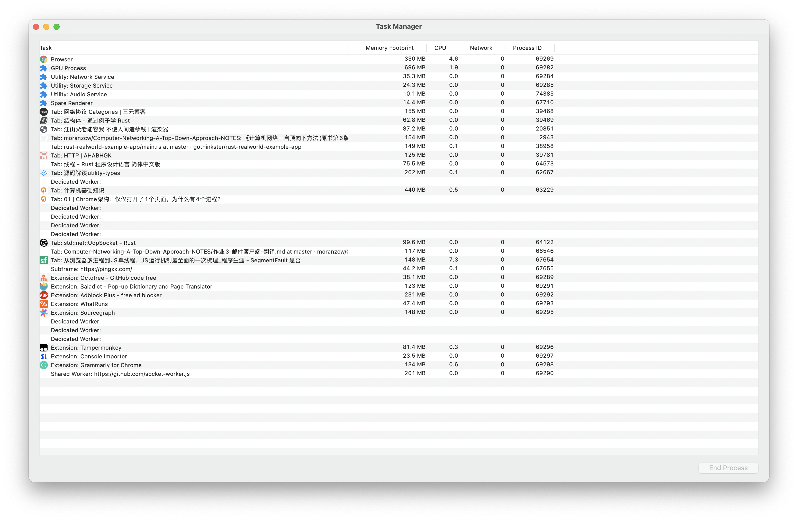
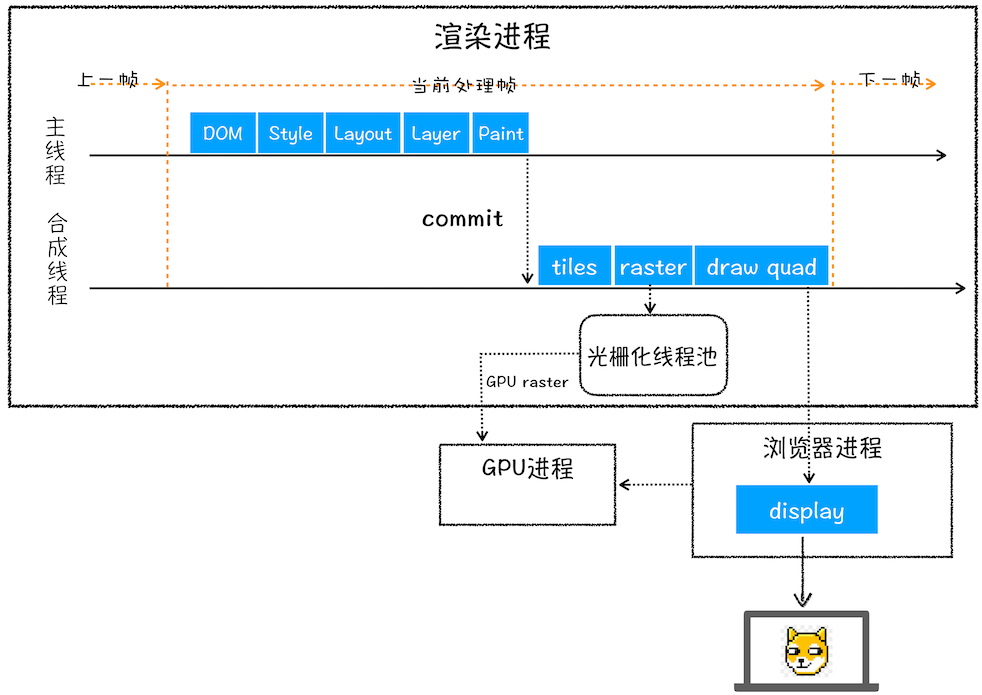
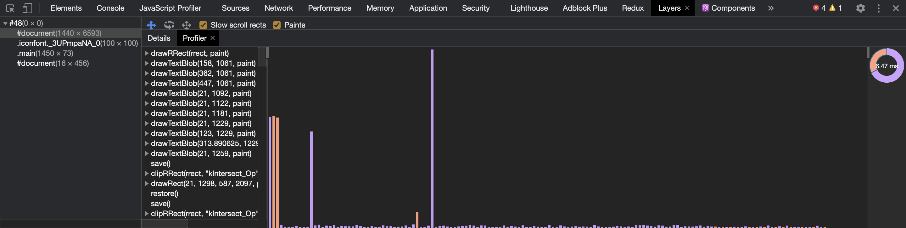

## 宏观

### 浏览器架构

> 进程与线程的关系：进程是 CPU 资源分配的最小单位；线程是 CPU 调度的最小单位
>
> 1. 进程中的任意一线程执行出错，都会导致整个进程的崩溃
> 2. 线程之间共享进程中的数据
> 3. 当一个进程关闭之后，操作系统会回收进程所占用的内存
> 4. 进程之间的内容相互隔离

所以单进程浏览器不稳定（一个线程崩溃整个浏览器崩溃）、不流畅（所有页面的渲染模块、JS 执行环境、插件都是运行页面线程中）、不安全（恶意插件、浏览器漏洞可以获取底层资源和/或权限）

- 浏览器主进程：一个。界面显示、用户交互（前进后退……）、子进程管理，同时提供存储等功能
- 渲染进程：多个，每个 Tab 页一个（如果从 A 打开 B，且 A B 是同一站点，则 A B 公用一个渲染进程）。排版引擎 Blink 和 JavaScript 引擎 V8 都是运行在该进程中，将 HTML、CSS、JS 转化为网页。出于安全考虑，渲染进程都是运行在沙箱模式下
- GPU 进程：一个。用于 3D 绘制、UI 界面生成等
- 网络进程：一个。页面的网络资源加载。之前通过主进程处理
- 插件进程：多个，每种类型的插件对应一个进程。插件的运行。因插件易崩溃，所以通过插件进程来隔离

> 同一站点：协议、跟域名相同，比如 `https://time.geekbang.org`、`https://www.geekbang.org:8080`

缺点有更高的资源占用、更复杂的体系架构

如果在资源受限的设备上，Chrome 会将很多服务整合到一个进程中，从而节省内存占用

### 从输入 URL 到页面加载的过程

1. 用户输入
    1. 判断地址栏中输入的是内容还是 URL
    2. beforeunload 事件触发（表单确认离开……）
    3. 此时页面内容并不会改变，需要等待提交文档阶段
2. URL 请求过程
    1. 通过 IPC 把 URL 请求发送至网络进程，发起网络请求
    2. 查找本地缓存（强缓存），有就直接返回给浏览器进程
    3. DNS 解析获取 IP。如果是 HTTPS 就还需要建立 TLS 连接
    4. 服务器响应给网络进程
    5. 处理重定向（301、302）
    6. 处理响应数据类型（Content-Type），根据类型而不同，text/html 就继续
3. 准备渲染进程
    - 默认会新建一个渲染进程
    - 如果 A 打开了 B，而 B 和 A 属于同一站点的话，那么 B 会复用 A 的渲染进程
4. 提交文档（浏览器进程将网络进程接收到的 HTML 数据提交给渲染进程）
    1. 当浏览器进程接收到网络进程的响应头数据之后，向渲染进程发起“提交文档”的消息
    2. 渲染进程接收后会和网络进程建立传输数据的“管道”
    3. 数据传输完后，渲染进程会返回“确认提交”的消息给浏览器进程
    4. 浏览器收到后，会更新浏览器界面状态（安全状态、地址栏的 URL、前进后退的历史状态）并更新页面

5. 渲染阶段
    1. 构建 DOM 树
    2. 样式计算
        1. 把 CSS 文本转换为浏览器可以理解的 styleSheets（document.styleSheets）
        2. 标准化（em -> px、red -> #ff0000……）
        3. 计算出 DOM 树中每个节点的具体样式（继承和层叠），之后保存到 computedStyle 中
    3. 布局（计算出 DOM 树中可见元素的几何位置）
        1. 创建布局树，遍历 DOM 树中的所有可见节点，加到布局树中，head 等标签和设置了 `display: none` 的不可见节点会忽略
        2. 计算布局树节点的坐标位置
    4. 分层（为了方便实现复杂的 3D 变换、页面滚动、z 轴排序等，渲染引擎为特定的节点生成专用的图层（合成层），并生成一棵对应的图层树）
        - 显式合成
            - 拥有[层叠上下文属性](https://developer.mozilla.org/zh-CN/docs/Web/Guide/CSS/Understanding_z_index/The_stacking_context)的元素会被提升为单独的一层
            - 需要剪裁（clip）的地方也会被创建为图层
        - 隐式合成：层叠等级低的节点被提升为单独的图层之后，那么所有层叠等级比它高的节点都会成为一个单独的图层（层爆炸的原因）
    5. 绘制
        - 渲染引擎会把一个图层的绘制拆分成很多小的绘制指令，按顺序组成待绘制列表
    6. 生成图块和生成位图（绘制列表准备好后，主线程会把绘制列表提交给合成线程，实际的绘制操作是由渲染引擎中的合成线程来完成）
        1. 分割图块
            - 页面可能很大，但是用户只能视口（viewport）部分，为了节省开销，合成线程会将图层划分为图块（tile），通常是 256 \* 256 或 512 \* 512 的
        2. 栅格化
            - 合成线程会按照视口附近的图块来优先生成位图，实际生成位图的操作是由栅格化在渲染进程维护的栅格化线程池中来执行
            - 通常栅格化过程会使用 GPU 进程来加速生成，渲染进程把生成图块的指令发送给 GPU 进程，在 GPU 中执行生成图块的位图，并保存在 GPU 的内存中
    7. 合成和显示
        1. 栅格化操作完成后，合成线程会生成一个绘制命令，即"DrawQuad"，并发送给浏览器进程
        2. 浏览器进程中的 viz 组件接收命令后把页面内容绘制到内存，然后把这部分内存发送给显卡，系统拿到后显示到显示屏上
            - 显示屏固定的刷新频率，一般是 60 HZ，即 60 帧，也就是一秒更新 60 张图片，每次更新的图片都来自显卡的前缓冲区。而显卡接收到浏览器进程传来的页面后，会合成相应的图像，并将图像保存到后缓冲区，然后系统自动将前缓冲区和后缓冲区对换位置，如此循环更新（当某个动画大量占用内存的时候，浏览器生成图像的时候会变慢，图像传送给显卡就会不及时，而显示器还是以不变的频率刷新，因此会出现卡顿，也就是明显的掉帧现象）

## JS

## 事件循环

## 页面

## 网络

## 安全
