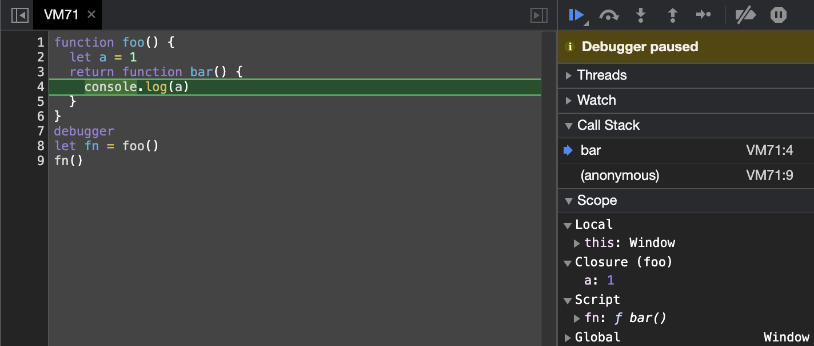
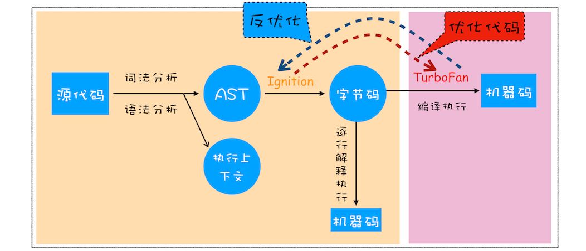
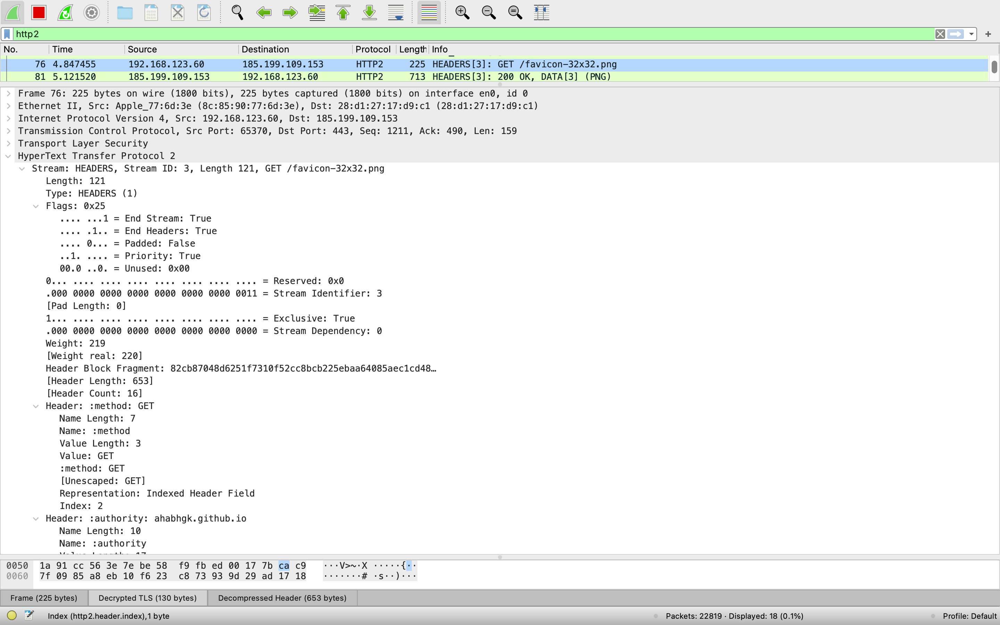

## 宏观

### 浏览器架构

> 进程与线程的关系：进程是 CPU 资源分配的最小单位；线程是 CPU 调度的最小单位
>
> 1. 进程中的任意一线程执行出错，都会导致整个进程的崩溃
> 2. 线程之间共享进程中的数据
> 3. 当一个进程关闭之后，操作系统会回收进程所占用的内存
> 4. 进程之间的内容相互隔离


所以单进程浏览器不稳定（一个线程崩溃整个浏览器崩溃）、不流畅（所有页面的渲染模块、JS 执行环境、插件都是运行页面线程中）、不安全（恶意插件、浏览器漏洞可以获取底层资源和/或权限）


- 浏览器主进程：一个。界面显示、用户交互（前进后退……）、子进程管理，同时提供存储等功能
- 渲染进程：多个，每个 Tab 页一个（如果从 A 打开 B，且 A B 是同一站点，则 A B 公用一个渲染进程）。排版引擎 Blink 和 JavaScript 引擎 V8 都是运行在该进程中，将 HTML、CSS、JS 转化为网页。出于安全考虑，渲染进程都是运行在沙箱模式下
- GPU 进程：一个。用于 3D 绘制、UI 界面生成等
- 网络进程：一个。页面的网络资源加载。之前通过主进程处理
- 插件进程：多个，每种类型的插件对应一个进程。插件的运行。因插件易崩溃，所以通过插件进程来隔离

> 同一站点：协议、跟域名相同，比如 `https://time.geekbang.org`、`https://www.geekbang.org:8080`

缺点有更高的资源占用、更复杂的体系架构


如果在资源受限的设备上，Chrome 会将很多服务整合到一个进程中，从而节省内存占用


### 从输入 URL 到页面加载的过程


1. 用户输入
    1. 判断地址栏中输入的是内容还是 URL
    2. beforeunload 事件触发（表单确认离开……）
    3. 此时页面内容并不会改变，需要等待提交文档阶段
2. URL 请求过程
    1. 通过 IPC 把 URL 请求发送至网络进程，发起网络请求
    2. 查找本地缓存（强缓存），有就直接返回给浏览器进程
    3. DNS 解析获取 IP。如果是 HTTPS 就还需要建立 TLS 连接
    4. 服务器响应给网络进程
    5. 处理重定向（301、302）
    6. 处理响应数据类型（Content-Type），根据类型而不同，text/html 就继续
3. 准备渲染进程
    - 默认会新建一个渲染进程
    - 如果 A 打开了 B，而 B 和 A 属于同一站点的话，那么 B 会复用 A 的渲染进程
4. 提交文档（浏览器进程将网络进程接收到的 HTML 数据提交给渲染进程）
    1. 当浏览器进程接收到网络进程的响应头数据之后，向渲染进程发起“提交文档”的消息
    2. 渲染进程接收后会和网络进程建立传输数据的“管道”
    3. 数据传输完后，渲染进程会返回“确认提交”的消息给浏览器进程
    4. 浏览器收到后，会更新浏览器界面状态（安全状态、地址栏的 URL、前进后退的历史状态）并更新页面


5. 渲染阶段
    1. 构建 DOM 树
    2. 样式计算
        1. 把 CSS 文本转换为浏览器可以理解的 styleSheets（document.styleSheets）
        2. 标准化（em -> px、red -> #ff0000……）
        3. 计算出 DOM 树中每个节点的具体样式（继承和层叠），之后保存到 computedStyle 中
    3. 布局（计算出 DOM 树中可见元素的几何位置）
        1. 创建布局树，遍历 DOM 树中的所有可见节点，加到布局树中，head 等标签和设置了 `display: none` 的不可见节点会忽略
        2. 计算布局树节点的坐标位置
    4. 分层（为了方便实现复杂的 3D 变换、页面滚动、z 轴排序等，渲染引擎为特定的节点生成专用的图层（合成层），并生成一棵对应的图层树）
        - 显式合成
            - 拥有[层叠上下文属性](https://developer.mozilla.org/zh-CN/docs/Web/Guide/CSS/Understanding_z_index/The_stacking_context)的元素会被提升为单独的一层
            - 需要剪裁（clip）的地方也会被创建为图层
        - 隐式合成：层叠等级低的节点被提升为单独的图层之后，那么所有层叠等级比它高的节点都会成为一个单独的图层（层爆炸的原因）
    5. 绘制
        - 渲染引擎会把一个图层的绘制拆分成很多小的绘制指令，按顺序组成待绘制列表
    6. 生成图块和生成位图（绘制列表准备好后，主线程会把绘制列表提交给合成线程，实际的绘制操作是由渲染引擎中的合成线程来完成）
        1. 分割图块
            - 页面可能很大，但是用户只能视口（viewport）部分，为了节省开销，合成线程会将图层划分为图块（tile），通常是 256 \* 256 或 512 \* 512 的
        2. 栅格化
            - 合成线程会按照视口附近的图块来优先生成位图，实际生成位图的操作是由栅格化在渲染进程维护的栅格化线程池中来执行
            - 通常栅格化过程会使用 GPU 进程来加速生成，渲染进程把生成图块的指令发送给 GPU 进程，在 GPU 中执行生成图块的位图，并保存在 GPU 的内存中
    7. 合成和显示
        1. 栅格化操作完成后，合成线程会生成一个绘制命令，即"DrawQuad"，并发送给浏览器进程
        2. 浏览器进程中的 viz 组件接收命令后把页面内容绘制到内存，然后把这部分内存发送给显卡，系统拿到后显示到显示屏上
            - 显示屏固定的刷新频率，一般是 60 HZ，即 60 帧，也就是一秒更新 60 张图片，每次更新的图片都来自显卡的前缓冲区。而显卡接收到浏览器进程传来的页面后，会合成相应的图像，并将图像保存到后缓冲区，然后系统自动将前缓冲区和后缓冲区对换位置，如此循环更新（当某个动画大量占用内存的时候，浏览器生成图像的时候会变慢，图像传送给显卡就会不及时，而显示器还是以不变的频率刷新，因此会出现卡顿，也就是明显的掉帧现象）

### 回流、重绘、合成


### 如果下载 CSS 文件阻塞了，是否会阻塞 DOM 树合成和页面的显示

看情况，如果在 CSS 文件下载时，JS 访问某个元素的样式，这时就需要等待 CSS 文件下载完才能继续执行

JavaScript 引擎在解析 JS 之前，是不知道 JS 是否操纵了 CSSOM 的，所以渲染引擎在遇到 JS 脚本时，不管该脚本是否操纵了 CSSOM，都会执行 CSS 文件下载，解析操作，再执行 JS 脚本

HTML 中的 JS 会阻塞 DOM，JS 脚本又依赖样式表

## JS

### 执行上下文

```js
ExecutionContext = {
  'code evaluation state', // All Execution Contexts 都有。执行，暂停和恢复与此执行上下文关联的代码的评估所需的任何状态
  Function, // All Execution Contexts 都有。如果此执行上下文正在执行函数对象的代码，则此组件的值就是该函数对象。如果上下文正在执行脚本或模块的代码，则该值为 null
  Realm, // All Execution Contexts 都有。关联记录从中访问 ECMAScript 资源的领域记录
  ScriptOrModule, // All Execution Contexts 都有
  LexicalEnvironment, // Code Execution Contexts 特有
  VariableEnvironment, // Code Execution Contexts 特有
  Generator, // Generator Execution Contexts 特有的，此执行上下文正在求值的 GeneratorObject
  outer,
  ResolveBinding(),
  ResolveThisBinding(),
}
```

### 内存模型

分为代码空间、栈空间、堆空间

原始类型的数据值都是直接保存在“栈”中的，引用类型的值是存放在“堆”中的

#### 为什么要分别保存，为什么不全保存到栈空间中

JavaScript 引擎需要用栈来维护程序执行期间上下文的状态，如果栈空间大了话，所有的数据都存放在栈空间里面，那么会影响到上下文切换的效率，进而又影响到整个程序的执行效率

#### 如何理解闭包

可以捕获环境的函数

1. 当 JS 引擎执行到 foo 函数时，首先会编译，并创建一个空执行上下文
2. 在编译过程中，遇到内部函数 bar，JS 引擎还要对 bar 函数做一次快速的词法扫描，发现该内部函数引用了 foo 函数中的 a 变量，所以 JS 引擎判断这是一个闭包，于是在堆空间创建换一个“Closure (foo)”的对象（这是一个内部对象，JavaScript 是无法访问的），用来保存 a 变量
3. 之后再遇到类似 a 的变量会直接加到“Closure (foo)”对象中



#### GC

见美团面经

#### V8 如何执行 JS 代码



1. 生成抽象语法树（AST）和执行上下文
    1. 词法分析（tokenize），code -> token
    2. 语法分析（parse），token -> AST
2. 生成字节码
    - 字节码通过解释器 Ignition 生成
    - 字节码比机器码要小很多，占用内存少
3. 执行代码
    - 字节码通过解释器转换成机器码执行
    - 会重复执行多次的代码（HotSpot）会通过编译器 TurboFan 编译成机器码

## 事件循环

### 为什么引入微任务

如果使用同步处理回调任务，会导致当前的任务执行时间被拉长，导致执行效率下降；如果使用宏任务处理，可能已经有很多宏任务在排队，高优先级的任务就得不到执行；所以引入微任务，在当前宏任务执行完后一次性执行完所有微任务

## 页面

### 如何优化网络请求时间


1. 排队（Queuing）时间过久：域名分片、升级 HTTP2
2. 第一字节时间（TTFB）时间过久：服务器处理慢、低带宽、发送请求头时带上了多余的用户信息（Cookie）
3. Content Download 时间过久：减少文件大小

### 怎样减少白屏时间

1. 优化网络请求时间
2. 将一些不需要在解析 HTML 阶段使用的 JS 标记上 async 或者 defer
3. 对于大的 CSS 文件，可以通过媒体查询属性，拆分为多个在特定的场景下加载特定的 CSS 文件

```html
<script src="foo.js" type="text/javascript"></script>
<script defer src="foo.js" type="text/javascript"></script>
<script async src="foo.js" type="text/javascript"></script>
<link rel="stylesheet" type="text/css" href="foo.css" />
<link rel="stylesheet" type="text/css" href="foo.css" media="screen"/>
<link rel="stylesheet" type="text/css" href="foo.css" media="print" />
<link rel="stylesheet" type="text/css" href="foo.css" media="orientation:landscape" />
<link rel="stylesheet" type="text/css" href="foo.css" media="orientation:portrait" />
```

### 为什么 CSS 动画比 JS 高效

CSS3 的 transform、opacity、filter 可以实现合成的效果（GPU 加速），在合成的情况下，会直接跳过布局和绘制流程，直接进入非主线程处理的部分，即直接交给合成线程处理

合成线程生成位图的过程中会调用线程池，而且光栅化一般会通过 GPU 加速，GPU 擅长处理位图数据；没有占用主线程的资源，即使主线程卡住了，效果依然能够流畅地展示

`will-change: auto | <animateable-feature>` 的作用是让渲染引擎为其单独实现一个图层，当这些变换发生时，仅仅只是利用合成线程去处理这些变换，而不牵扯到主线程

## 网络

### HTTP/0.9 缺陷和 HTTP/1.0 的解决

HTTP/0.9 仅支持 GET 请求，不支持请求头，只能传输纯文本内容，只支持 ASCII 字节码，典型的无状态连接

| HTTP/0.9 | HTTP/1.0 |
|:--:|:--:|
| 没有途径告诉服务器更多的信息 | 引入头部和体，引入 GET、POST、HEAD |
| 不支持多种类型文件、多种语言、多种压缩方式、多种编码 | `accept` 系列头和 `content` 系列头 |
| 无法告诉浏览器服务器处理的情况 | 引入状态码 |
| 没有缓存，服务器压力大 | 引入 `Expires`、`Last-Modified/If-Modified-Since` 字段 |
| 无法统计客户端的基础信息 | 引入 `User-Agent` 字段 |
| 不支持长连接 | 可手动开启 `Connection: keep-alive` 长连接 |

### HTTP/1.0 缺陷和 HTTP/1.1 的解决

| HTTP/1.0 | HTTP/1.1 |
|:--:|:--:|
| 默认短连接 | 默认开启 `Connection: keep-alive` 长连接 |
| 浏览器服务器交流有限 | 引入 PUT、PATCH、OPTIONS、DELETE，增加 100 等一些状态码 |
| 不支持虚拟主机（一个物理主机有多个虚拟主机，每个虚拟主机有单独的域名，都公用一个 IP 地址）| 增加 `Host` 字段表示当前的域名，供服务器处理 |
| 不支持动态生成的内容 | 引入 `Transfer-Encoding: chunked` 字段 |
| 缓存时间不精确 | 引入 `Cache-Control`、`ETag/If-None-Match` 字段 |
| 网络效率低 | 浏览器为每个域名最多同时维护 6 个 TCP 长连接（规范是 2 个，后面改了）|

### HTTP/1.1 缺陷和 HTTP/2 的解决

| HTTP/1.1 | HTTP/2 |
|:--:|:--:|
| TCP 的慢启动，影响首屏 | 一个域名只使用一个 TCP 长连接来传输数据，只需一次慢启动 |
| 多条 TCP 连接之间又不能协商让哪些关键资源优先下载 | 一个域名一个 TCP 长连接，且有请求的优先级（PRIORITY 帧） |
| 队头阻塞 | 多路复用（引入二进制分帧层给帧加编号）|
| 头部过大 | 头部压缩（Huffman 编码，客户端和服务器同时维护和更新一个包含之前见过的 header 的索引列表）|

除此之外还有 HTTP/2 push，服务器接收到 HTML 请求后，可以把相关的 JS、CSS 一起发给客户端，优化首屏



### HTTP/2 缺陷和 HTTP/3 的解决

| HTTP/2 | HTTP/3 |
|:--:|:--:|
| TCP 的队头阻塞 | QUIC |
| TCP、TLS 握手需要 3-4 RTT | QUIC |

HTTP/2 中多个请求是跑在一个 TCP 管道中的，如果其中任意一路数据流中出现了丢包的情况，那么就会阻塞该 TCP 连接中的所有请求。不同于 HTTP/1.1 浏览器为每个域名开启了 6 个 TCP 连接，如果其中的 1 个 TCP 连接发生了队头阻塞，那么其他的 5 个连接依然可以继续传输数据。所以随着丢包率的增加，HTTP/2 的传输效率也会越来越差。有测试数据表明，当系统达到了 2% 的丢包率时，HTTP/1.1 的传输效率反而比 HTTP/2 表现得更好


## 安全

### 为什么要有同源策略

同源策略表现在三个方面

1. DOM：页面 A 打开页面 B，若 A、B 同源，B 可以通过 `opener` 对象操控 A；若 A、B 不同源，就不能操控，会报 `Uncaught DOMException: Blocked a frame with origin "https://zhuanlan.zhihu.com" from accessing a cross-origin frame.`
2. 数据：同源策略限制了不同源的站点读取当前站点的 Cookie、IndexDB、LocalStorage 等数据，同源的站点可以通过 opener 操控
3. 网络

所以如果没有同源策略，就可以通过诱导用户从 A 打开 B……

### 同源策略对安全和便利性的权衡

1. 页面中可以嵌入第三方资源：所有资源都来自于同一个源会限制 CDN 等，所以 script、img 标签的 src 都没有限制的，这也导致 XSS 攻击，所以浏览器也引入了 CSP，让服务器决定浏览器能够加载哪些资源，让服务器决定浏览器是否能够执行内联 JavaScript 代码
2. 跨域资源共享和跨文档消息机制：不同源两个网页的网络互通可以通过 CORS，数据和 DOM 互通可以通过 postMessage
