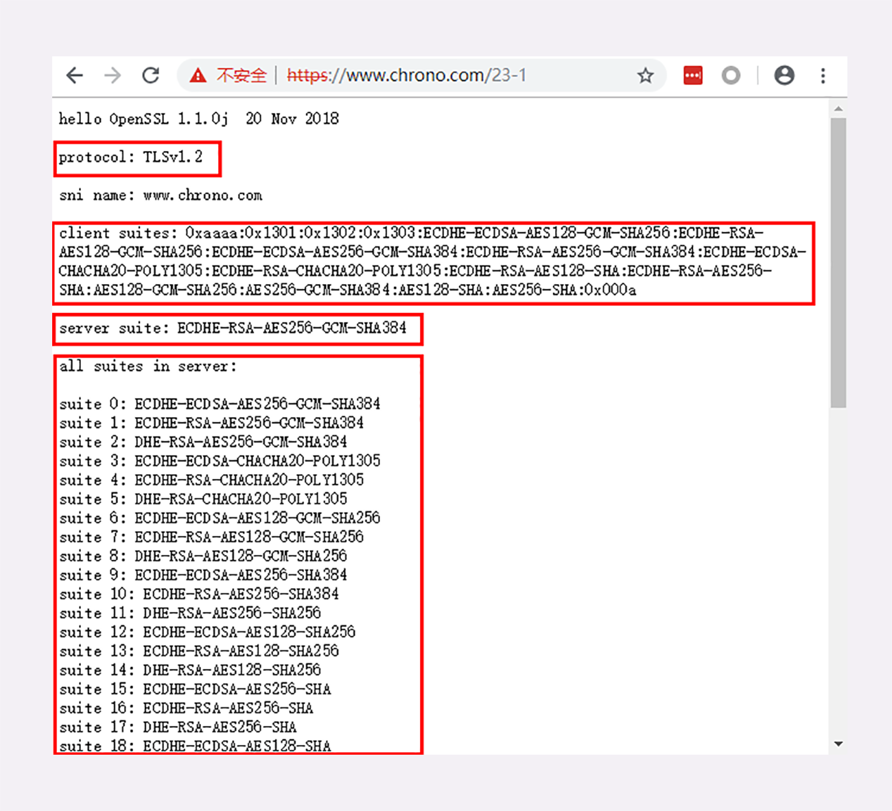

## DNS

域名使用字符串来代替 IP 地址，方便用户记忆，本质上一个名字空间系统


例如，你要访问“www.apple.com”，如果没有缓存和 hosts 就要进行下面的三次查询：

1. 访问根域名服务器，它会告诉你“com”顶级域名服务器的地址

2. 访问“com”顶级域名服务器，它再告诉你“apple.com”域名服务器的地址

3. 最后访问“apple.com”域名服务器，就得到了“www.apple.com”的地址

## Content 系列字段

TCP / UDP 由于是传输层协议，并不关心传输的数据，只关心传输，而 HTTP 是应用层协议，需要关心数据是什么，告诉上层应用数据类型、压缩方式、语言类型

1. 数据类型

多种格式的数据传输到客户端，客户端最低效的方式是根据前几个字节直接猜，更高效的方式是通过指定数据类型告诉客户端是什么格式

MIME 之前是用在电子邮件系统里的，让电子邮件可以发送 ASCII 码以外的任意数据，常用的有：text/html、text/plain、text/css、image/gif、image/jpeg、image/png、audio/mpeg、video/mp4、application/json，application/javascript、application/pdf、application/octet-stream（不透明的二进制数据）

客户端发送请求带有 Accept 头部字段标记可理解的数据类型：`Accept: text/html,application/xml,image/webp,image/png`，服务器会在响应报文里用头字段 Content-Type 告诉实体数据的真实类型：`Content-Type: text/html`

2. 压缩方式

HTTP 在传输时为了节约带宽，有时候还会压缩数据，为了不要让浏览器继续“猜”，还需要有一个“Encoding type”

常用压缩格式：gzip、deflate、br（一种专门为 HTTP 优化的新压缩算法 Brotli）

客户端通过 Accept-Encoding 标记客户端支持的压缩格式：`Accept-Encoding: gzip, deflate, br`，服务器实际使用的压缩格式放在响应头字段 Content-Encoding：`Content-Encoding: gzip`

3. 语言类型和字符集

Accept-Language 字段标记了客户端可理解的自然语言：`Accept-Language: zh-CN, zh, en`（最好给我 zh-CN 的汉语文字，如果没有就用其他的汉语方言，如果还没有就给英文），服务器应该在响应报文里用头字段 Content-Language 告诉客户端实体数据使用的实际语言类型：`Content-Language: zh-CN`

字符集在 HTTP 里使用的请求头字段是 Accept-Charset：`Accept-Charset: gbk, utf-8`，响应头中放在 Content-Type 中：`ontent-Type: text/html; charset=utf-8`

4. 内容协商

Accept、Accept-Encoding、Accept-Language 等请求头字段进行内容协商的时候，还可以用一种特殊的“q”参数表示权重来设定优先级

权重的最大值是 1，最小值是 0.01，默认值是 1，如果值是 0 就表示拒绝

`Accept: text/html,application/xml;q=0.9,*/*;q=0.8` 表示客户端最希望 html 格式，权重 1，其次 xml 权重 0.9，最后任意类型权重 0.8

内容协商的过程是不透明的，每个 Web 服务器使用的算法都不一样，但有的时候，服务器会在响应头里多加一个 Vary 字段，记录服务器在内容协商时参考的请求头字段：`Vary: Accept-Encoding,User-Agent,Accept`

## HTTP 大文件传输

压缩传输、分批传输、范围请求

### Transfer-Encoding: chunked 不定长数据 Content-Length 定长数据

对于定长数据添加 Content-Length 响应头

```js
res.setHeader('Content-Type', 'text/plain')
res.setHeader('Content-Length', 10)
res.write("helloworld")
```

如果 length 小于真实长度会截断，大于真实长度会直接无法显示

对于不定长数据需要 `Transfer-Encoding: chunked` 响应头，与 Content-Length 互斥

```js
res.setHeader('Content-Type', 'text/html; charset=utf8')
res.setHeader('Content-Length', 10)
res.setHeader('Transfer-Encoding', 'chunked')
res.write("<p>来啦</p>")
setTimeout(() => {
  res.write("第一次传输<br />")
}, 1000)
setTimeout(() => {
  res.write("第二次传输")
  res.end()
}, 2000)
```


响应题格式：其中 length 是 16 进制数字表示长度，最后用一个长度为 0 的块表示结束，即“0\r\n\r\n”


使用 telnet 看格式：

```http
HTTP/1.1 200 OK
Content-Type: text/html; charset=utf8
Content-Length: 10
Transfer-Encoding: chunked
Date: Sun, 23 Feb 2020 11:06:31 GMT
Connection: keep-alive

d
<p>来啦</p>
14
第一次传输<br />
f
第二次传输
0
```

### Range 范围请求

不是必备的，所以服务器必须在响应头中添加 `Accept-Ranges: bytes` 告诉客户端支持范围请求，如果不支持需要用 `Accept-Ranges: none` 或不添加该字段

比如看视频时，想要跳过一部分

```http
GET /16-2 HTTP/1.1
Host: ahabhgk.top/ranging
Range: bytes=30-39
```

```http
HTTP/1.1 206 Partial Content
Content-Length: 10
Accept-Ranges: bytes
Content-Range: bytes 30-39/100

// video data...
```

其中 `Range: bytes=30-39` 表示偏移量，从 30 开始到 39 一共 10 个字节，格式还可以是“10-”表示“10-99”、“-10”表示“90-99”

服务器收到 Range 后检测范围是否合法，超出就会返回 416，如果正确就返回“206 Partial Content”并添加 Content-Range 表示片段的实际偏移量和资源的总大小

不仅看视频的拖拽进度需要范围请求，常用的下载工具里的多段下载、断点续传也是基于它实现的，要点是：

1. 先发个 HEAD，看服务器是否支持范围请求，同时获取文件的大小

2. 多个请求使用 Range 字段划分出各自负责下载的片段，发请求传输数据

3. 下载意外中断也不怕，不必重头再来一遍，只要根据上次的下载记录，用 Range 请求剩下的那一部分

当 Range 用逗号隔开分为多段时，可以一次性请求多个数据片段，此时需要 multipart/byteranges 表示报文的 body 是由多段字节序列组成的，并通过 boundary 分割


```http
GET /16-2 HTTP/1.1
Host: ahabhgk.top/ranging
Range: bytes=0-9, 20-29
```

```http
HTTP/1.1 206 Partial Content
Content-Type: multipart/byteranges; boundary=00000000001
Content-Length: 189
Connection: keep-alive
Accept-Ranges: bytes


--00000000001
Content-Type: text/plain
Content-Range: bytes 0-9/96

// this is
--00000000001
Content-Type: text/plain
Content-Range: bytes 20-29/96

ext json d
--00000000001--
```

## Connection: keep-alive 长连接

响应头 `Connection: keep-alive` HTTP/1.1 默认添加

长连接对于短连接性能更好，但是也有一些缺点：TCP 连接长时间不关闭，服务器必须在内存里保存它的状态，这就占用了服务器的资源。如果有大量的空闲长连接只连不发，就会很快耗尽服务器的资源，导致服务器无法为真正有需要的用户提供服务

关闭长连接：

1. 对于关闭长连接可以在请求头中添加 `Connection: close` 字段，服务器看到后就会关闭连接并在响应头中也添加这个字段

2. 服务器端通常不会主动关闭连接，Nginx 可以使用 keepalive_timeout 指令设置长连接的超时时间，keepalive_requests 指令设置长连接上可发送的最大请求次数

3. 客户端和服务器都可以在报文里附加通用头字段 `Keep-Alive: timeout=60`，但该字段约束力不强

> Connection: Upgrade 配合 101 表示协议升级，比如 HTTP 升级 WebSocket

## 如何解决对头阻塞

因为 HTTP 规定报文必须是“一发一收”，这就形成了一个先进先出的“串行”队列。队列里的请求没有轻重缓急的优先级，只有入队的先后顺序，排在最前面的请求被最优先处理，对首的处理太慢就会阻塞后面的

1. 并发连接，一个域名发起多个长连接，但如果过多服务器扛不住，可能被认为恶意攻击造成拒绝访问，所以规范限制一个客户端最多并发两个长连接，但仍然不够用，浏览器实现为 6-8 个，之后修订的规范也取消了两个的限制

2. 域名分片，由于限制并发连接数量，那就多开几个域名都指向同一个服务器

## 重定向

当发送请求，服务器返回 3xx 并带有 Location 字段的响应头，表示（由服务器）发起重定向，浏览器自动跳转到新的 URL，用户无感知

Location 表示跳转到的地址，也分为绝对地址和相对地址，如果不带有 Location 响应头字段，则不会进行跳转；Refresh 表示延时跳转，`Refresh: 5, url=xxx` 表示 5 秒钟后跳转到 xxx

Referer 表示跳转来源，`Referer: /18-1` 表示从 /18-1 跳转过来，可用于统计分析和防盗链

- 301（Moved Permanently）：永久重定向，浏览器会做适当的优化。比如历史记录、更新书签，下次可能就会直接用新的 URI 访问，省去了再次跳转的成本。搜索引擎的爬虫看到 301，也会更新索引库，不再使用老的 URI

- 302（Moved Temporarily）：临时重定向，原 URI 处于“临时维护”状态

- 300（Multiple Choices）：返回多个跳转链接的页面，由用户自己决定

- 307（Temporary Redirect）：重定向后请求里的方法和实体不允许变动，类似 302

- 308（Permanent Redirect）：不允许重定向后的请求变动，类似 301

应用：

1. 资源不可用：域名变更、服务器变更、网站改版、系统维护、没有登录注册导致原 URI 指向的资源无法访问

2. 避免重复：多个名称类似的域名重定向到主站上（qq.com、github.com）

问题：

1. 性能损耗：会发生多次请求应答（根据重定向次数而定），301 会优化

2. 循环跳转：a 跳 b，b 跳 a

## Cookie

响应头 Set-Cookie 请求头自动带上 Cookie，多个 Cookie 设置时由多个 Set-Cookie 设置，请求时由一个 Cookie 携带并用“;”隔开

属性：

1. Expires 和 Max-Age 设置过期时间，max-age <= 0 按 0 处理表示立即失效

2. Domain 和 Path 指定了 Cookie 所属的域名和路径，浏览器在发送 Cookie 前会从 URI 中提取出 host 和 path 部分，对比 Cookie 的属性。如果不满足条件，就不会在请求头里发送 Cookie

3. 安全性

    - HttpOnly 不能用 JS 操作 Cookie
    
    - SameSite 防范 CSRF，SameSite=Strict 严格限定 Cookie 不能随着跳转链接跨站发送，而 SameSite=Lax 则略宽松一点，允许 GET/HEAD 等安全方法，但禁止 POST 跨站发送安全性

    - Secure”，表示这个 Cookie 仅能用 HTTPS 协议加密传输，明文的 HTTP 协议会禁止发送。但 Cookie 本身不是加密的，浏览器里还是以明文的形式存在

应用：

1. 身份识别

2. 广告跟踪：网页里嵌入广告代码，信息通过 Cookie 存储，然后在别的网站也有同一个广告商的广告代码，就会读 Cookie 得到信息

## session 与 Cookie 的区别

本来 session 是一个抽象概念，开发者为了实现中断和继续等操作，将 user agent 和 server 之间一对一的交互，抽象为“会话”，进而衍生出“会话状态”，也就是 session 的概念

而 cookie 是一个实际存在的东西，http 协议中定义在 header 中的字段。可以认为是 session 的一种后端无状态实现

session 因为需要 session id 维持会话作为唯一标识，通常要借助 cookie 实现，但这并非必要，只能说是通用性较好的一种实现方案，还可以在 URL 上添加 sid=xxxxx 的参数实现

## 浏览器各种刷新发送的请求头有什么不同

不止服务器可以发 Cache-Control 头，浏览器也可以发 Cache-Control，也就是说请求 - 应答的双方都可以用这个字段进行缓存控制，互相协商缓存的使用策略

- 刷新：请求头带有 `Cache-Control: max-age=0`，max-age 表示生存时间，由于本地数据至少保存了几秒钟，所以浏览器就不会使用缓存，而是向服务器发请求。服务器看到 max-age=0，也就会用一个最新生成的报文回应浏览器

- control + F5 强制刷新：请求头带有 `Cache-Control: no-cache`，max-age=0 含义基本一样，看服务器怎么理解，通常效果相同

- 前进后退跳转：无 Cache-Control

## 强弱 ETag

强 ETag 要求资源在字节级别必须完全相符，弱 ETag 在值前有个“W/”标记，只要求资源在语义上没有变化，但内部可能会有部分发生了改变（例如 HTML 里的标签顺序调整，或者多了几个空格）

## 代理

### 代理的作用

1. **负载均衡**：随机算法、轮询、一致性hash、LRU（最近最少使用）等等

2. **内容缓存**：暂存、复用服务器响应

3. **安全防护**：保护被代理的后端服务器，限制 IP 地址或流量，抵御网络攻击和过载

4. 健康检查：使用“心跳”等机制监控后端服务器，发现有故障就及时“踢出”集群，保证服务高可用

5. 加密卸载：对外网使用 SSL/TLS 加密通信认证，而在安全的内网不加密，消除加解密成本

6. 数据过滤：拦截上下行的数据，任意指定策略修改请求或者响应

### 代理相关头字段

Via：代理服务器以此标明自己的身份，在 HTTP 传输中留下自己的痕迹，`客户端 -> 代理1 -> 代理2 -> 源服务器` 的请求头是 `Via: proxy_server1, proxy_server2` 响应头是 `Via: proxy_server2, proxy_server1`

X-Forwarded-For（非标准）：Via 只能获取是否有代理，不能得到客户端真实信息。X-Forwarder-For 记录请求方的IP地址，所以服务器可以在字段最左边获取真实客户端 IP（但 HTTP 明文传输，可能会遭到修改，不可信）。对应有标准版本 Forwarded

X-Real-IP（非标准）：只获取真实客户端的 IP，X-Forwarded-Host 和 X-Forwarded-Proto 类似，记录真实客户端域名和协议

### 代理协议

由于 X-Forwarded-For 请求头字段需要代理解析并修改请求头，所以影响性能，而且 HTTPS 时不能修改，于是出现代理协议

```http
PROXY TCP4 1.1.1.1 2.2.2.2 55555 80\r\n
GET / HTTP/1.1\r\n
Host: www.xxx.com\r\n
\r\n
```

代理服务器拿到后只需解析第一行得到真实客户端的信息（TCP4 / 1.1.1.1:55555），不需要管之后的 HTTP 数据

### CONNECT 方法

网关可以由 HTTP 请求转化为其他协议通信，比如使用 SSL 提高安全性、连接数据库

CONNECT 方法可以建立隧道，隧道使用 SSL 等加密手段进行通信，隧道的目的是确保客户端能与服务器进行安全的通信


`CONNECT www.example.com:443 HTTP/1.1` 带有完整 URL，服务端返回 200 Connection established 完成隧道建立

### 缓存代理

代理上的缓存与客户端的缓存不同在于，客户端缓存只能供该客户端使用，而代理上的缓存可以供多个客户端使用

源服务器通过响应头上的 Cache-Control 字段对客户端缓存和代理缓存进行控制，除了 max-age、no-store、no-cache、must-revalidate 还有：

- private、public：private 表示是客户端私有的，只能在客户端缓存，比如 Set-Cookie 中带有的 ID，public 可以在代理上缓存

- proxy-revalidate：代理的缓存过期后必须验证，客户端不必回源，而 must-revalidate 表示客户端和代理的缓存只要过期就必须回源服务器验证

- s-maxage：share-maxage，表示代理上缓存的过期时间，max-age 表示客户端缓存的过期时间

- no-transform：代理缓存下来数据有时会做一些优化，比如把图片生成 png、webp 等多个格式，以方便之后的请求使用，而 no-transform 就禁止这样做

**源服务器在设置完 Cache-Control 后必须要为报文加上 Last-modified 或 ETag 字段。否则，客户端和代理后面就无法使用条件请求来验证缓存是否有效，也就不会有 304 缓存重定向**

客户端通过请求头上的 Cache-Control 字段对源服务器和代理缓存进行控制，除了 max-age、no-store、no-cache 还有：

- max-slate：表示代理缓存过期 x 秒内仍能够使用

- min-fresh：表示代理缓存 max-age 时间减少 x 秒

- only-if-cached：表示只接受代理缓存的数据，没有或过期就返回 504 Gateway Timeout

> 自定义请求方法 PURGE 发给代理可以删除对应的缓存
>
> 代理可以通过读取请求头的 Accept-Encoding、User-Agent 等字段对比缓存的响应头 Vary 字段值，如果完全相同，就表示版本一致可以返回

## 什么是 HTTPS

HTTP 由于不安全，数据可能被劫持篡改，为了通信的安全性出现了 HTTPS

保证通信的安全性需要保证通信的这四个特性：

- 传输过程安全

    1. 机密性：对外人数据不可见

    2. 完整性：传输过程中不可篡改

- 通信双方安全

    3. 身份认证：确认发送方接收方的身份

    4. 不可否认：不能否认已经发生过的行为（双方不可耍赖皮）

HTTP over SSL/TSL（Secure Sockets Layer / Transport Layer Security）通过 SSL/TSL 保证安全性，所以也有 HTTP 的特性，默认端口号是 443

浏览器和服务器在使用 TLS 建立连接时需要选择一组恰当的加密算法来实现安全通信，这些算法的组合被称为“密码套件”（cipher suite，也叫加密套件）



server suite 表示最后协商选定的是 ECDHE-RSA-AES256-GCM-SHA384（密钥交换算法 + 签名算法 + 对称加密算法 + 摘要算法），表示握手时使用 ECDHE 算法进行密钥交换，用 RSA 签名和身份认证，握手后的通信使用 AES 对称算法，密钥长度 256 位，分组模式是 GCM，摘要算法 SHA384 用于消息认证和产生随机数

OpenSSL 是一个著名的开源密码学程序库和工具包，几乎支持所有公开的加密算法和协议许多应用软件都会使用它作为底层库来实现 TLS 功能，包括常用的 Web 服务器 Apache、Nginx 等

## HTTPS 机密性和加密算法

先通过非对称加密将对称加密的密钥加密传输，双方得到后通过对称加密进行通信，既保证安全性也保证性能

非对称加密：RSA、ECC（ECDHE、ECDSA）

对称加密：AES、ChaCha20

// TODO: 加密算法相关

## HTTPS 完整性、身份认证、不可否认

有了机密性黑客虽然无法破解密文，但是可以收集足够多密文，修改后发给服务器，通过响应获取线索，最终获取破解，所以需要保证完整性

完整性：通过摘要算法（哈希函数）得到摘要，加到明文后面，通过密钥加密进行传输，另一方得到后通过 `hash(明文) == 摘要` 进行验证，当然完整性验证要在机密性的基础上

> 哈希函数有 MD5、SHA-1、SHA-2 等，MD5、SHA-1 不安全

黑客也可以伪造身份发布公钥，让你以为你在和某宝通信，然后骗取信息，所以需要身份验证

身份验证、不可否认：非对称加密如果使用私钥加密公钥解密，就可以用来进行身份认证。服务器可以将明文（序列号、用途、颁发者、有效时间等等）的摘要（只加密摘要效率高，得到数字证书）用私钥加密得到数字签名，客户端通过公钥解密得到摘要再与原文对比来验证身份。为了防止公钥的伪造，可以用别的私钥来加密公钥，但别的私钥的公钥仍可以伪造，于是引入具有公信的 CA 机构作为“信任的起点，递归的终点”，构建起信任链。比如服务器证书是一个二级 CA 颁发的证书，现在服务器返回证书链（不包括根证书，根证书预置在浏览器中），然后浏览器使用预置的根证书的根公钥解密根证书得到一级证书的公钥和一级证书的数字签名并验签（验证身份），再通过一级证书的公钥解密发来证书链中的一级证书，得到二级证书的公钥和二级证书的数字签名并验签，再用二级证书的公钥解密二级证书得到服务器证书的公钥和服务器证书的数字签名并验签，最终验证服务器的身份


> 数字证书 = hash(信息)
>
> 数字签名 = privateKey(数字证书) // 签名
>
> publicKey(数字签名) == hash(信息) // 验签
>
> CA 怎么证明自己呢？小一点的 CA 可以让大 CA 签名认证，但链条的最后，也就是 Root CA，就只能自己证明自己（Root CA）
>
> 签发的证书可信程度 DV < OV < EV

证书体系的弱点：

1. CA 失误签发错误证书，对应方案 CRL（证书吊销列表，Certificate revocation list）和 OCSP（在线证书状态协议，Online Certificate Status Protocol），及时废止有问题的证书

2. CA 被黑或有恶意，信任的根源在于 Root CA，导致整个信任链里的所有证书也就都不可信，对应方案是浏览器或操作系统撤销对 CA 信任列入黑名单

## TLS 1.2 握手过程

传统 RSA：


现在使用 ECDHE：


1. Change Cipher Spec 之前传输的都是明文，之后都是对称密钥加密的密文

2. `master_secret = PRF(pre_master_secret, "master secret", ClientHello.random + ServerHello.random)`

3. RSA 的 pre-master 是客户端生成的随机数，通过 ClientKeyExchange 发送给服务端，ECDHE 的 pre-master 是客户端根据 ServerKeyExchange 的 ServerParams，服务端根据 ClientKeyExchange 的 ClientParams，通过 `ECDHE(ServerParams, ClientParams)` 算出 pre-master

4. ECDHE 客户端可以不用等服务端发回 Finish 确认握手完毕，直接发送 HTTP 报文，省去了一个消息往返的时间浪费（RTT），提高传输的效率，叫做 TLS False Start（抢跑）

## ECDHE 原理

Change Cipher Spec 之后才是加密通信，那之前的 ClientKeyExchange.ClientParams 和 ServerKeyExchange.ServerParams 都可以被截获然后算出 pre-master，那如何保证安全呢？

// TODO

## TLS 1.3 优化


- 兼容：1.3 会“伪装”成 TLS1.2，新特性在“扩展”里实现，以此兼容老版本

- 安全性：1.1、1.2 在实践中发现了很多安全隐患，所以 TLS1.3 大幅度删减了加密算法，只保留了 ECDHE、AES、ChaCha20、SHA-2 等极少数算法，强化了安全

> RSA 的缺点：1. RSA 存在 FREAK 攻击 2. RSA 每次握手私钥一致，获取私钥后就能破解之前所有加密数据，而 ECDHE 每次握手会生成一个临时的私钥，具有前向安全性

- 性能：简化了握手过程，ClientHello 发送 ClientRandom、ClientParams、TLS 版本、加密套件列表，ServerHello 发送 ServerRandom、ServerParams、确认 TLS 版本、使用的加密套件、服务器证书，所以完全握手只需要一个消息往返（RTT），提升了性能

## 优化 TLS 连接过程

慢在于消息往返 RTT、验证证书、非对称加解密的运算

- 硬件优化：是计算密集型可以使用更快 CPU；SSL 加速卡和 SSL 加速服务器专门进行非对称加解密运算，分担 CPU 压力

- 软件优化：

    - 软件升级：Linux 内核、Nginx、OpenSSL 升级有对应优化

    - 协议优化：1.3 只用 1-RTT；1.2 的 ECDHE 算法运算速度快，安全性高，还支持抢跑，也是 1-RTT

    - 证书验证优化：证书验证方面使用 ECDHE 算法；是否失效验证 OCSP Stapling（让服务器预先访问 CA 获取 OCSP 响应，然后在握手时随着证书一起发给客户端，免去了客户端连接 CA 服务器查询的时间）> OCSP（客户端向 CA 发送查询请求，让 CA 返回证书的有效状态）> CRL（客户端预先下载可能几 M 的 CRL）

    - 会话复用优化：服务端内存保存 Session ID，再次连接时有则复用；Session Ticket 类似 JWT，客户端存 Ticket，Ticket 需要一个 ticket_key 加密，保证“前向安全”，ticket_key 需要定期更换；PSK（Pre-shared Key）实现 0-RTT，应用数据随 ticket 一起发给服务器，牺牲点安全性，一般只允许 GET/HEAD 方法

## 浏览器地址栏直接输入域名如何跳转到 HTTPS 页面

地址栏里直接敲域名（或者是旧的书签、超链接），默认使用 HTTP 协议访问

1. 301 302，Nginx 配置 `return 301 https://$host$request_uri; rewrite ^ https://$host$request_uri permanent; #永久重定向`，但是增加了网络成本，多出了一次请求，重定向的响应可能会被“中间人”窜改，实现“会话劫持”，跳转到恶意网站

2. HSTS（HTTP 严格传输安全，HTTP Strict Transport Security）添加响应头 `Strict-Transport-Security: max-age=15768000; includeSubDomains`，这样浏览器再访问同样的域名的时候就会自动使用 HTTPS

## HTTP/2

- 头部压缩：HTTP/1 就是大头娃娃，HTTP/2 通过 HPACK 对头进行压缩，HPACK 在服务器和客户端之间建立哈希表，将用到的字段（常用 61 作静态表，不常用或自定义的作动态表）存放在这张表中，那么在传输的时候对于之前出现过的值，只需要把索引（比如0，1，2，...）传给对方即可，对方拿到索引查表就行了，起始行转换成头字段，只不过前面加个“:”；并对于头部进行哈夫曼编码压缩


- 二进制帧、流、多路复用：由于明文有多义性字符，内部需要用到状态机，不利于计算机解析，二进制格式利于机器解析；二进制帧通过 Stream ID 标示自己属于那个流，Stream ID 自增，达到上限之后又新开 TCP 连接从头开始；流具有并发性和双向性；流可设置优先级，让服务端先处理重要资源


- Server Push：比如浏览器请求一个 HTML，服务器就可以在返回 HTML 的基础上，将 HTML 中引用到的其他资源文件一起返回给客户端，减少客户端的等待

## HTTP/3

TCP 为了保证可靠传输，有个特别的“丢包重传”机制，丢失的包必须要等待重新传输确认，其他的包即使已经收到了，也只能放在缓冲区里，上层的应用拿不出来，形成阻塞，所以 HTTP/2 仍没有解决弱网环境下的对头阻塞，HTTP/3 不用 TCP 而基于 UDP 使用 QUIC，保证快而稳定


## CDN

由全局负载均衡（DNS）和缓存系统（代理缓存）组成。

没有 CDN 时，DNS 返回服务器 IP 地址，有 CDN 则返回 CNAME 别名记录，指向的就是 CDN 的 GSLB，GSLB 根据各种因素（用户地理位置、节点健康状态等）算出最合适的节点，把这个节点 IP 返回给用户

命中率就是命中次数与所有访问次数之比，回源率是回源（回源服务器）次数与所有访问次数之比

## WebSocket

HTTP/2 弥补 HTTP/1 队头堵塞的问题，WebSocket 弥补请求 - 响应模式的不足，半双工升级为全双工

握手时客户端发一个 GET 请求，带有表示协议升级的相关头字段：


之后响应返回 101 Switching Protocols，通知客户端之后使用 WebSocket 进行通信，响应报文头字段带有 `Sec-WebSocket-Accept: encode_base64( sha1( Sec-WebSocket-Key + '258EAFA5-E914-47DA-95CA-C5AB0DC85B11' ) )`，客户端使用同样的算法进行验证，相等则表示返回的报文是刚才握手时连接的服务器


WebSocket 虽然是在应用层，但使用方式却与“TCP Socket”差不多，过于“原始”，用户必须自己管理连接、缓存、状态，开发上比 HTTP 复杂的多

## Nginx

- 进程池：每个请求用一个线程或进程处理会有创建和上下文切换的开销。Nginx 在启动时预先创建好多个 worker 进程，运行过程中不会再 fork 出新进程，完全消除了进程创建和切换的成本，由一个 master 进程监控 worker 进程，自动恢复发生异常


- I/O 多路复用，单线程：I/O 密集型，Linux epoll


- 多阶段处理：使用了“职责链”模式，多个模块分工合作，自由组合，以流水线的方式处理 HTTP 请求
