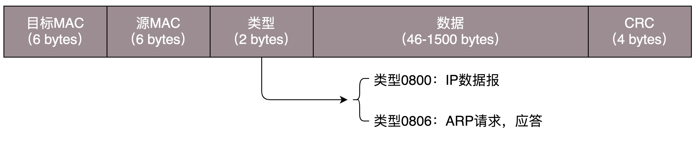

## 综述

<!-- markdownlint-disable MD010 -->
```shell
➜  ~ ip addr
lo0: flags=8049<UP,LOOPBACK,RUNNING,MULTICAST> mtu 16384
	inet 127.0.0.1/8 lo0
	inet6 ::1/128
	inet6 fe80::1/64 scopeid 0x1
en0: flags=8863<UP,BROADCAST,SMART,RUNNING,SIMPLEX,MULTICAST> mtu 1500
	ether 8c:85:90:77:6d:3e
	inet6 fe80::68:d69:29c8:e0d7/64 secured scopeid 0x5
	inet 192.168.123.60/24 brd 192.168.123.255 en0
awdl0: flags=8943<UP,BROADCAST,RUNNING,PROMISC,SIMPLEX,MULTICAST> mtu 1484
	ether ca:a3:19:17:0e:97
	inet6 fe80::c8a3:19ff:fe17:e97/64 scopeid 0xc
llw0: flags=8863<UP,BROADCAST,SMART,RUNNING,SIMPLEX,MULTICAST> mtu 1500
	ether ca:a3:19:17:0e:97
	inet6 fe80::c8a3:19ff:fe17:e97/64 scopeid 0xd
utun0: flags=8051<UP,POINTOPOINT,RUNNING,MULTICAST> mtu 1380
	inet6 fe80::37ec:d7f4:e2c9:3c4a/64 scopeid 0xe
utun1: flags=8051<UP,POINTOPOINT,RUNNING,MULTICAST> mtu 2000
	inet6 fe80::5a6a:38b7:31c8:3c41/64 scopeid 0xf
en7: flags=8863<UP,BROADCAST,SMART,RUNNING,SIMPLEX,MULTICAST> mtu 1500
	ether ac:de:48:00:11:22
	inet6 fe80::aede:48ff:fe00:1122/64 scopeid 0x4
```

### IPv4 分配 IP 过少怎样解决

无类型域间选路（CIDR），将 32 位的 IP 地址一分为二，前面是网络号，后面是主机号

`192.168.123.60/24` 24 指 32 位中，前 24 位是网络号，后 8 位是主机号

广播地址 `192.168.123.255`，如果发送这个地址，所有 192.168.123 网络里面的机器都可以收到

子网掩码 `255.255.255.0`

网络号 `192.168.123`，将子网掩码和 IP 地址按位计算 AND，就可得到网络号

### MAC 地址与 IP 地址区别

IP 是门牌号，有定位功能，MAC 是身份证，只在小范围内有定位功能，局限在一个子网里面

### 动态主机配置协议（DHCP）

16.158.23.6 与 192.168.1.6 通信：已知自己的 MAC，需要获取对方的 MAC 地址，如果是同一个网段，就发送 ARP 请求获取 MAC 地址，否则把包发送到网关

```shell
# net-tools
sudo ifconfig eth1 10.0.0.1/24
sudo ifconfig eth1 up
# iproute2
sudo ip addr add 10.0.0.1/24 dev eth1
sudo ip link set up eth1
```

手动配置 IP，真实情况是网管写配置文件（CIDR、子网掩码、广播地址和网关地址）

使用 DHCP，网管只需要配置一段共享的 IP 地址，每一台新接入的机器都通过 DHCP 协议，来这个共享的 IP 地址里申请，然后自动配置好就可以了。等人走了，或者用完了，还回去，这样其他的机器也能用

## 二层到三层

两台电脑可以使用 1－3、2－6 交叉接法互联，形成一个局域网（LAN），多个电脑可以使用集线器（Hub），集线器只在第一层物理层工作，会将自己收到的每一个字节，都复制到其他端口上去

此时就有几个问题：

### 数据链路层解决的问题

1. 包发给谁？谁该接收？
2. 大家都在发，会不会产生混乱？有没有谁先发、谁后发的规则？
3. 如果发送的时候出现了错误，怎么办？

就需要数据链路层解决



MAC 地址也叫物理地址、链路层地址，解决 `1.`；`2.` 叫多路访问，有很多算法可以解决，比如信道划分、轮流协议、随机接入协议；第二层的最后面是 CRC，循环冗余检测，通过 XOR 异或的算法，来计算发送过程中是否有错误，解决 `3.`

### ARP 协议

用来获取 MAC 地址，二层协议，发送一个广播包，对应 IP 的进行响应

为了避免每次都用 ARP 请求，机器本地也会进行 ARP 缓存。当然机器会不断地上线下线，IP 也可能会变，所以 ARP 的 MAC 地址缓存过一段时间就会过期

```shell
arp -a
```

### 交换机与集线器的不同

当有很多主机时，使用集线器是广播的，而且产生冲突的概率高了，可以使用交换器准确转发

A 发包给 B 时，经过交换机，交换机不知道 B 的口，只能转发给除了 A 之外的所有口，但是可以记住 A 的口，内部维持一个转发表（有过期时间），用的久了就可以实现准确转发

交换器是二层设备，集线器是一层设备

## 传输层

## 应用层

## 数据中心

## 云计算中的网络

## 容器中的网络

## 微服务

## 串讲
