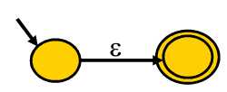
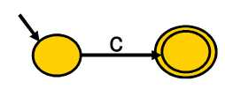
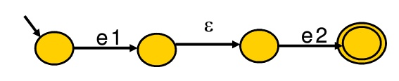
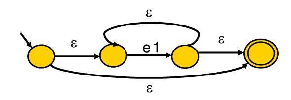
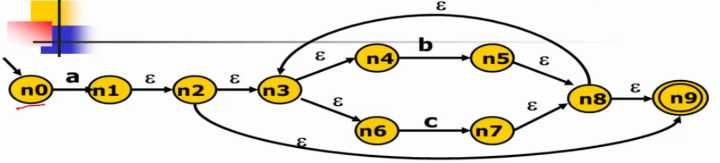
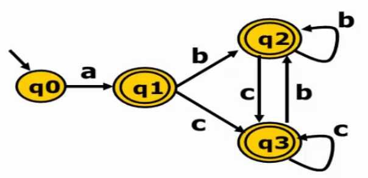
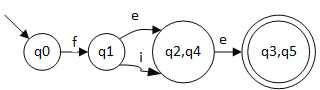

## 实现脚本语言

- 词法分析：把程序分割成一个个 Token 的过程，可以通过构造有限自动机来实现
- 语法分析：把程序的结构识别出来，并形成一棵便于由计算机处理的抽象语法树。可以用递归下降的算法来实现
- 语义分析：消除语义模糊，生成一些属性信息，让计算机能够依据这些信息生成目标代码

### 词法分析器

实现一个词法分析器，首先需要写出每个词法的正则表达式，并画出有限自动机，之后，只要用代码表示这种状态迁移过程就可以了

有限状态自动机 $M = (Σ, S, q_0, F, δ)$，分别是字符集、状态集、初始状态、终结状态（集）、转移函数

- 确定状态有限自动机 DFA：对任意字符，最多有一个状态可以转移，$F$ 是终结状态
- 非确定状态有限自动机 NFA：对任意字符，有多于一个状态可以转移，$F$ 是终结状态集

```text
   Thompson 算法      子集构造算法      Hopcraft 最小化算法
RE ------------> NFA ----------> DFA -----------------> 最小化 DFA ------> 词法分析器代码
```

#### RE -> NFA

- `e -> 𝛆`

- `e -> c`

- `e -> e1 e2`

- `e -> e1 | e2`

- `e -> e1*`


由上面构造 `a(b|c)*` 得



#### NFA -> DFA

```fakecode
// eps_closure 可用 BFS 或 DFS 实现
q0 <- eps_closure(n0)   // q0 = {n0}
Q <- {q0}       // Q = {q0}
workList <- q0     // workList = [q0, ...]
while(workList != [])   
  remove q from workList   // workList = [...]
  foreach(character c)     // c = a
    t <- e-closure(delta(q,c))   // delta(q0, a) = {n1}, t = {n1, n2, n3, n4, n6, n9}
    D[q,c] <- t    //   q1 = t
    if(t not in Q)    // Q = {q0, q1} , workList = [q1]
      add t to Q and workList
```

`a(b|c)*` 进行转换可得

`q1 = {n1, n2, n3, n4, n6, n9}`
`q2 = {n5, n8, n9, n3, n4, n6}`
`q3 = {n7, n8, n9, n3, n4, n6}`

图像：

Hopcraft 最小化算法将 DFA 转化为最小化 DFA

```fakecode
//基于等价类的思想
split(S)
  foreach(character c)
    if(c can split s)
      split s into T1, ..., Tk

hopcroft()
  split all nodes into N, A
  while(set is still changes)
    split(s)
```


先分为非终结状态 `N: {q0, q1, q2, q4}` 和终结状态 `A: {q3, q5}`，在 N 中 q0 和 q1 在接受 e 的条件下最终得到的状态还是在 N 的内部。所以可以将其根据 e 拆分成 `{q0, q1}`，`{q2, q4}`，`{q3, q5}`。q0 和 q1 ，在接受 e 的时候，q0 最终得到还是在 `{q0, q1}` 这个状态的结合中，q1 却会落在 `{q2, q4}` 的状态中，所以可以将 q0 和 q1 分为 `{q0}`，`{q1}`



### 语法分析器

#### 上下文无关文法

上下文无关文法 G 是一个四元组：$G = (T, N, P, S)$

- T 是终结符集合
- N 是非终结符集合
- P 是一组产生式规则集合
- S 是唯一的开始符号（非终结符，S ∈ N）

```text
E -> num
   | id
   | E + E
   | E * E

T = {num, id, +, *}
N = {E}
P = {E -> num, E -> id, E -> E + E, E -> E * E}
S = E
```

#### 推导

- 最左推导：每次总是选择最左侧的符号进行替换
- 最右推导：每次总是选择最右侧的符号进行替换

> 语法分析器的任务：语法分析器从记号流中获取句子 S，再接受使用上下文无关文法 G 描述的语言的语言规则，回答在 G 中是否存在对 S 的推导。是或者否。并给程序员反馈精确的出错信息

#### 分析树

- 推导可以表达成树状结构
  - 和推导所用的顺序无关（最左、最右、其它）
- 特点：
  - 树中的每个内部节点代表非终结符
  - 每个叶子节点代表终结符
  - 每一步推导代表如何从双亲节点生成它的直接孩子节点

```text
E -> num
   | id
   | E + E
   | E * E

推导 3 + 4 * 5

E -> E + E                  E
  -> 3 + E           E      +      E
  -> 3 + E * E       3          E  *  E
  -> 3 + 4 * e                  4     5
  -> 3 + 4 * 5

E -> E * E                     E
  -> E + E * E          E      *      E
  -> 3 + E * E       E  +  E          5
  -> 3 + 4 * E       3     4
  -> 3 + 4 * 5

得到两种树的结构，分析树的含义取决于树的**后序遍历**的顺序，所以第一个是先乘后加，第二个是先加后乘，导致二义性
```

#### 二义性文法

重写解决

```text
E -> E + T
   | T
T -> T * F
   | F
F -> num
   | id

推导 3 + 4 * 5 如下

E -> E + T                    E
  -> T + T             E      +      T
  -> F + T             T          T  *  F
  -> 3 + T             F          F     5
  -> 3 + T * F         3          4
  -> 3 + F * F
  -> 3 + 4 * F
  -> 3 + 4 * 5

推导 3 + 4 + 5 如下

E -> E + T                       E
  -> E + T + T            E      +      T
  -> T + T + T         E  +  T          F
  -> F + T + T         T     F          5
  -> 3 + T + T         F     4
  -> 3 + F + T         3
  -> 3 + 4 + T
  -> 3 + 4 + F
  -> 3 + 4 + 5

使用了左递归的方式（E -> E + T，T -> T * F ），从而使得该句子的计算顺序是 (3+4)+5，保证了加法的左结合性
```

#### 算法

- 回溯算法（自顶向下）
- 递归下降分析算法：O(n)，容易实现（方便手工编码），错误定位和诊断信息准确，GCC4、LLVM 使用

```text
S -> N V N
N -> s
   | t
   | g
   | w
V -> e
   | d

parse_S()
  parse_N()
  parse_V()
  parse_N()

parse_N()
  token = tokens[i++]
  if(token == s || token == t || token == g || token == w)
    return;
  error("...")

parse_V()
  token = tokens[i++]
  ... //
```

一般框架：

```text
X -> β11 ... β1i
   | β21 ... β2j
   | β31 ... β3k
   | ...

parse_X()
  token = nextToken()
  switch(token)
    case ...:  // β11 ... β1i
    case ...:  // β21 ... β2j
    case ...:  // β31 ... β3k
    ...
    default: error("...");
```

#### LL(1) 分析算法

从左（L）向右读入程序，最左（L）推导，采用一个（1）前看符号

与回溯算法不同的在于，又一个分析表进行优化，时间复杂度 O(n)

如何构造分析表就是关键，分别求出 NULLABLE 集合、FIRST 集合、FOLLOW 集合，然后推出 SELECT 集合，即预测分析表

- NULLABLE 集合

  ```fakecode
  NULLABLE = {}
  while (NULLABLE is still changing)
    for (production p: X -> β)
      if (β == 𝛆)
        NULLABLE ⋃= {X}
      if (β == Y1Y2...Yn)
        if (Y1 ∈ NULLABLE && ... && Yn ∈ NULLABLE)
          NULLABLE ⋃= {X}
  ```

- FIRST 集合

  ```fakecode
  for (noterminal N)
    FIRST(N) = {}

  while (some set is still changing)
    for (production p: N -> β1β2...βn)
      for (βi from β1 upto βn)
        if (βi == a)
          FIRST(N) ⋃= {a}
          break
        if (βi == M)
          FIRST(N) ⋃= FIRST(M)
          if (M is not in NULLABLE)
            break
  ```

- FOLLOW 集合

  ```fakecode
  for (noterminal N)
    FOLLOW(N) = {}

  while (some set is still changing)
    for (production p: N -> β1β2...βn)
      tmp = FOLLOW(N)
      for (βi from βn downto β1)
        if (βi == a)
          tmp = {a}
        if (βi == M)
          FOLLOW(M) ⋃= tmp
          if (M is not in NULLABLE)
            tmp = FIRST(M)
          else
            tmp ⋃= FIRST(M)
  ```

- SELECT 集合

  ```fakecode
  for (production p)
    SELECT(p) = {}

  for (production p: N -> β1β2...βn)
    for (βi from β1 upto βn)
      if (βi == a)
        SELECT(p) ⋃= {a}
        return
      if (βi == M)
        SELECT(p) ⋃= FIRST(M)
          if (M is not in NULLABLE)
            return
    SELECT(p) ⋃= FOLLOW(N)
  ```

例子：

```text
p0: Z -> d
p1:    | X Y Z
p2: Y -> c
p3:    | 𝛆
p4: X -> Y
p5:    | a

NULLABLE = {Y, X}

N\FIRST  0  1      2
Z        {} {d}    {d, c, a}
Y        {} {c}    {c}
X        {} {c, a} {c, a}

N\FOLLOW 0  1
Z        {} {}
Y        {} {d, c, a}
X        {} {d, c, a}

        p0   p1         p2   p3         p4         p5
SELECT  {d}  {d, c, a}  {c}  {d, c, a}  {d, c, a}  {a}

预测分析表
    a      c      d
Z   p1     p1     p0,p1
Y   p3     p2,p3  p3
X   p4,p5  p4     p4
```

得到的预测分析表有的会有多个，引起冲突，导致算法的不确定性

```text
p0: E  -> T E'
p1: E' -> + T E'
p2:     | 𝛆
p3: T  -> F T'
p4: T' -> * F T'
p5:     | 𝛆
p6: F  -> ( E )
p7:     | a

NULLABLE = {E', T'}

FIRST(E) = FIRST(T) = FIRST(F) = {(, a}
FIRST(E') = {+, 𝛆}
FIRST(T') = {*, 𝛆}

FOLLOW(E) = FOLLOW(E') = {), #}
FOLLOW(T) = FOLLOW(T') = {+, ), #}
FOLLOW(F) = {*, +, ), #}

预测分析表
   a    +    *    (    )    #
E  p0             p0
E'      p1             p2   p2
T  p3             p3
T'      p5   p4        p5   p5
F  p7             p6
```

#### 解决冲突

- 消除左递归

  ```text
  E -> E + T // 左递归情况下，E 能推导出 E 开头的，导致冲突
     | T

  // T + T + T ... + T，把 `+ T` 看作一体，重新构建成右递归的形式

  E -> T E'
  E' -> + T E'
  ```

- 提取左公因子

  ```text
  X -> a Y
     | a Z // 都是 a 开头，导致冲突

  X -> a X'
  X' -> Y
      | Z
  ```
