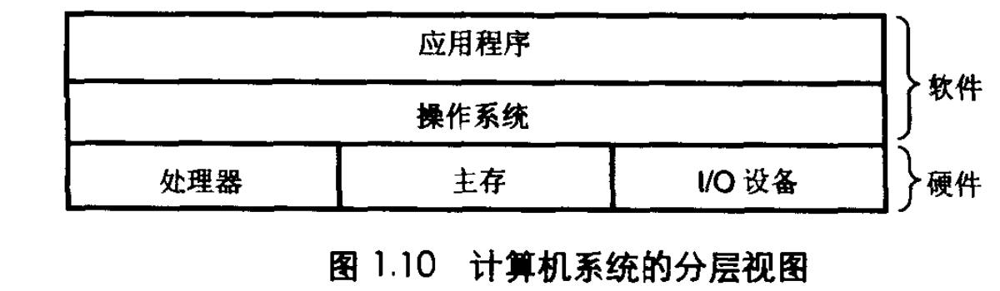
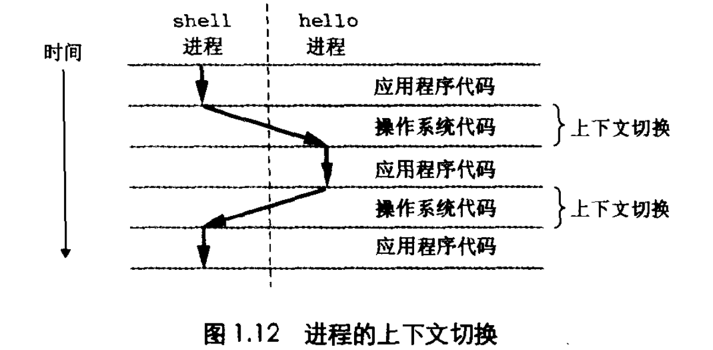
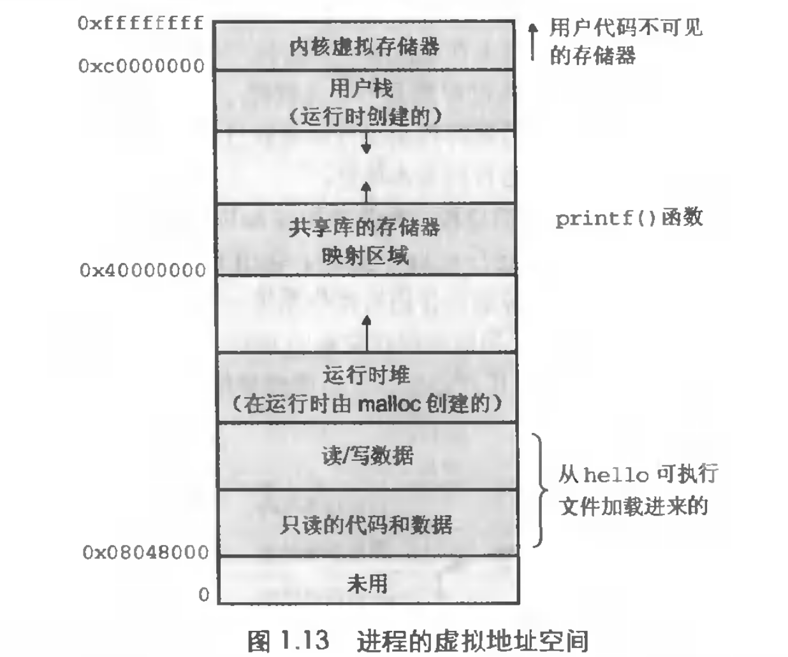

- 预处理：预处理器根据 `#include <stdio.h>` 直接读取 stdio.h 内容并插入到原来文件中

- 编译：编译器翻译成汇编语言程序，汇编每一条语句都对应一条机器指令

- 汇编：汇编器处理得到一个二进制文件，是机器指令

- 链接：比如程序调用 printf，printf 函数单独存在于 printf.o 预编译文件中，链接器将 printf.o 并入到 hello.o 中得到可执行文件，可执行文件加载到存储器后由系统执行

- 总线：携带信息字节并在各个部件中传递

- I/O 设备：通过一个控制器或适配器与 I/O 总线连接

- 主存：处理器执行程序中，被用来存放程序和程序处理的数据。物理上由一组 DRAM（动态随机存取存储器）芯片组成，逻辑上由一组线性的字节数组组成，每个字节都有自己的唯一地址，机器指令由不同长度的字节组成

- 处理器：执行存储在主存中指令的引擎，寄存器（PC）指向存储器读取指令，解释并执行，然后指向下一个指令

输入 ./hello 后，会把 hello 程序和数据从磁盘中拷贝到主存中，利用 DMA（直接存储器存取）数据可以不通过处理器直接从磁盘到达主存，之后寄存器依次执行指令

hello 程序运行式从磁盘拷贝到主存很慢，为了尽量得快出现了缓存，用于缓存近期可能用到的程序和数据，速度仅次于寄存器

程序通过 OS 访问处理器、主存、I/O 设备，OS 可以看成一层软件，所有程序都需要通过 OS 访问硬件

OS 功能：防止程序滥用硬件、封装硬件接口。文件是对 I/O 设备的抽象，虚拟存储器是对主存的抽象，进程是对处理器的抽象，OS 通过这些抽象实现功能

进程是不同的上下文进行切换，线程共享进程中的上下文

每个进程都有，好像每个进程都在单独的使用主存

- 代码和数据：一开始固定的

- 堆：运行时扩展收缩，malloc、free

- 共享库：存放 C 标准库和数学库等

- 栈：实现函数调用，动态

- 内核虚拟存储器：OS 总是驻留在存储器中的部分

文件就是字节序列，每一个 I/O 设备都可以看作文件，使得应用程序能够统一的看待系统中的 I/O 设备

网络也可被视为一个 I/O 设备
