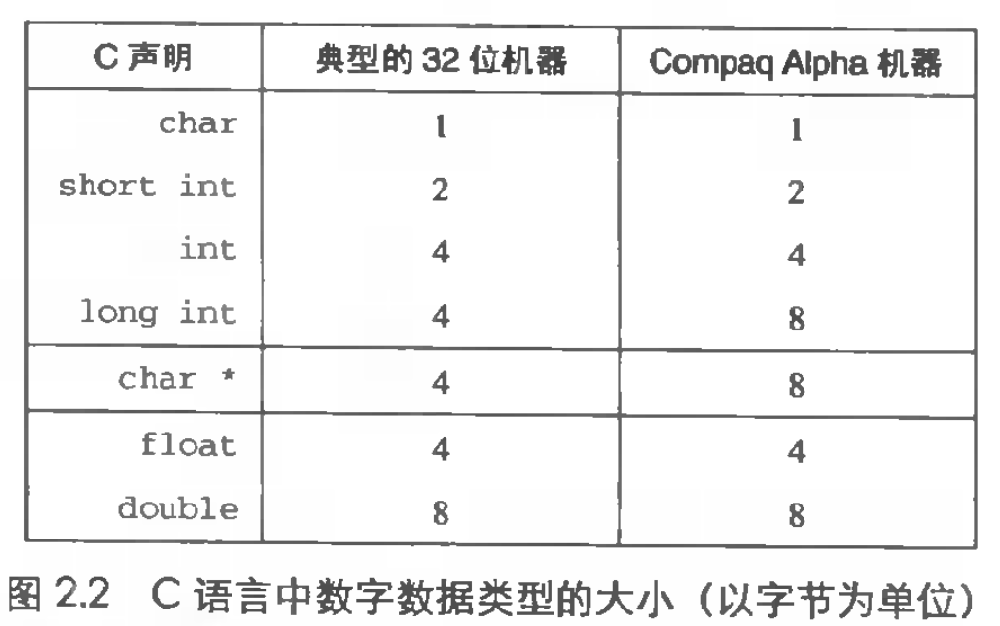
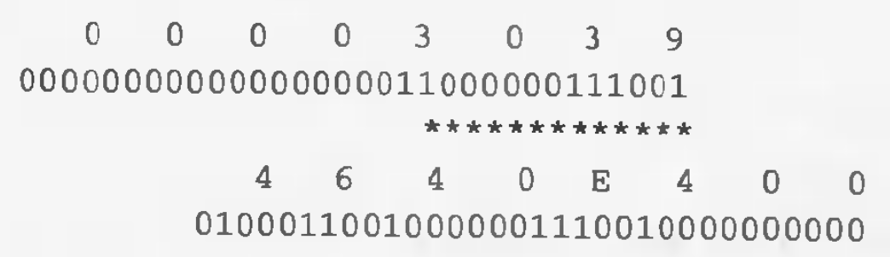
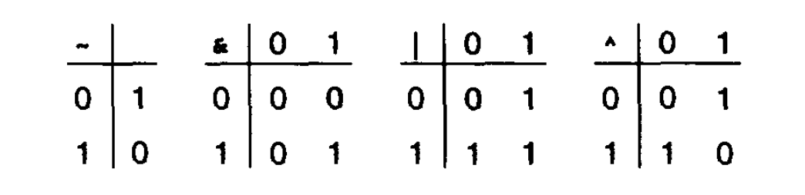
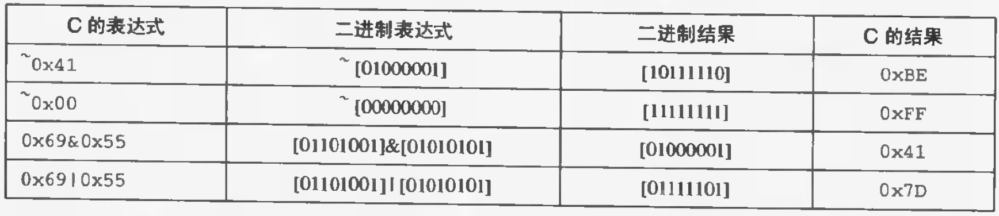
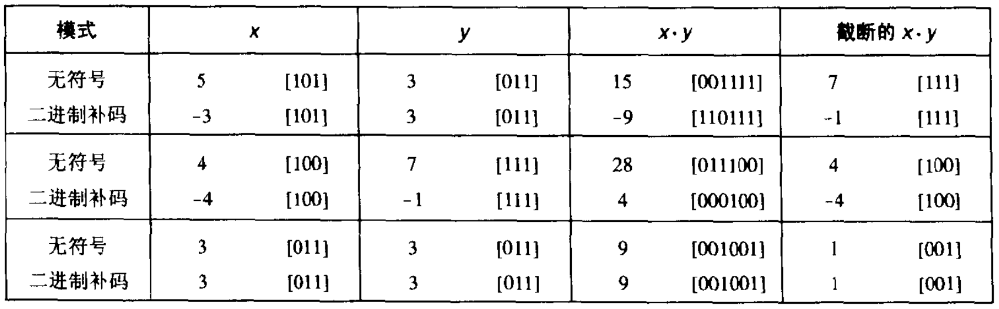
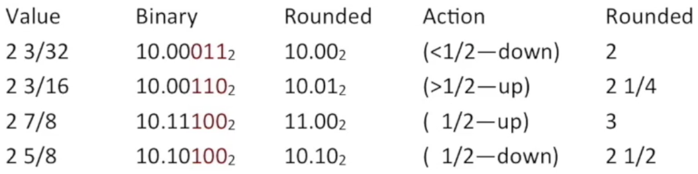

## 信息存储

位 bit：二进制数字

字节 byte：8 位的块

机器级程序视存储器为一个非常大的字节数组，称为虚拟存储器，下标就是地址，所有可能地址的集合就是虚拟地址空间，编译器和运行时将存储器分为可管理的单元，来存放程序对象（数据、指令、控制信息），对于不同单元的分配和管理在虚拟地址空间中完成

### 16 进制

```text
16 进制：0x 8    F    7    A    9    3
2 进制：    1000 1111 0111 1010 1001 0011
```

```text
16 进制：0x C    4    E    5    D
2 进制：    1100 0100 1110 0101 1101
```

```text
2 进制：    1011 0111 1001 1100
16 进制：0x B    7    9    C
```

```text
2 进制：    11 0101 1011 0111 1110 0110
16 进制：0x 3  5    B    7    E    6
```

16 进制的 0 代表 4 个 2 进制的 0，可以把 $x^n$ 中的 $n$ 写成 $i+4j$ 的形式，得到 $x$ 的 16 进制为：$2^i$ 后面跟 $j$ 个 0

| $n$ | $2^n$（十进制）| $2^n$（十六进制）|
|---|---|---|
| 11 | 2048 | 0x800（3 + 4 * 2）|
| 7 | 128 | 0x80（3 + 4 * 1）|
| 13 | 8129 | 0x2000（1 + 4 * 3）|

十进制转换为十六进制：`76 = 4 * 16 + 12(C), 4 = 0 * 16 + 4(4), 76 => 0x4C`

| 十进制 | 二进制 | 十六进制 |
|---|---|---|
| 243 | 11110011 | 0xF3 |
| 55 | 110111 | 37 |

### 字

字长：32 位、64 位，字长为 n 位的机器其虚拟地址范围是 $0$ ~ $2^n - 1$，程序最多访问 $2^n$ 字节，比如 32 位计算机虚拟地址空间为 $2^{32}=4*2^{30}=4GB$

### 数据大小



### 寻址和字节顺序

int 类型地址在 0x100，存 0x01234567：

```text
大端法: 0x100 0x101 0x102 0x103
        01    23    45    67

小端法: 0x100 0x101 0x102 0x103
(Intel) 67    45    23    01
```

```c:title=byte_pointer.c
#include <stdio.h>
#include <stdlib.h>

typedef unsigned char *byte_pointer; // 定义类型

void show_bytes(byte_pointer start, int len) {
 int i;
 for (i = 0; i < len; i++)
   printf(" %.2x", start[i]);
  printf("\n");
}

void show_int(int x) {
  show_bytes((byte_pointer) &x, sizeof(int));
}

void show_float(float x) {
  show_bytes((byte_pointer) &x, sizeof(float));
}

void show_pointer(void *x) {
  show_bytes((byte_pointer) &x, sizeof(void *));
}

int main(int argc, char *argv[]) { // argc 命令行参数个数，argv 命令行参数
  printf(" %s\n", argv[1]);

  int int_value = atoi(argv[1]); // char * 转 int
  float float_value = (float) int_value; // 强制类型转换
  int *pointer_value = &int_value;

  show_int(int_value);
  show_float(float_value);
  show_pointer(pointer_value);

  return 0;
}
```

```shell
$ gcc byte_pointer.c -o byte_pointer
$ byte_pointer 12345
 12345
 39 30 00 00
 00 e4 40 46
 7c 32 6d e2 fe 7f 00 00
```

int 12345 十六进制是 0x00003039，float 12345 表示为 0x4640E400，其中有 13 位相匹配



### 表示字符串

C 中字符串以 null（\0）结尾，ASCII 码中 0x00 表示 \0，十进制数字 n 由 0x3n 表示，A～Z 由 0x41～0x5A 表示，`man ascii` 可以得到 ASCII 表

```c
char *s = "ABCDEF";
show_bytes((byte_pointer) s, strlen(s));
// 41 42 43 44 45 46
```

> ASCII 只适用于编码英语，编码其他特殊字符和语言需要 Unicode

### 表示代码

代码会被编译生成字节表示的机器代码，程序仅仅是字节序列

### 布尔代数和环



| 运算 | 结果 |
|---|---|
| a | 01101001 |
| b | 01010101 |
| ~a | 10010110 |
| ~b | 10101010 |
| a&b | 01000001 |
| a\|b | 01111101 |
| a^b | 00111100 |

### C 中的位级运算



```c
void inplace_swap(int *x, int *y) {
  *x = *x ^ *y;
  *y = *x ^ *y; // *x ^ *y ^ *y == *x
  *x = *x ^ *y; // *x ^ *y ^ *x == *y
}
```

### C 中的逻辑运算

零表示 false，非零表示 true

### C 中的移位运算

逻辑移位：补 0

算数移位：补最高（低）有效位

通常是逻辑左移和算数右移

| x | x << 3 | x >> 2（逻辑）| x >> 2（算数）|
|---|---|---|---|
| 0xF0 - 11110000 | 0x80 - 10000000 | 0x3C - 00111100 | 0xFC - 11111100 |

## 整数表示

### 整型数据类型

char: -128 ~ 127
unsigned char: 0 ~ 255 ($2^8$, 1 bytes)
short: -32768 ~ 32767
unsigned short: 0 ~ 65535 ($2^{16}$, 2 bytes)
int: -2147483648 ~ 2147483647
unsigned int: 0 ~ 4294967295 ($2^{32}$, 4 bytes)
long: (4 bytes)
long long: (8 bytes)

### 无符号与补码

| x | 无符号 | 补码 |
|---|---|---|
| 0xA - 1010 | $2^3+2^1=10$ | $-2^3+2^1=6$ |
| 0x8 - 1000 | $2^3=8$ | $-2^3=-8$ |
| 0xF - 1111 | $2^3+2^2+2^1+2^0=15$ | $-2^3+2^2+2^1+2^0=-1$ |

原码：最高位表示符号 `6 - 0 000 0110` `-6 - 1 000 0110`

反码：正数同原码，负数除符号位取反 `-6 - 1 111 1001`

补码：计算机表示方式，正数同原码，负数取反码加一 `-6 - 1 111 1010`

### C 有符号数转无符号数

运算时会隐式的把有符号数转换为无符号数

### 截断数字

```c
int x = 53191;
short y = (short) x; // -12345
int z = y; // -12345
```

x 对应 0000 0000 0000 0000 1100 1111 1100 0111 截断成 1100 1111 1100 0111，符号位是 1 所以是负的，100 1111 1100 0111 是 12345 的补码（减一取反的原码）

## 整数运算

### 补码加法

会溢出

假定长度是 4 位

正溢出：7 + 5 = 0111 + 0011 = 1010 = -2

负溢出：-8 + -5 = 1000 + 1011 = 0011 = 3

### 补码的非

5 = 0101 取反 1010 = ($-2^3+1*2^1$) = -6 加一 1011 = -5

### 补码的乘法



### 乘以二的幂

一般操作可能溢出，位移不会，x << k == x * $2^k$

### 除以二的幂

负的不正确，-5 / 2 = 1011 >> 1 = 1101 = -3，所以 `(x < 0 ? (x + (1 << k) - 1) : x) >> k`，-5 / 2 = (-5 + (1 << 1) - 1) >> 1 = 1100 >> 1 = 1110 = -2

## 浮点

### 二进制小数

$12.34_{10}=1*10^1+2+10^0+3*10^{-1}+4*10^{-2}=12\frac{34}{100}$

$101.11_2=1*2^2+0*2^1+1*2^0+1*2^{-1}+1*2^{-2}=4+0+1+\frac{1}{2}+\frac{1}{4}=5\frac{3}{4}$

限制：只能表示 $x/2^k$，其他的需要无限循环；范围限制

### IEEE 浮点表示

$value=(-1)^s*M*2^E$

32 位 float：s 占 1 位，exp 占 k=8 位，frac 占 23 位

对应 double: exp 占 k=11 位，frac 占 52 位

Bias = $2^{k-1}-1$（32 位是 127，64 位是 1023）

规格化值：exp 不全为 0 或 1 时，$E = e（exp 表示的 10 进制数）- Bias, M = 1 - f（frac 表示的十进制数）$

非规格化值：exp 全为 0 或 1 时，$E = 1 - Bias，M = f$（提供非规格化值平滑转换为规格化值）

特殊数值：当 exp 全为 1 时，frac 全为 0 表示无穷，frac 非零表示 NaN

以下 8 位 k=4，Bias=7


### 舍入



## data lab

// TODO: data lab
