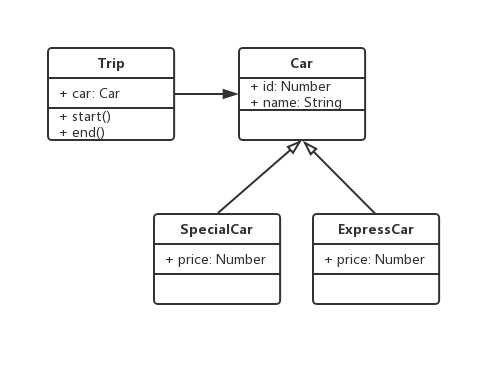

## 设计准则

`《UNIX/LINUX 设计哲学》`

* 小即是美

* 每一个程序只做好一件事

* 快速建立原型

* 舍弃高效率而取可移植性

* 采用纯文本来存储数据（可读性，不用二进制存）

* 充分利用软件的杠杆效应（软件复用）

* 使用 shell 脚本来提杠杆效应和可移植性

* 避免强制的用户界面

* 让每个程序都称为过滤器

* 允许用户定制环境

* 尽量使操作系统内核小而轻量化

* 使用小写字母并尽量简短

* 沉默是金（fail 时返回 0 或空）

* 各部分之和大于整体

* 寻求 90% 的解决方案

## 六大设计原则

### 单一职责原则（SRP）

* 一个程序只做好一件事

* 若果功能过于复杂就拆分开，每个部分保持独立

并不是所有的职责都应该一一分离。一方面，如果随着需求的变化，有两个职责总是同时变化，那就不必分离他们；另一方面，职责的变化轴线仅当它们确定会发生变化时才具有意义，即使两个职责已经被耦合在一起，但它们还没有发生改变的征兆，那么也许没有必要主动分离它们，在代码需要重构的时候再进行分离也不迟

我们未必要在任何时候都一成不变地遵守原则。在实际开发中，因为种种原因违反 SRP 的情况并不少见。比如 jQuery 的 attr 等方法，就是明显违反SRP原则的做法。jQuery 的 attr 是个非常庞大的方法，既负责赋值，又负责取值，这对于 jQuery 的维护者来说，会带来一些困难，但对于 jQuery 的用户来说，却简化了用户的使用在方便性与稳定性之间要有一些取舍。具体是选择方便性还是稳定性，并没有标准答案，而是要取决于具体的应用环境

优点：降低了单个类或者对象的复杂度，按照职责把对象分解成更小的粒度，这有助于代码的复用，也有利于进行单元测试。当一个职责需要变更的时候，不会影响到其他的职责。

缺点：增加编写代码的复杂度。当我们按照职责把对象分解成更小的粒度之后，实际上也增大了这些对象之间相互联系的难度

### 最少知识原则（LKP）

* 软件实体（类、对象、系统、模块、函数、变量……）应当尽可能少地与其他实体发生相互作用

* 尽量减少对象之间的交互

中介者模式、外观模式（定义了一个高层接口，这个接口使子系统更加容易使用）


优点：减少了对象之间的依赖

缺点：有可能增加一些庞大到难以维护的第三者对象

在实际开发中，是否选择让代码符合最少知识原则，要根据具体的环境来定

### 开放封闭原则（OCP）

* 软件实体（类、模块、函数……）应该是对扩展开放，但对修改封闭

* 增加需求时，扩展新代码，而非修改已有代码

* 这是软件设计的终极目标

AOP、FP

过多的条件分支语句是造成程序违反开放-封闭原则的一个常见原因。每当需要增加一个新的if语句时，都要被迫改动原函数，利用对象的**多态性**来让程序遵守开放-封闭原则，是一个常用的技巧：

```js
// const makeSound = function (animal) {
//   if (animal instanceof Duck) {
//     console.log('gagaga')
//   } else if (animal instanceof Chicken) {
//     console.log('gegege')
//   }
// }

const makeSound = function (animal) {
  animal.sound()
}

const chicken = {
  sound() {
    console.log('gegege')
  },
}

const duck = {
  sound() {
    console.log('gagaga')
  },
}
```

**封装变化**，可以把系统中稳定不变的部分和容易变化的部分隔离开来。在系统的演变过程中，我们只需要替换那些容易变化的部分，如果这些部分是已经被封装好的，那么替换起来也相对容易。而变化部分之外的就是稳定的部分。在系统的演变过程中，稳定的部分是不需要改变的

**放置挂钩（hook）**也是分离变化的一种方式。我们在程序有可能发生变化的地方放置一个挂钩，挂钩的返回结果决定了程序的下一步走向。这样一来，原本的代码执行路径上就出现了一个分叉路口，程序未来的执行方向被预埋下多种可能性。**回调函数**是一种特殊的挂钩。我们可以把一部分易于变化的逻辑封装在回调函数里，然后把回调函数当作参数传入一个稳定和封闭的函数中。当回调函数被执行的时候，程序就可以因为回调函数的内部逻辑不同，而产生不同的结果

让程序一开始就尽量遵守开放-封闭原则，并不是一件很容易的事情。一方面，我们需要尽快知道程序在哪些地方会发生变化，这要求我们有一些“未卜先知”的能力。另一方面，留给程序员的需求排期并不是无限的，所以我们可以说服自己去接受不合理的代码带来的第一次愚弄。在最初编写代码的时候，先假设变化永远不会发生，这有利于我们迅速完成需求。当变化发生并且对我们接下来的工作造成影响的时候，可以再回过头来封装这些变化的地方。然后确保我们不会掉进同一个坑里

### 里氏置换原则

* 子类能覆盖父类

* 父类能出现的地方子类就能出现

### 接口独立原则

* 保持接口的单一独立，避免出现“胖接口”

* 类似 S，关注于接口

### 依赖倒置原则

* 面对接口编程，依赖于抽象而不依赖于具体

* 使用方只关注接口而不关注具体类的实现

## 面向接口编程

1. 库或模块的 API

2. interface 关键字产生的完全抽象的类，专门负责类与类之间的联系

3. “面向接口编程”中的接口，更为抽象，接口是对象能响应的请求的集合

面向接口编程”也可以看成面向抽象编程，即针对超类型中的 abstract 方法编程，接口在这里被当成 abstract 方法中约定的契约行为。这些契约行为暴露了一个类或者对象能够做什么，但是不关心具体如何去做

interface 同样可以用于向上转型，这也是让对象表现出多态性的一条途径，实现了同一个接口的两个类就可以被相互替换使用

### JavaScript 是否需要抽象类和 interface

抽象类和interface的作用主要都是以下两点：

* 通过向上转型来隐藏对象的真正类型，以表现对象的多态性。

* 约定类与类之间的一些契约行为。

对于 JavaScript 而言，因为 JavaScript 是一门动态类型语言，类型本身在 JavaScript 中是一个相对模糊的概念。也就是说，不需要利用抽象类或者 interface 给对象进行“向上转型”。除了 number、string、boolean 等基本数据类型之外，其他的对象都可以被看成“天生”被“向上转型”成了 Object 类型

因为不需要进行向上转型，接口在 JavaScript 中的最大作用就退化到了检查代码的规范性。比如检查某个对象是否实现了某个方法，或者检查是否给函数传入了预期类型的参数。如果忽略了这两点，有可能会在代码中留下一些隐藏的 bug。比如我们尝试执行 obj 对象的 show 方法，但是 obj 对象本身却没有实现这个方法，或者 show 是 obj 的一个属性，此时我们不得不加一些防御性代码来进行判断

### 用鸭子类型进行接口检查

> 如果它走起路来像鸭子，叫起来也像鸭子，那么它就是鸭子

鸭子类型是动态类型语言面向对象设计中的一个重要概念。利用鸭子类型的思想，不必借助超类型的帮助，就能在动态类型语言中轻松地实现本章提到的设计原则：面向接口编程，而不是面向实现编程

## 23 种设计模式

将不变的部分和变化的部分隔开，进行封装

### 创建型

封装创建对象的变化

* 工厂模式（工厂方法模式、抽象工厂模式、建造者模式）

* 单例模式

* 原型模式

### 结构型

封装对象之间的组合关系

* 适配器模式

* 装饰器模式

* 代理模式

* 外观模式

* 桥接模式

* 组合模式

* 享元模式

### 行为型

封装对象的行为变化

* 策略模式

* 模版方法模式

* 观察之模式

* 迭代器模式

* 职责链模式

* 命令模式

* 备忘录模式

* 状态模式

* 访问者模式

* 中介者模式

* 解释器模式

## 面试题

画出 UML 类图，写出代码。

1. 打车时，可以打专车或者快车。任何车都有车牌号和名称。不同车价格不同，快车每公里 1 元，专车每公里 2 元。行程开始时，显示车辆信息，行程结束时，显示打车金额（假定行程就 5 公里）

* UML:



* JS:

```js
class Car {
  constructor(id, name) {
    this.id = id
    this.name = name
  }
}

class SpecialCar extends Car {
  constructor(id, name) {
    super(id, name)
    this.price = 1
  }
}

class ExpressCar extends Car {
  constructor(id, name) {
    super(id, name)
    this.price = 2
  }
}

class Trip {
  constructor(car) {
    this.car = car
  }

  start() {
    console.log(`行程开始，名称：${this.car.name}，车牌号：${this.car.id}`)
  }

  end() {
    console.log(`行程结束，金额${this.car.price * 5}`)
  }
}

// test
const car = new SpecialCar(100, 'lanb')
const trip = new Trip(car)
trip.start()
trip.end()
```

2. 某停车场，分 3 层，每层 100 车位。每个车位都能监控到车辆的驶入和离开。车辆进入前，显示每层的空余车位数量；车辆进入时，摄像头可识别车牌号和时间；车辆出来时，出口显示器显示车牌号和停车时长。

* UML：


