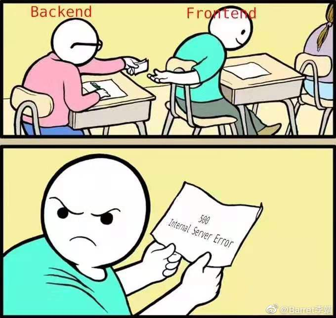

先思考几个问题：

1. 你们写的 TodoList 要怎样供别人访问使用？

    要放到服务器上，用户通过浏览器找到该网页（URL、搜索...）

2. 那我们在浏览器中输入 TodoList 的 URL 然后回车到页面加载完成发生了什么呢？

    简单回答：

    1. 浏览器接收 URL，解析后开启网络请求线程

    2. DNS 查询得到 IP，三次握手建立 TCP 连接，发送 HTTP 请求报文

    3. 服务器处理请求并返回 HTTP 响应报文

    4. 浏览器根据返回内容**开始**解析渲染页面

        [浏览器如何渲染 HTML & CSS？](http://layout.imweb.io/article/how-to-render.html)

    5. 四次挥手断开 TCP 连接

    以上的回答非常简单，扩展来讲可以说很多，比如：浏览器的进程线程、DNS 缓存、HTTP 缓存、浏览器怎样执行 JS、回流重绘...

    [一篇文章](https://segmentfault.com/a/1190000013662126)、[又一篇文章](https://mp.weixin.qq.com/s?__biz=MzI5MjUxNjA4Mw==&mid=2247485526&idx=1&sn=f8f74a63253a656e10284ff3deeaf5b1&chksm=ec0171cadb76f8dc78473c2362a6671ce18ef6d1c6e56446b987a60f5f74a892aada67fa8523&mpshare=1&scene=23&srcid&sharer_sharetime=1573088121785&sharer_shareid=ff850364fdc08ae532955239c841ceda%23rd)

3. 你们现在切图做的（静态）网页与微博这种网页有什么区别？

    微博是动态的，网页中的数据通过网络请求向后端获取，同时有些数据要上传给后端

    而现在做的静态页面是没有数据的

4. 那我们前端主要通过什么技术从后端获取那些动态的数据？

    AJAX

## URL

### URL 组成

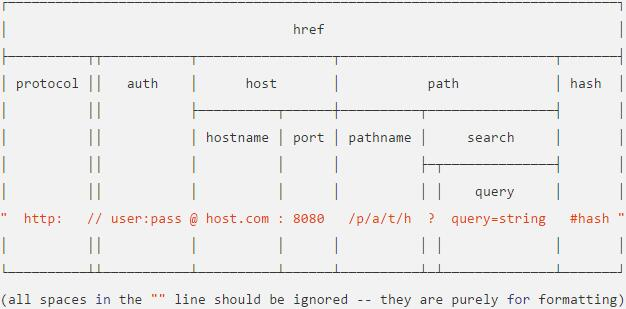

* protocol 协议，常用的协议是 http、https、ftp、ws

* hostname 主机地址，可以是域名，也可以是 IP 地址

* port 端口，http 协议默认端口是 80 端口，如果不写默认就是 80 端口

* path 路径，网络资源在服务器中的指定路径

* query 查询字符串，如果需要从服务器那里查询内容，在这里编辑

* hash 片段，网页中可能会分为不同的片段，如果想访问网页后直接到达指定位置，可以在这部分设置

### URL 和 URI 的区别

URI（Uniform Resource Identifier）是统一资源标识符，而 URL（Uniform Resource Locator）是统一资源定位符，我们可以把 URL 理解为是找到 URI 的一个方法，而另一种方法是 URN。

## 简单说下 HTTP

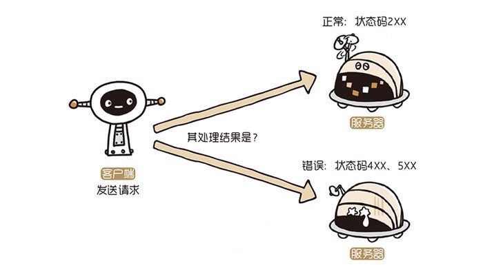

HTTP协议（HyperText Transfer Protocol，超文本传输协议）是因特网上应用最为广泛的一种网络传输协议，所有的WWW文件都必须遵守这个**标准**。

### 方法

* **GET：获取资源**

* **POST：传输实体主体，主要目的是传输**

* PUT：传输文件，保存到指定的位置

* HEAD：获得报文首部

* DELETE：删除文件

* OPTIONS：查询支持的方法

* TRACE：追踪路径

* CONNECT：要求使用隧道协议连接代理

### 常见状态码

* 2XX 成功

  * 200 OK：请求成功

  * 204 No Content：请求处理成功，但没有资源可返回

* 3XX 重定向

  * 301 Moved Permanently：永久重定向

  * 302 Found：临时重定向

  * 304 Not Modified：服务端资源未改变，可使用缓存（和重定向无关）

* 4XX 客户端错误

  * 400 Bad Request：请求报文语法错误

  * 401 Unauthorized：请求需认证

  * 403 Forbidden：不允许访问资源

  * 404 Not Found：服务器无请求资源

* 5XX 服务器错误

  * 500 Internal Server Error：服务器端在执行请求时发生错误

  * 503 Service Unavaiable：服务器超负载

### HTTP 报文

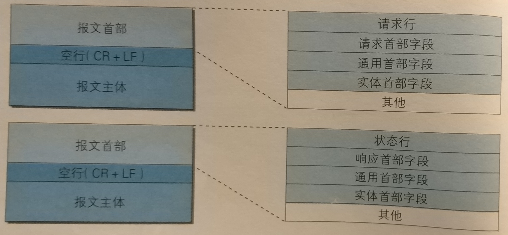

GET 请求示例：

```http
GET /search?hl=zh-CN&source=hp&q=domety HTTP/1.1
Accept: image/gif, image/x-xbitmap, image/jpeg, image/pjpeg, application/vnd.ms-excel, application/vnd.ms-powerpoint, application/msword, application/x-silverlight, application/x-shockwave-flash, */*
Referer: http://www.google.com/
Accept-Language: zh-cn
Accept-Encoding: gzip, deflate
User-Agent: Mozilla/4.0 (compatible; MSIE 6.0; Windows NT 5.1; SV1; .NET CLR 2.0.50727; TheWorld)
Host: www.google.com
Connection: Keep-Alive
Cookie: PREF=ID=80a06da87be9ae3c:U=f7167333e2c3b714:NW=1:TM=1261551909:LM=1261551917:S=ybYcq2wpfefs4V9g;NID=31=ojj8d-IygaEtSxLgaJmqSjVhCspkviJrB6omjamNrSm8lZhKy_yMfO2M4QMRKcH1g0iQv9u-2hfBW7bUFwVh7pGaRUb0RnHcJU37y-FxlRugatx63JLv7CWMD6UB_O_r
```

POST 请求示例：

```http
POST /search HTTP/1.1  
Accept: image/gif, image/x-xbitmap, image/jpeg, image/pjpeg, application/vnd.ms-excel, application/vnd.ms-powerpoint, application/msword, application/x-silverlight, application/x-shockwave-flash, */*  
Referer: http://www.google.com/
Accept-Language: zh-cn  
Accept-Encoding: gzip, deflate  
User-Agent: Mozilla/4.0 (compatible; MSIE 6.0; Windows NT 5.1; SV1; .NET CLR 2.0.50727; TheWorld)  
Host: www.google.com
Connection: Keep-Alive  
Cookie: PREF=ID=80a06da87be9ae3c:U=f7167333e2c3b714:NW=1:TM=1261551909:LM=1261551917:S=ybYcq2wpfefs4V9g; NID=31=ojj8d-IygaEtSxLgaJmqSjVhCspkviJrB6omjamNrSm8lZhKy_yMfO2M4QMRKcH1g0iQv9u-2hfBW7bUFwVh7pGaRUb0RnHcJU37y-FxlRugatx63JLv7CWMD6UB_O_r  
  
hl=zh-CN&source=hp&q=domety  
```

响应示例：

```http
HTTP/1.1 200 OK
Date: Sat, 31 Dec 2005 23:59:59 GMT
Content-Type: text/html;charset=ISO-8859-1
Content-Length: 122
  
＜html＞
＜head＞
＜title＞Wrox Homepage＜/title＞
＜/head＞
＜body＞
＜!-- body goes here --＞
＜/body＞
＜/html＞
```

### HTTP 协议是无状态的

HTTP 协议是无状态的，它不对之前发生过的请求和响应的状态进行管理

由于不必保证状态，自然可以减少服务器的 CPU 及内存资源消耗，也正是因为 HTTP 协议本身非常简单，所以才会被应用到各种场景

那么假设要求登录认证的 Web 页面，如果无法进行状态管理（不能记录已登录的状态），那么每次跳转到新页面就要再次登录，为了解决类似的问题又保留无状态的机制，于是引入了 Cookie

Cookie 会根据服务器端发送的响应报文内的一个叫 Set-Cookie 的首部字段信息，通知客户端保存 Cookie，当下次客户端再向该服务器发送请求时，客户端会自动在请求报文中加入 Cookie 值后发送出去

## AJAX

### AJAX 解决的问题

我们先来随便看个页面，会发现这个页面再点击时并没有整个页面全都刷新，而是只有数据改变的相对应的部分发生了刷新（局部刷新），这就是应用 AJAX 实现的

在很久以前是没有 AJAX 这项技术的，那时网页想要和服务器通信，最常用的方式是使用 form 表单；用户提交表单后，浏览器就开始跳转，服务器接收表单并处理，然后将新的网页整个返回给浏览器；页面全部刷新一遍，整个过程用户都只有等待，用户之前的操作状态会丢失，并且服务器返回的新网页常常和之前网页的大部分内容相同，浪费带宽

就举个 🌰：

bilibili 的动态鼠标晃上去会显示出一个 tab

* 使用 AJAX：

    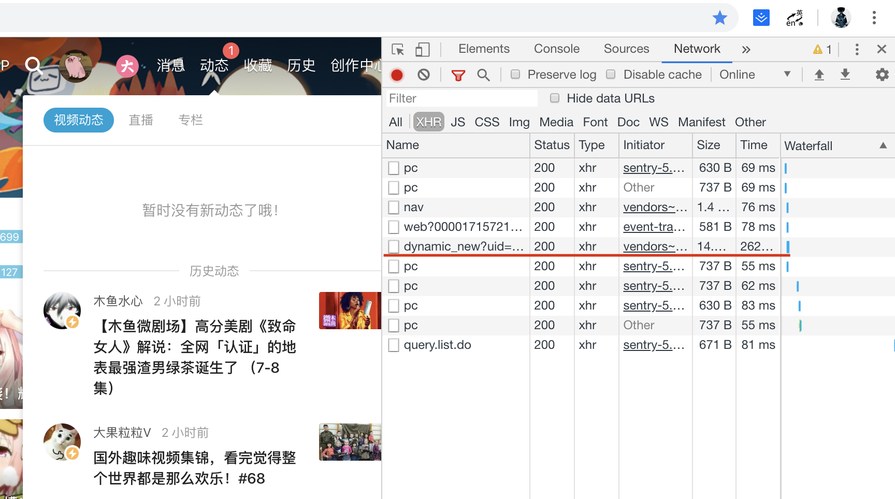

    晃上去之后会发现 Network 多了几个 XHR 请求，这就是通过 AJAX 发出的，接收到响应，将响应回来的数据插入到 tab 中

    看看响应的数据：

    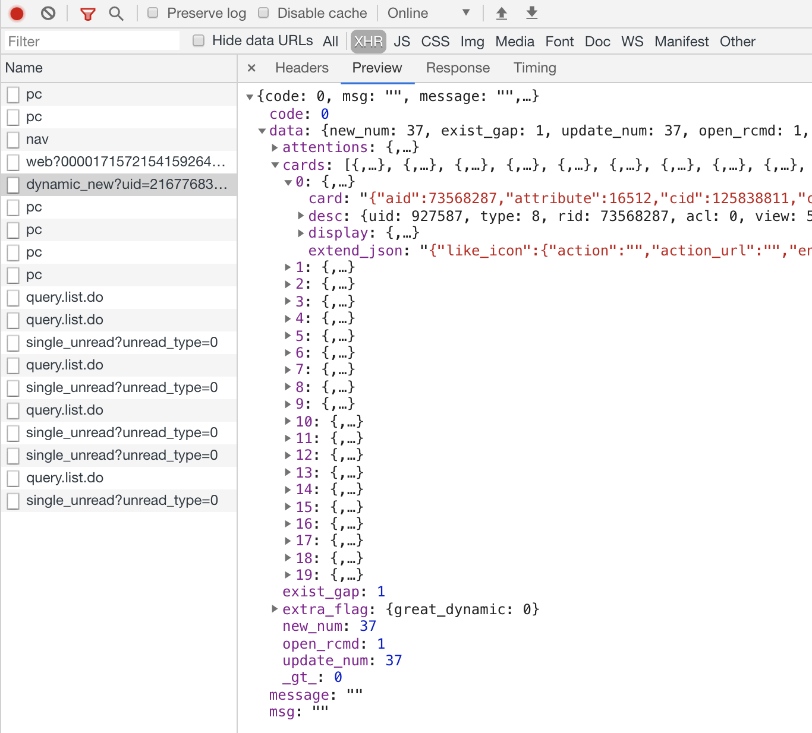

* 以前没有 AJAX 时：

    这是由服务器返回的最初的页面：

    ```html
    <!DOCTYPE html>
    <html lang="en">
    <head>
      <title>bilibili</title>
    </head>
    <body>
      <!-- lots of html -->
      <a href="/t.bilibili">动态</a>
      <!-- lots of html -->
    </body>
    </html>
    ```

    晃上去……

    服务器返回新的页面：

    ```html
    <!DOCTYPE html>
    <html lang="en">
    <head>
      <title>bilibili</title>
    </head>
    <body>
      <!-- lots of html -->
      <a href="/t.bilibili">动态</a>
      <div class="header__nav--dynamic-tab">
        <!-- dynamic tab contents -->
      </div>
      <!-- lots of html -->
    </body>
    </html>
    ```

    只是比之前多了一个显示动态的 tab 的 HTML，却要让服务器把整个页面的 HTML 计算出来，返回给浏览器，然后整个页面都刷新一遍……

所以，直白地说，就是没用 AJAX 的网页，你点一个按钮就要刷新一下页面，尽管新页面上只有一行字和当前页面不一样，但你还是要无聊地等待页面刷新。

用了 AJAX 之后，你点击，然后页面上的一行字就变化了，页面本身不用刷新

AJAX 也推进了前后端的分离（以前利用后端语言提供的模板引擎生成 HTML 页面，再经服务器返回到客户端浏览器中。而浏览器就只需要解析这些代码就行了。如：PHP 语言的模板引擎与 Thinkphp 框架、Java 语言的 JSP）

### AJAX 是什么

AJAX 即“Asynchronous JavaScript And XML”（异步 JavaScript 和 XML），是指一种创建交互式网页应用的网页开发技术。AJAX 不是一种新的编程语言，而是使用现有标准的新方法。**AJAX 可以在不重新加载整个页面的情况下，与服务器交换数据**。这种异步交互的方式，使用户单击后，不必刷新页面也能获取新数据。使用 AJAX，用户可以创建接近本地桌面应用的直接、高可用、更丰富、更动态的Web用户界面

这里有几个点：

* Asynchronous 异步

* XML

* 与服务器交换数据

* 资源共享

之后再提

### 使用 AJAX

浏览器为我们提供了 XMLHttpRequest 对象（低版本 IE 使用 ActiveXObject 对象，IE 爪巴），让我们能够方便地使用 Ajax

先示例化一个 XMLHttpRequest 对象，让我们简单看看这个对象都有什么方法和属性

```js
// new（实例化）一个对象
// 浏览器里调试推荐用 var 来声明，更方便
const request = new XMLHttpRequest()
console.log(request)
```

先看实例上的：

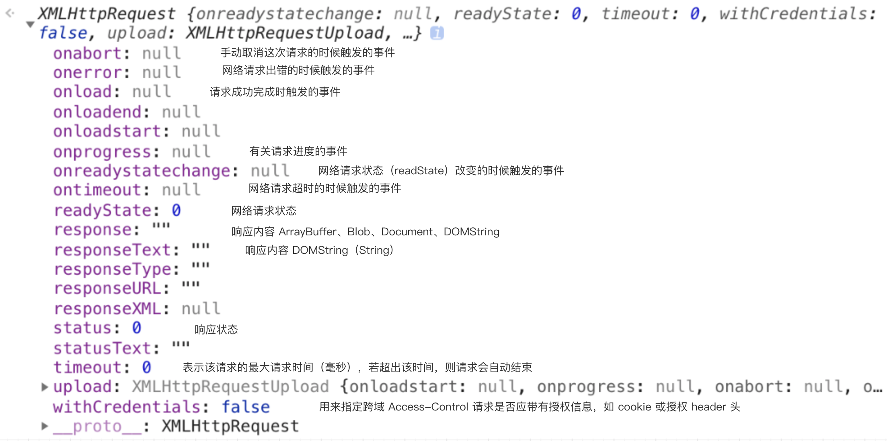

再看看原型上的：

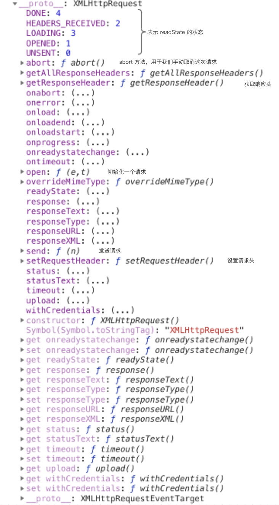

> 复习下原型：XMLHttpRequest.prototype.\_\_proto__ === XMLHttpRequestEventTarget，看这个 EventTarget 就能猜到它的原型是 EventTarget，像上面教的一样看看 EventTarget 上的属性和方法，发现了什么？懂了吧，再随便找个 DOM 往上找，懂了吧 :)

然后我们一步一步写一下

#### 1. 初始化 request

我们获取知乎热榜的信息

在知乎用 Network 面板很容易就能找到接口

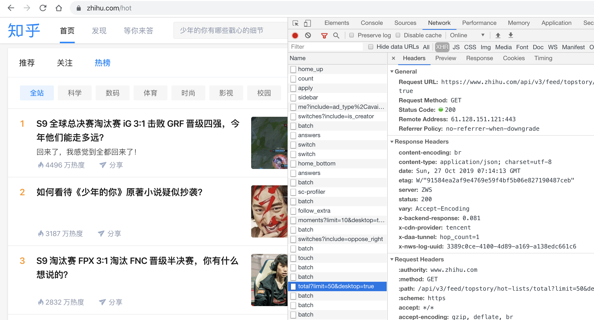

我们找到的完整 URL：https://www.zhihu.com/api/v3/feed/topstory/hot-lists/total?limit=50&desktop=true

可以简单整理出这样的接口：

API：https://www.zhihu.com/api/v3/feed/topstory/hot-lists/total

| 参数名 | 类型 | 说明 |
|---|---|---|
|limit|number|限制个数|
|desktop|bool|是否为桌面端|

我们在与后端合作时，一般要先和后端商量好接口，然后会整理出一份类似这样的文档，我们只需要照着文档的要求调接口就行

先用 open 初始化

```js
const API = 'https://www.zhihu.com/api/v3/feed/topstory/hot-lists/total'
const request = new XMLHttpRequest()
// (method: string, url: string, isAsync = true): void
// 第三个参数是否异步，默认是 true
request.open('GET', API, true)
```

#### 2. 写好需要的回调函数

[我们又多了一个问题：啥是 callback？](https://codeburst.io/javascript-what-the-heck-is-a-callback-aba4da2deced)

可以直接写 onreadystatechange，也可以用 addEventListener

```js
request.onreadystatechange = function () {
  if (request.readyState === 4) {
    if (request.status === 200) {
      const json = JSON.parse(request.responseText)
      // 这里我们只是把它打印出来
      // 一般我们要根据拿到的对象把响应的数据动态插入到页面中
      // （用 DOM 的一些方法：innerHTML、innerText……）
      console.log(json)
      console.log(request.responseText)
      console.log('请求成功')
    } else {
      console.log('请求错误')
    }
  }
}
```

因为响应给我们的是字符串（JSON），我们用 `JSON.parse` 来把响应的字符串解析成对象，用 `JSON.stringify` 来将一个对象序列化成字符串

这里只写了成功时的回调，如果有 error、timeout…… 的需求也要把相应的回调函数写好

#### 3. 发送请求

send 方法，发送 GET 请求

```js
request.send()
```

## 之前说的那几个问题

### 异步

说起异步，就要先说说 JavaScript 运行机制。我们知道，JavaScript 是**单线程**执行的，意味着同一个时间点，只有一个任务在运行。单线程就意味着，所有任务需要排队，前一个任务结束，才会执行后一个任务。如果前一个任务耗时很长，后一个任务就不得不一直等着。

> JavaScript 为什么设计成单线程？

#### 如果没有异步……

如果没有异步，用户在发网络请求的时候，就必须等待请求响应结束，然后才能继续在页面上进行操作，等待期间页面卡住，什么都不能干…… 其他的异步也是同理，比如 addEventListener、setTimeout、setInterval、Promise……

#### [异步的实现](https://segmentfault.com/a/1190000012925872)

任务队列、事件循环、Web API

目前可以先简单理解为有一个任务队列（先入先出），当我们触发一个点击事件时，会把该事件的回调函数放到任务队列中，等 JS 线程空闲后，在将任务队列中的任务一次出队执行

#### AJAX 中的异步

> callback：
>
> 在 JavaScript 中，函数是一等（普通）公民（函数也是对象），因此函数可以做为另一个函数的返回值或参数，当 A 函数作为 B 函数的参数时，A 就是回调函数（callback）
>
> callback 不一定用于异步，一般同步(阻塞)的场景下也经常用到回调，比如要求执行某些操作后执行回调函数
>
> ```js
> button.addEventListener('click', e => {
>   // some codes
> })
>
> function doAfter(task, after) {
>   task()
>   after()
> }
> ```
>
> 其中 e => {} 就是一个回调函数，task、after 也是
>
> > 当 A 函数作为 B 函数的返回值时，B 叫什么呢？
>
> > 为啥 JavaScript 需要 callback？（解决的问题）

在 XMLHttpRequest 在连接后是通过浏览器新开一个线程（异步 http 请求线程）请求

将检测到状态变更时，异步线程就产生状态变更**事件**，如果设置有回调函数，则将这个回调放入事件队列中。再由 JavaScript 引擎执行

### XML？JSON？

XML 可扩展标记语言（英语：Extensible Markup Language，简称：XML）被设计用来**传输**和存储数据

JSON 是一个轻量级的数据格式 ，不是一种编程语言。JSON 是一个 JavaScript 的严格的子集，利用 JavaScript 中一些模式来表示结构化数据

仅对传输数据来说：

* JSON 相对于 XML 而言，数据体积小，传递的速度快

* JSON 与 JavaScript 的交互更加方便，更容易解析处理

所以我们现在一般用 JSON（AJAJ？）

```js
// ...
const json = JSON.parse(request.responseText)
console.log(json)
console.log(request.responseText)

const str = JSON.stringify(json)
console.log(str)
```

当然我们也可以用其他的格式，比如 HTML，设置好请求头（'Content-Type': 'text/html'），然后后端返回给你一段 HTML，你直接修改要改变位置的 innerHTML 也不是不可以，但这样有很多缺点：

* 后端需要处理 HTML，这应该前端干

* 返回的 HTML 有很多除数据外的冗杂内容，标签、CSS 类名……

* 体积没 JSON 小，资源浪费

* ……

### 交换数据

我们用 GET 请求时，所带数据只能放在 URL 上，按照约定参数的写法（只要后端能够解释出来就行），发给后端

常见：

1. `http://api.xxx.com/user?name=ahab&age=18`

2. `http://api.xxx.com/user/name/ahab/age/18`

我们知道 HTTP 请求方式不止 GET……

我们来看看 POST 请求：

POST 在语义上是传输实体主体，GET 是获取资源

POST 常用与提交表单等

```js
request.open('POST', POSTAPI)
request.setRequestHeader('Content-Type', 'application/x-www-form-urlencoded')
// 这样就将数据放在了请求体（request body）中
request.send('name=hzh&age=18&nb=true')
```

或者其他格式, 类似 multipart/form-data、application/json 等，只要设置好请求头的相应的 Content-Type

#### GET 和 POST 有什么区别？

先甩一手“真 · 标准”答案：

|分类|GET|POST|
|---|---|---|
|后退按钮/刷新|无害|数据会被重新提交（浏览器应该告知用户数据会被重新提交）|
|书签|可收藏为书签|不可收藏为书签|
|缓存|能被缓存|不能缓存|
|编码类型|application/x-www-form-urlencoded|application/x-www-form-urlencoded 或 multipart/form-data。为二进制数据使用多重编码。|
|历史|参数保留在浏览器历史中。|参数不会保存在浏览器历史中。|
|对数据长度的限制|是的。当发送数据时，GET 方法向 URL 添加数据；URL 的长度是受限制的（URL 的最大长度是 2048 个字符）。|无限制。|
|对数据类型的限制|只允许 ASCII 字符。|没有限制。也允许二进制数据。|
|安全性|与 POST 相比，GET 的安全性较差，因为所发送的数据是 URL 的一部分。在发送密码或其他敏感信息时绝不要使用 GET|POST 比 GET 更安全，因为参数不会被保存在浏览器历史或 web 服务器日志中。|
|可见性|数据在 URL 中对所有人都是可见的。|数据不会显示在 URL 中。|

而实际上，标准这样定义，浏览器就严格实现了吗？

[GET 和 POST 方法没有实质区别，只是报文格式不同](https://segmentfault.com/a/1190000018129846)

两种方法本质上是 TCP 连接，没有差别，也就是说，如果我不按规范来也是可以的。我们可以在 URL 上写参数，然后方法使用 POST；也可以在请求体写参数，然后方法使用 GET。当然，这需要服务端支持

### 跨域

我们在其他页面（与知乎不同域）调刚才知乎热榜那个接口，就会出现跨域问题

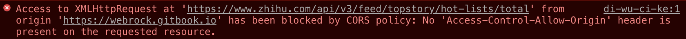

**协议，域名，端口**相同，视为同一个域，一个域内的脚本仅仅具有本域内的权限，可以理解为本域脚本只能读写本域内的资源，而无法访问其它域的资源。这种安全限制称为同源策略。**浏览器的同源策略**保证了资源的隔离。一个网站的脚本只能访问自己的资源，就像操作系统里进程不能访问另一个进程的资源一样

如果没有浏览器的同源策略，你在网站浏览，跳转其他网页，然后这个网页就可以跨域读取你网站中的信息，这样整个Web世界就无隐私可言了。这就是同源策略的重要性，它限制了这些行为。

通俗的讲，浏览器有一个很重要的安全机制，即为同源策略：不同域的客户端脚本在无明确授权的情况下不能读取对方资源，跨域也就是不同源。

#### 解决跨域的方法

同源策略是**浏览器**的，**浏览器**通过同源策略限制了我们读取不同域的资源

我们在另一个域的页面向知乎发请求

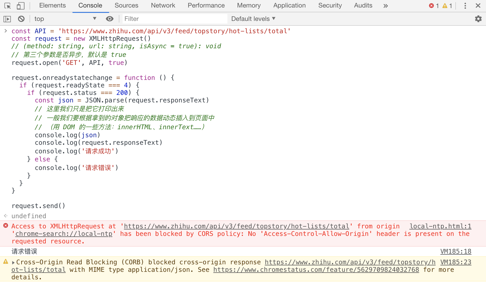

报错了吧，CORS 跨域的报错，但是我们看 Network 面板，会发现这个请求是成功的（200）

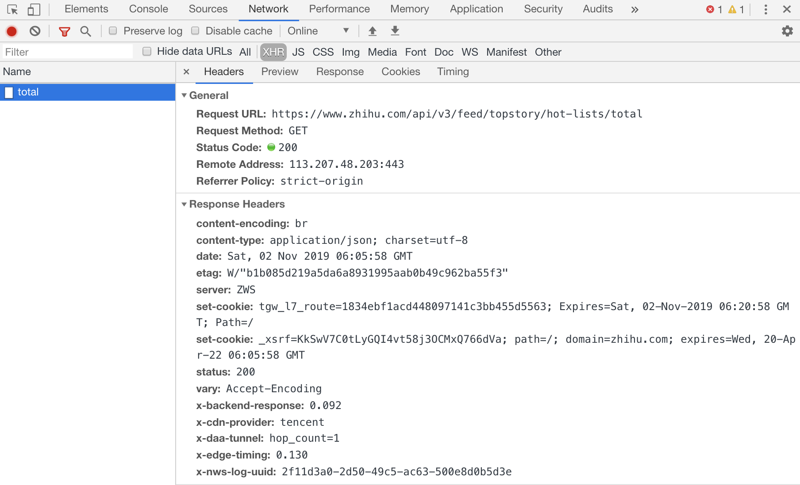

我们可以收到服务器的响应，所以同源策略并不是服务器限制我们的，而是浏览器

所以基本上有三种思路解决跨域：

1. 绕过浏览器的同源策略

    * 使用 Nginx 反向代理

    * Node 中间件代理

2. 告诉浏览器这个跨域允许

    * CORS

3. 使用没有跨域限制的方式

    * JSONP

    * postMessage

    * WebSocket

##### JSONP

实现原理：利用 `<script>`、`` 等标签没有跨域限制，网页可以得到从其他来源动态产生的 JSON 数据。JSONP请求一定需要对方的服务器做支持才可以

1. 声明一个回调函数，其函数名（如 show）当做参数值，要传递给跨域请求数据的服务器，函数形参为要获取目标数据(服务器返回的data)。

    ```js
    function show(data) {
      // some codes to handle data
    }
    ```

2. 创建一个标签，把那个跨域的 API 数据接口地址，赋值给该标签的 src，还要在这个地址中向服务器传递该函数名（可以通过问号传参：?callback=show）。

    ```js
    const script = document.createElement('script')
    script.src = 'http://api.xxx.com?name=LJ&callback=show'

    const head = document.querySelector('head')
    head.appendChild(script)
    ```

3. 服务器接收到请求后，需要进行特殊的处理：把传递进来的函数名和它需要给你的数据拼接成一个字符串

    ```json
    // 返回 JSON 的 🌰
    show({
      "name": "LJ",
      "age": 6
    })
    ```

4. 最后服务器把准备的数据通过 HTTP 协议返回给客户端，客户端再调用执行之前声明的回调函数（show），对返回的数据进行操作。

    最终页面内容：

    ```html
    <html>
    <head>
      <title>JSONP 🌰</title>
      <!-- 动态添加的 -->
      <script src="http://api.xxx.com?name=LJ&callback=show"></script>
      <!--
      上面那行等同于这样：
      <script>
        show({
          "name": "LJ",
          "age": 6
        })
      </script>
      -->
    </head>
    <body>
      <!-- lots of html -->
    <script>
    function show(data) {
      // some codes to handle data
    }

    const script = document.createElement('script')
    script.src = 'http://api.xxx.com?name=LJ&callback=show'

    const head = document.querySelector('head')
    head.appendChild(script)
    </script>
    </body>
    </html>
    ```

    懂了吧，一目了然

JSONP 优点是简单兼容性好，可用于解决主流浏览器的跨域数据访问的问题。缺点是仅支持 GET 方法具有局限性，不安全可能会遭受 XSS 攻击

##### CORS

实现 CORS 通信的关键是后端。只要后端实现了 CORS，就实现了跨域。

服务端设置 `Access-Control-Allow-Origin` 就可以开启 CORS。该属性表示哪些域名可以访问资源，如果设置通配符 `*` 则表示所有网站都可以访问资源。

Node.js 写的后端实现跨域：

前端本地服务 3000 端口跨到后端 8080 端口

```js
const http = require('http')

const cors = res => {
  // 根据需要设置
  res.setHeader('Access-Control-Allow-Origin', 'http://localhost:3000')
  res.setHeader(('Access-Control-Allow-Methods:', 'GET, POST, DELETE')
  res.setHeader(('Access-Control-Allow-Headers:', 'X-TOKEN')
  res.setHeader('Access-Control-Allow-Credentials', true)
}

http.createServer((request, response) => {
  cors(response) // 从这里也可以看出是对响应的处理，加几个响应头告诉浏览器这个响应不要限制 🚫

  // some codes

  response.end();
})

http.listen(8080, () => {
  console.log('Server has started...')
})
```

## 看看 JQuery 的 AJAX

> JQuery 是什么？
>
> jQuery是一套**跨浏览器**的 JavaScript 库，**简化 HTML 与 JavaScript 之间**的操作
>
> 大家上次课用原生 JS 操作 DOM 写作业是不是感觉很麻烦，被 DOM 恶心到了（如果现在没有，不久后就有了 \滑稽），JQuery 就是为了让开发者不被 DOM 恶心到（方便操作）而设计出来的库

我们看看用 JQuery 封装好的 ajax 函数怎么调接口：

```js
$('button').click(() => {
  $.ajax({
    type: 'POST',
    url: 'demo_test.txt',
    data: { // 相当于 send 的参数
      name: 'LJ',
      age: 6,
    },
    success(result) { // 成功的回调函数，获取到数据后渲染页面
      $('#div1').html(result)
    },
    timeout: 5000, // 请求超时时间 5s
  })
})
```

可以看到相比于原生 `open\send...` 会方便很多，这是因为 JQuery 已经为我们封装好了，我们只需要传入相应的参数（配置）即可

AJAX 这么简单，所以我们这节课作业就是封装类似的函数

## 说下 fetch 和 axios

[Axios or fetch(): Which should you use?](https://blog.logrocket.com/axios-or-fetch-api/)

### fetch

fetch API 是一个用用于访问和操纵 HTTP 管道的强大的原生 API，是一个非常底层的 API

> 这种功能以前是使用 XMLHttpRequest 实现的。Fetch 提供了一个更好的替代方法，可以很容易地被其他技术使用，例如 Service Workers。Fetch 还提供了单个逻辑位置来定义其他 HTTP 相关概念，例如 CORS 和 HTTP 的扩展。

简单的 fetch 请求：

```js
fetch('http://api.xxx.com?name=ahab')
  .then(res => res.json())
  .then(console.log)
  .catch(console.error)
```

利用 ES7 的 async/await 还可以更优雅：

```js
const getDate = async url => {
  const res = await fetch(url)
  const json = res.json()

  console.log(json)
}

try {
  getDate('http://api.xxx.com?name=ahab')
} catch (e) {
  console.error(e)
}
```

fetch 返回一个 Promise，使得异步调用非常优雅

### axios

一个非常优秀的 XMLHttpRequest 请求封装库，比 JQuery.ajax 还优秀

## 作业

这节课内容有点多了，AJAX 确实能扯出来很多知识点，其实现在只需要会写 AJAX 调接口就行了，课件中带的文章现在没必要看，以后再看，那些内容随着自己的积累都会慢慢理解的 :)

`Level 1`：调接口，并展现数据

`Level 2`：封装一个方法来调接口，并展现数据

`Level 3`：封装一个对象来调接口，并展现数据

```js
// 传入最基本的配置，会合并之后调用方法时传入的配置
const ajax = new Ajax({
  data: JSON.stringify({
    // 传递参数，会与之后传的合并
  }),
  headers: {
    // 设置请求头
  },
  beforeSuccess: () => { /* some codes to handle data */ },
  afterSuccess: () => { /* some codes to handle data */ },
  beforeError: () => { /* some codes to handle error */ },
  afterError: () => { /* some codes to handle error */ },
  // ...
})

// 默认 GET 请求
ajax('http://api.xxx.com', {
  data: JSON.stringify({
    // 传递参数
  }),
  headers: {
    // 设置请求头
  },
  success: () => { /* some codes to handle data */ },
  error: () => { /* some codes to handle error */ },
  // ...
})

ajax.get('http://api.xxx.com', {
  data: JSON.stringify({
    // 传递参数
  }),
  headers: {
    // 设置请求头
  },
  success: () => { /* some codes to handle data */ },
  error: () => { /* some codes to handle error */ },
  // ...
})

ajax.post('http://api.xxx.com', {
  data: JSON.stringify({
    // 传递参数
  }),
  headers: {
    // 设置请求头
  }
  success: () => { /* some codes to handle data */ },
  error: () => { /* some codes to handle error */ },
  // ...
})

// ...
```

`Level 4`：封装一个 fetch 或者将 Level 3 Promisify

## 参考

[前端九部-入门者手册-AJAX](https://www.yuque.com/fe9/basic/dwoufv)

[全面分析前端的网络请求方式](https://mp.weixin.qq.com/s?__biz=Mzg5NDEyMzA2NQ==&mid=2247484436&idx=1&sn=116b17de0d3c68638c901624756815a4&chksm=c0252942f752a054d08e97e2ce42f6ef7298031c110aac8044b3ee661ef8ca546bde4073c7db&mpshare=1&scene=23&srcid&sharer_sharetime=1571383119008&sharer_shareid=ff850364fdc08ae532955239c841ceda%23rd)

《图解 HTTP》
