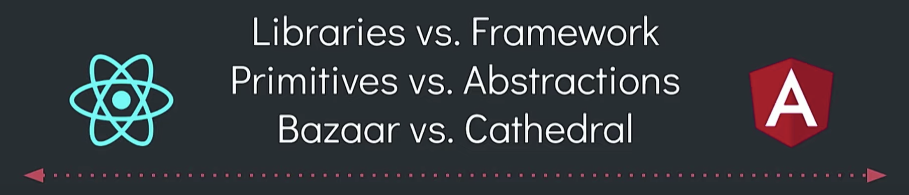
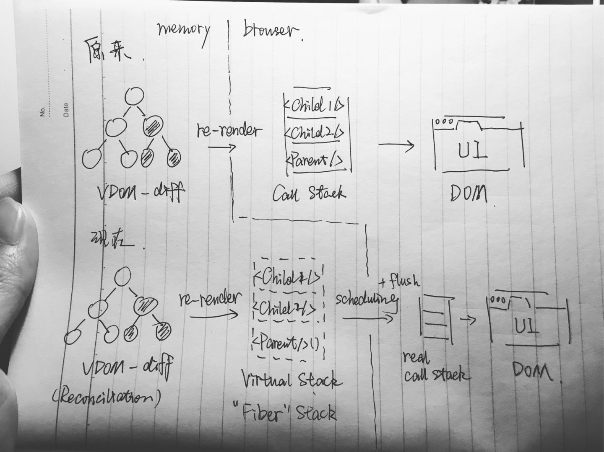
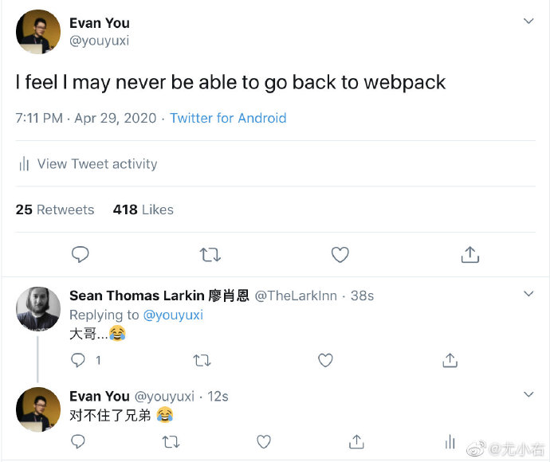

[Frontend Evolution 1995 - 2019](https://github.com/ManzDev/frontend-evolution)

宽泛地讲前端框架会涉及很多，我们只谈谈现在常用的 Vue、React、Angular（很少一部分 Angular，因为我不会），当然仅仅谈这三个也会涉及到很多东西

What you will get:

1. 大体的框架认识

2. 简单了解常用框架的原理

3. 一个简易的前端 DSL

4. 课后作业

## 1. 简单介绍

首先先介绍下这三个框架（库）：



- React：用于构建用户界面的 JavaScript **库**

- Vue：**渐进式** JavaScript 框架

- Angular：一套**框架**，多种平台

对于前端应用的构建，大体可以概括为三个方面：UI 视图、状态管理、前端路由

React 只是一个构建 UI 的库，只涉及到 UI 视图，而且对于很多场景并没有更高层次的抽象，很多优化需要手动写（大部分时候不需要优化），官方目前也并没有提供稳定的状态管理和前端路由，所以 React 只能算是一个 UI 库（library）。由于 React 本身做的事情很简单，导致社区生态非常繁荣，这些问题都可以通过 React 繁荣的生态自己根据需要进行选择

Vue 如果只是 Vue，那么它也是用来构建 UI 的库，只不过相比 React 做了一些更高层次的抽象和优化，但是官方提供了与 Vue 高度集成的状态管理（Vuex）和前端路由（Vue Router）方案，所以它是一个渐进式的框架。由于官方做的事情多了一点，所以社区生态并不如 React 一样丰富

Angular 提供的是一整套技术方案，对于很多场景会有更高层的抽象，你需要的几乎一切都可以在官方文档中找到，仅有很少的时候会需要社区中的方案或自己写，而且是使用工程化的方法实现，是一个大而全的框架。社区生态自然也不很丰富

> 比如对于表单的实现：
>
> ```js
> // React
> const [username, setUsername] = useState('')
> const [password, setPassword] = useState('')
> const validateUsername = () => {
>   // ...
> }
> const validatePassword = () => {
>   // ...
> }
> // 验证逻辑
> useEffect(() => {
>   // ...
> }, [username, password, validateUsername, validatePassword])
> // 还有表单初始化，表单提交等 ...
> ```
>
> ```ts
> // Angular
> this.userForm = new FormGroup({
>   'username': new FormControl('', [Validators.required]),
>   'password': new FormControl('', [Validators.required]),
> })
> // 然后你就有完全控制权了
> // this.userForm.addCtrol —— 添加表单项
> // this.userForm,patchValue —— 批量变更
> // this.userForm.touched —— 有没有编辑过
> // this.userForm.valid —— 是否合法
> // this.userForm.reset —— 重置表单
> // this.userForm.valueChanges.pipe(...) —— 处理变更副作用
> // this.userForm.setValidators —— 添加验证项
> // this.userForm.parent —— 父表单项 （可以嵌套生成表单树）
> // ...
> ```
>
> 当然 React 使用一些表单库也会很方便，但它本身并没有像 Angular 一样提供很多场景的 api

### 1.1 与命令式的区别

`UI = render(data)`

这三种是声明式的，对于原生或者 JQuery 这种命令式来说，我们需要告诉它每一步要怎么做；而声明式我们只需要告诉它 data 的结果是什么就可以了，**不需要告诉它如何修改 DOM**

```js
// JQuery
$('button').click(() => { // 点击 button 要发请求
  $.ajax({
    // ...
    success(res) { // 请求成功后要修改 html
      $('div').html(res)
    },
  })
})
```

```vue
// Vue
<template>
  <div>{{ text }}</div> <!-- 结果是 text -->
  <button @click="handleGetText">get text</button> <!-- 请求后告诉它结果 -->
</template>

<script>
export default {
  data() {
    return {
      text: '',
    }
  },
  methods: {
    handleGetText() {
      fetch('url').then(res => this.text = res)
    },
  },
}
</script>
```

同时也有了 Model、View 等概念的划分，使我们的代码更好维护更清晰。比如 Vue 是一个 MVVM 框架，template 中的是 View，script 中的是 Model，Vue 本身将 data 处理成响应式的 ViewModel

### 1.2 如何学习

对于选择哪一个进行学习，应该要知道我们并不是为了学习框架而学习框架，我们是利用框架学习其背后的思想（涉及到的知识和框架设计思想等），学习 Virtual DOM、函数式、Concurrent 就选择 React；学习响应式、complier 选择 Vue；学习 IoC\DI、工程化实践就选择 Angular

> 由于 Vue 对于简单学习过 HTML、CSS、JS 的同学容易上手，而 React 需要 JS 基础知识掌握牢固，了解函数式的思想，所以网校推荐先学 Vue，之后再学习 React，最后如果有时间的话再学习 Angular 了解工程化实践
>
> [npm 趋势](https://www.npmtrends.com/react-vs-vue-vs-@angular/core)

## 2. 组件方案


对于复杂的前端应用，我们只需要拆成一块一块的组件，完成每一个组件的编写，再拼装成组件树

可以总结为这四种：

- 展示型组件：无状态的，stateless，props 进 UI 出

- 交互型组件：有自身的状态，stateful，props 进 UI 出，讲究复用，UI 库中常见

- 接入型组件：连接 service 与 UI，会调用 api 获取数据，管理数据等

- 功能型组件：会有一些功能的实现，不渲染任何东西，比如 `<router-view />`、`<transition />`

### 2.1 template

Vue 主要使用了 template，通过 compiler 编译成渲染函数，由于它强制你将尽量少的逻辑放到 template 中，所以相比 JSX 少了很多灵活性，但是可以在 compiler 编译的时候做很多事，比如将不涉及逻辑的地方变为静态的，Virtual DOM diff 时直接跳过，大大提高性能

### 2.2 JSX

React 使用了 JSX，它本身就是 JS（`<div className="ui">hah</div>` 编译成 `React.createElement('div', { className: 'ui' }, hah)`），获得了远超模版的灵活性，同时 React 团队也有在探索对于 JSX 的性能优化方案

还有 JSX 非常创新的一点就是将 HTML 和 JS 放到一起，让人们重新思考将本来耦合的组件的 HTML、CSS、JS 分开写是否合适

## 3. 渲染机制

`UI = render(data)`

就是公式中的 render 的实现，render 是声明式实现的关键，如何监测到 data 哪里进行了改变，导致 UI 如何改变

我们想把 data（Model）和 UI（View）分离，自己实现一个简单很不完善的 render 函数：

```js:title=slowly-render/index.js
export const render = (App, data) => document.innnerHTML = `
  <!DOCTYPE html>
  <html>
    <head>
      <title>slowly render</title>
    </head>
    <body>
      ${App(data)}
    </body>
  </html>
`
// ViewModel
export const reactive = (App, data) => new Proxy(data, {
  set(target, propKey, value) {
    target[propKey] = value
    render(App, target) // update
  },
})
```

```js:title=app.js
// View（这里组件的参数可以换成更熟悉的命名：props）
const Header = (data) => `
  <header>
    <div>${data.title}</div>
    ${data.nav.map(e => `<nav>${e}</nav>`)}
  </header>
`
const Content = (data) => `
  <main onclick="${data.handleContentClick}">
    ${data.content}
  </main>
`
const App = (data) => `
  ${Header(data.HeaderData)}
  ${Body(data.BodyData)}
`

// Model
const data = reactive(App)({
  HeaderData: {
    title: 'slowly render',
    nav: ['a', 'b', 'c'],
  },
  BodyData: {
    content: 'wulawulawulawula...',
    handleContentClick(e) {
      console.log(`On Content Click Event: ${e}`)
    },
  },
})

render(App, data) // mount
```

当然这会导致每次 data 改变就会触发 document.innerHTML 整体的重新渲染，引发回流重绘，有巨大的性能问题，如何解决就成了我们的问题

### 3.1 Virtual DOM

React 开创性的引入了 Virtual DOM，在内存中创建一个用 JavaScript 描述 DOM 结构对象，更新时先在 Virtual DOM 上找到变化的节点，然后在更新到真实的 DOM 结构上，大大减少了 JS 与 DOM 之间的通信和回流重绘

但这也引出了新的问题，Virtual DOM 的 diff 因为是整课 Virtual DOM 树的深度优先遍历，时间复杂度会比较大，为了减少时间复杂度，React 的 diff 算法做了三个预设：

- 只对同级元素进行 diff。如果一个 DOM 节点在前后两次更新中跨越了层级，那么 React 会直接销毁原来的节点，并在新的层级插入新创建的节点

- 两个不同类型的元素会产生出不同的树。如果元素由 div 变为 p，React 会销毁 div 及其子孙节点，并新建 p 及其子孙节点

- 开发者可以通过 key 属性来暗示哪些子元素在不同的渲染下能保持稳定

时间复杂度从原来的 $O(n^3)$ 降为 $O(n)$

> [Tree Edit Distance 算法论文](http://vldb.org/pvldb/vol5/p334_mateuszpawlik_vldb2012.pdf)

除此之外，还可以通过 shouldComponentUpdate 和 memo 打断 Virtual DOM 树的 diff 以此提高 diff 性能

还有要注意一点的是，[Virtual DOM 并不会相比原生细粒度的修改 DOM 性能更高](https://www.zhihu.com/question/31809713/answer/53544875)，只是相比 document.innerHTML 整体重写性能要好得多，其实 Virtual DOM 更是一种表达力的提高，我们可以用 Web 平台的 DSL 得到的 Virtual DOM 根据渲染器（renderer）的不同，渲染到不同的平台，比如 React Native 就可以写手机原生 app

Vue2 也引入了 Virtual DOM，但它是的更新细粒度是以组件为单位的，每个组件会有一个 Watcher，在更新时进行依赖收集，然后再进行 Virtual DOM 的 diff，并且在同一层 diff 时会从两端双向进行 diff，以此提高 diff 的效率，也不用手写 shouldComponentUpdate 进行性能优化，但是如果组件很多的场景下，就会相应的创建很多 Watcher，占用更多的内存，也会导致性能下降


React16 则引入了 Concurrent Mode，通过在 Reconcile（就是之前的 diff） 和函数调用栈之间添加了一个 Scheduler 进行更新任务的调度，当有优先级高的任务时会打断优先级低的任务，优先执行优先级高的任务，由于可能打断更新，为了保证 UI 的一致性，将更新分为 render 阶段和 commit 阶段，render 阶段调度任务并更新 Fiber（就是之前的 Virtual DOM）或其他幂等的任务（Suspense），commit 阶段进行请求和 DOM 更新等非幂等的任务。这样就可以及时响应用户的操作，给用户一种**流畅的感觉**



Vue3 则是在 Vue2 的基础上将 template 编译优化进行到了极致，减少了几乎全部的静态节点的 diff，只对动态的节点进行 diff，性能非常惊人

### 3.2 细粒度绑定更新

Vue1.0、Svelte、SlowlyRender（粗粒度绑定更新 🐶）

看看 Svelte 是如何实现的

```svelte
<script>
  let count = 0;

  function handleClick() {
    count += 1;
  }
</script>

<button on:click={handleClick}>
  Clicked {count} {count === 1 ? 'time' : 'times'}
</button>
```

编译出来的 JS 代码

```js {8,13,23,28,19,37-42,50}
/* App.svelte generated by Svelte v3.23.2 */
import {/* ... */} from "svelte/internal";

function create_fragment(ctx) {
  let button, t0, t1, mounted, dispose;

  return {
    c() { // compile
      button = element("button");
      t0 = text("Clicked");
      t1 = text(/*count*/ ctx[0]);
    },
    m(target, anchor) { // mount
      insert(target, button, anchor);
      append(button, t0);
      append(button, t1);

      if (!mounted) {
        dispose = listen(button, "click", /*handleClick*/ ctx[1]); // addEventListener
        mounted = true;
      }
    },
    p(ctx, [dirty]) { // update
      if (dirty & /*count*/ 1) set_data(t1, /*count*/ ctx[0]);
    },
    i: noop,
    o: noop,
    d(detaching) { // unmount
      if (detaching) detach(button);
      mounted = false;
      dispose(); // removeEventListener
    }
  };
}

function instance($$self, $$props, $$invalidate) {
  // user's codes
  let count = 0;

  function handleClick() {
    $$invalidate(0, count += 1);
  }

  return [count, handleClick];
}

class App extends SvelteComponent { // 控制权交给 SvelteComponent
  constructor(options) {
    super();
    init(this, options, instance, create_fragment, safe_not_equal, {});
  }
}

export default App;
```

## 4. 状态管理

管理将事件源映射到状态变化的过程（**管理状态如何变化**），将这个过程从组件中剥离出来，提高代码可维护性

```js
const store = new Vuex.Store({
  state: {
    count: 0
  },
  // 管理状态如何变化
  mutations: {
    increment(state) {
      state.count++
    }
  },
  actions: {
    async increment(context) {
      await fetch(/* ... */)
      context.commit('increment')
    }
  },
})
```


Vue 和 React 的数据流都是单向的，只能通过 props 从父组件传向子组件，这是为了保证数据流向的清晰，提高可读性可维护性。这种单向的数据流向模式我们叫它 flux，还有 MVC、MVP、MVVM，并不建议细扣什么是什么模式，没有太大意义，因为它们都是为了代码的可读性可维护性而存在

> 自我推荐：[Redux 源码分析](https://ahabhgk.github.io/blogs/redux-source-code)，只有后一部分讲的源码，前一部分介绍了很多扩展知识

### 4.1 接入型组件（Container）进行管理

> props down, events up

其实就是将子组件的状态提升到父组件进行管理，通过 props 和 context 将状态传给子组件，比如一个应用，每个页面之间的数据并没有联系，页面都是独立的，我们就可以把 Page 作为接入型组件，把状态提升到 Page 组件中，子组件都是交互型组件、展示型组件或功能型组件

适合状态简单的场景

### 4.2 Store 进行管理

可以是多 store 也可以是单 store，将状态放到外部的 store 中进行管理，store 的 Provider 相当于一个功能型组件，包裹需要用到 store 中状态的组件，比如单 store 就是直接包裹 App `<Provider store={store}><App /></Provider>`，Provider 通过 context（this）传给子组件所有状态，子组件只需要使用需要的状态即可

现在常用的 Vuex、Mobx、Redux 都没有解决异步的问题，Redux 交给 middleware 来处理，Vuex 和 Mobx 直接在 action 中交给用户随便处理，类似 redux-thunk，但这也对于非常复杂的场景（很难遇到）仍然很难解决，或许就需要引入 RxJS 了

### 4.3 GraphQL

Relay、Apollo Client

不懂……

## 5. 前端路由

把一个 url 映射到组件树结构（url 也看作 data，相当于一个序列化的状态，`UI = render(url)`）的过程

用到的 API：[hash](https://developer.mozilla.org/zh-CN/docs/Web/API/HashChangeEvent)、[history](https://developer.mozilla.org/zh-CN/docs/Web/API/History_API)

对于 hash 来说，只是控制 url 的 hash，并不会向后端发送新的请求；对于 history 来说，改变的是 url 的 path 等部分，会向后端发送请求，为了防止后端返回给你 404，就需要[对服务器进行配置](https://router.vuejs.org/zh/guide/essentials/history-mode.html)

```js:title=slowly-render/router.js
let currentRouterView = () => ''

export class HashRouter {
  constructor(routes) {
    this.routes = routes.reduce((routes, route) => routes[route.path] = route.component, {})
    this.bindEvent()
  }

  go(path) {
    if (this.routes[path]) {
      window.location.hash = path
    } else throw new Error('url has not setted.')
  }

  bindEvent() {
    const handleHashChange = e => {
      const path = window.location.hash.slice(1) // #/about => /about
      currentRouterView = this.routes[path]
    }

    window.addEventListener('load', handleHashChange)
    window.addEventListener('hashchange', handleHashChange)
  }
}

export const RouterView = (props) => currentRouterView(props)
export const RouterLink = (props) => `<a href="/#${props.url}">${props.text}</a>`
```

```js:title=app.js
import { render, reactive } from 'slowly-render'
import { HashRouter, RouterView, RouterLink } from 'slowly-render/router'
import { data } from './model'

const router = new HashRouter([
  { path: '/', component: Home },
  { path: '/about', component: About },
])

const data = reactive({
  HomeData: {
    handleGoAbout() {
      router.go('/about') // 命令式路由跳转
    },
  },
})

const Home = (props) => `
  <h1>Home Page</h1>
  <button onclick="${props.handleGoAbout}">go to about page</button>
`
const About = (props) => `<h1>About Page</h1>`
// 其实 data 就是我们的全局状态管理
const App = (data) => `
  ${RouterLink({ url: '/', text: 'home' })}
  ${RouterLink({ url: '/about', text: 'about' })}
  <div>
    ${RouterView(data.HomeData)}
  </div>
`

render(App, data)
```

除了简单的路由跳转至外，一个完整的前端路由还有很多需要我们考虑，比如重定向、路由跳转钩子、页面 data 的 keep alive

### 5.1 静态路由

通过编写一个路由表来表示，比如 vue-router

```js
// 1. 定义 (路由) 组件 - 可以从其他文件 import 进来
const Foo = { template: '<div>foo</div>' }
const Bar = { template: '<div>bar</div>' }

// 2. 定义路由 - 每个路由应该映射一个组件
const routes = [
  { path: '/foo', component: Foo },
  { path: '/bar', component: Bar },
]

// 3. 创建 router 实例，然后传 `routes` 配置
const router = new VueRouter({ routes })
```

好处就是可以通过路由表看出整个 App 的路由结构

### 5.2 动态路由

路由是一个功能型组件，通过组件去定义路由，比如 react-router

```js
export default function App() {
  return (
    <Router>
      <div>
        <nav><Link to="/">Home</Link></nav>
        <nav><Link to="/about">About</Link></nav>

        <Switch>
          <Route path="/about">
            <About />
          </Route>
          <Route path="/">
            <Home />
          </Route>
        </Switch>
      </div>
    </Router>
  );
}
```

可以看到它是通过 JSX 写组件来定义的，所以也具备了 JS 的灵活性

## 6. CSS 方案

CSS 两大问题：

1. 模块化

2. 编程能力

对比之前原生变化在于，对于框架来说是以组件为单位的，之前原生写是将 HTML、JS、CSS 分开来写，那么 BEM 这些还需要吗？BEM 是为了更好的维护 CSS，通过 `block__element--modifier` 的方式写明那些 CSS 属于那些 HTML 元素，而现在 CSS 与组件耦合，只要解决了模块化的问题就可以实现以组件为单位的局部样式，继续使用 BEM 反而可能成为一种负担

### 6.1 CSS 预处理和 Post CSS

为了解决 CSS 模块化的问题，可以通过配置打包工具使用 CSS Module 解决，对于 CSS 编程能力的提升，可以使用 SCSS、LESS 等预处理器，因为都是在打包工具上进行配置，还可以完美结合 Post CSS

Vue 的 `<style scope lang="scss">` 就是借鉴于此通过编译然后经过打包工具预处理和 Post CSS 处理得到最终样式

### 6.2 CSS in JS

这是一种很激进的方案，完全抛弃 CSS，将所有样式通过 JS 来写，用 JS 的模块化和编程能力解决 CSS 的这两个问题，但是这样使用不了原有的 Post CSS 生态，但是 Post CSS 工具也是用 JS 来写的，也可以通过 JS 解决

目前缺点之一是没有一个具体的标准，各种 CSS-in-JS 库写法都有区别

推荐扩展文章：[CSS in JS 的好与坏](https://zhuanlan.zhihu.com/p/103522819)、[vjeux/React: Css in JS](https://speakerdeck.com/vjeux/react-css-in-js)、[A Unified Styling Language](https://medium.com/seek-blog/a-unified-styling-language-d0c208de2660)

### 6.3 原子 CSS

Facebook 最近重构了自家的网站，使用 Atomic CSS 将主页 CSS 减少 80%，同时还添加了 Dark Mode

> [我们用 React 重构了 Facebook.com 的技术栈](https://www.infoq.cn/article/Kv81gRrwEV4z2eqihagm)

Facebook 具体用了什么库并没有公布，但是目前开源最好的原子 CSS 库应该是 [tailwind](https://www.tailwindcss.cn/)

## 7. 构建工具

之前直接写个 script 标签在 HTML 中就可以，现在需要各种编译、打包工具，因为之前仅仅是做 Web 页面，现在由于复杂度的上升，做的是 Web 应用

Webpack 适合用于打包 Web 应用，Rollup 适合用于打包库，最近新出的 vite、snowpack 通过 esbuild 进行编译，使用浏览器原生 module 引入文件，可以大大提高 hot reload 效率



## 8. SSR

服务端渲染，将一部分客户端渲染压力放到服务端，服务端直接返回渲染好的 html 字符串，这样有利于首屏渲染，SEO

## homework

1. 用 Vue2 写一个 todolist，通过提供的 api：[jsonplaceholder](https://jsonplaceholder.typicode.com/) 的 todos api 获取初始的 todolist，之后删除完成的请求不作要求

    

2. 现在 Slowly Render 已经有了 HashRouter，为了更完善的使用方式，用 history api 完成 HistoryRouter 吧

3. 将作业 1 用 Vue3 的 [Composition API](https://composition-api.vuejs.org/zh/api.html) 进行重构，并阅读 [Composition API 的 RFC](https://composition-api.vuejs.org/zh/)

    Vue3 尝鲜方式：

    - 直接用 [vite 创建 Vue3 应用](https://github.com/vitejs/vite)

    - 在 vue-cli 中使用 [vue-cli-plugin-vue-next](https://github.com/vuejs/vue-cli-plugin-vue-next)

    - 在 Vue2 中使用 [@vue/composition-api 插件](https://github.com/vuejs/composition-api/blob/master/README.zh-CN.md)

## ref

1. [作为前端，真的有必要把三大 JS 框架（vue，react，angular）都学会吗?](https://www.zhihu.com/question/368330227/answer/1159175429)

2. [Evan You: Seeking the Balance in Framework Design | JSConf.Asia 2019](https://www.youtube.com/watch?v=ANtSWq-zI0s) - 尤雨溪讲 Vue 在框架设计中的平衡

3. [不吹不黑聊聊前端框架](https://www.zhihu.com/lives/846356429794336768) - 尤雨溪讲前端框架，知乎付费 Live

4. [Dan Abramov: Beyond React 16 | JSConf Iceland](https://www.youtube.com/watch?v=nLF0n9SACd4) - Dan 介绍 React Concurrent Mode

5. [如何理解 React Fiber 架构？](https://www.zhihu.com/question/49496872)
