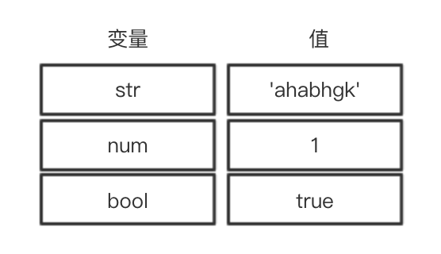
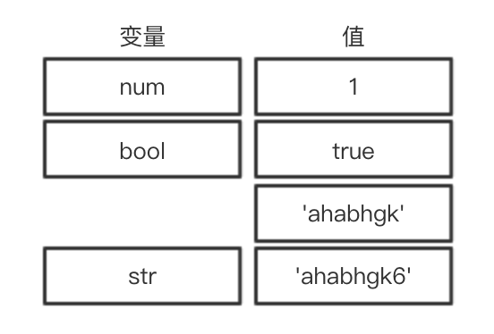

## 数据类型

ECMAScript 标准规定了 7 种数据类型，其把这7种数据类型又分为两种：

基础类型（原始类型）：

`Null`

`Undefined`

`Boolean`：布尔

`Number`：双精度浮点型，还有一些特殊值（-Infinity、+Infinity、NaN）

`String`：字符串

`Symbol`：一种实例是唯一且不可改变的数据类型（es6）

`BigInt`：任意精度的大整数（es10）


引用类型（对象类型）：

`Object`：对象

`Function`：函数

`Array`：数组

……

### 基础类型与引用类型区别

**栈（stack）** 内存：

* 存储的值大小固定
* 空间较小
* 可以直接操作其保存的变量，运行效率高
* 由系统自动分配存储空间

**堆（heap）** 内存：

* 存储的值大小不定，可动态调整
* 空间较大，运行效率低
* 无法直接操作其内部存储，使用引用地址读取
* 通过代码进行分配空间

### 基础类型：

原始类型的值被直接存储在栈中，在变量定义时，栈就为其分配好了内存空间



由于栈中的内存空间的大小是固定的，那么注定了存储在栈中的变量就是不可变的

```js
var str = 'ahabhgk';
var slicedStr = str.slice(1)

console.log(str) // ahabhgk
console.log(slicedStr) // habhgk
```

```js
str += '6'
console.log(str);  // ahabhgk6
```



### 引用类型：

引用类型的值实际存储在堆内存中，它在栈中只存储了一个固定长度的地址，这个地址指向堆内存中的值。

```js
var obj = { name: 'ahabhgk' }
var fn = function () {}
var arr = [1, 2, 3]
```


引用类型就不再具有不可变性了，我们可以轻易的改变它们：

```js
obj.name = "baha"
arr.splice(1, 1)

console.log(obj) // { name: 'baha' }
console.log(arr) // [1, 3]
```

<details>
<summary>
console.log 输出什么？

```js
var obj = { a: 'foo', b: 'bar' }
var copy = obj
copy.a = 'wala'
console.log(obj.a)
```

</summary>
'wala'
</details>

<details>
<summary>
console.log 输出什么？

```js
var obj1 = { a: 'foo', b: 'bar' }
var obj2 = { a: 'foo', b: 'bar' }
console.log(obj1 === obj2)
```

</summary>
false
</details>

### 包装类型

为了便于操作基本类型值，ECMAScript还提供了几个特殊的引用类型，他们是基本类型的包装类型：

* Boolean
* Number
* String

> 引用类型和包装类型的主要区别就是对象的生存期，使用new操作符创建的引用类型的实例，在执行流离开当前作用域之前都一直保存在内存中，而自基本类型则只存在于一行代码的执行瞬间，然后立即被销毁，这意味着我们不能在运行时为基本类型添加属性和方法。

#### 装箱和拆箱

装箱转换：把基本类型转换为对应的包装类型

拆箱操作：把引用类型转换为基本类型

既然原始类型不能扩展属性和方法，那么我们是如何使用原始类型调用方法的呢？

装箱：

```js
var str = 'ahabhgk';
var slicedStr = str.slice(1)
```

实际上发生了以下几个过程：

1. 创建一个 String 的包装类型实例
2. 在实例上调用 slice 方法
3. 销毁实例

也就是说，我们使用基本类型调用方法，就会自动进行装箱和拆箱操作，相同的，我们使用 Number 和 Boolean 类型时，也会发生这个过程。

拆箱：

从引用类型到基本类型的转换，也就是拆箱的过程中，会遵循 ECMAScript 规范规定的 toPrimitive 原则，一般会调用引用类型的 valueOf 和 toString 方法，你也可以直接重写 toPeimitive 方法。一般转换成不同类型的值遵循的原则不同，例如：

* 引用类型转换为 Number 类型，先调用 valueOf，再调用 toString
* 引用类型转换为 String 类型，先调用 toString，再调用 valueOf

若valueOf和toString都不存在，或者没有返回基本类型，则抛出TypeError异常。

```js
const basketball = {
  [Symbol.toPrimitive]() { // toString
    return '🏀'
  },
}
console.log(basketball == '🏀')
console.log(basketball === '🏀')
console.log('你打' + basketball + '……')
```

<details>
<summary>
一道经典的面试题，如何让：a == 1 && a == 2 && a == 3 返回 true。
</summary>
根据上面的拆箱转换；同时使用 == 时，若两侧类型相同，则比较结果和 === 相同，否则会发生隐式转换，所以：

```js
const a = {
  value: [3, 2, 1],
  valueOf() {
    return this.value.pop()
  },
}
```

</details>

## 变量声明

```js
var a = 1
let b = 'hah'
const obj = {}
const foo = (...args) => {
  //
}
function bar() {
  //
}
class Person {
  //
}
import img from './img.png'
```

### 变量提升

```js
var a = function () {} // 以变量形式定义函数
a()
var b = 1
```

等同于：

```js
var a, b // undefined, undefined
a = function () {}
a()
b = 1 // 1
```

<details>
<summary>
两个 console.log 分别输出什么？

```js
console.log(a)
var a = 1
console.log(a)
```

</summary>
undefined

1
</details>

### 函数提升

```js
foo()
function foo() {}
```

等同于：

```js
function foo() {}
foo()
```

<details>
<summary>
运行结果是什么？

```js
bar()
var bar = () => console.log('foo')
```

</summary>
报错 // Uncaught TypeError: bar is not a function
</details>

### 暂时性死区（es6）

JavaScript 引擎在扫描代码发现变量声明时，要么将它们提升到作用域顶部（遇到 var 声明），要么将声明放在 TDZ 中（遇到 let 和 const 声明）。访问 TDZ 中的变量会触发运行时错误。只有执行过变量声明语句后，变量才会从 TDZ 中移出，然后方可访问。

```js
console.log(a, b) // Uncaught ReferenceError
const a = 1
let b = 2
```

#### const 本质

> const实际上保证的，并不是变量的值不得改动，而是变量指向的那个内存地址所保存的数据不得改动。对于简单类型的数据（数值、字符串、布尔值），值就保存在变量指向的那个内存地址，因此等同于常量。但对于复合类型的数据（主要是对象和数组），变量指向的内存地址，保存的只是一个指向实际数据的指针，const只能保证这个指针是固定的（即总是指向另一个固定的地址），至于它指向的数据结构是不是可变的，就完全不能控制了

有兴趣的可以阅读[ Airbnb 有关变量声明的规范](https://github.com/airbnb/javascript#variables)，也可以用 airbnb 规范配置的 eslint 试着写写代码，看现在变量通常是怎样声明的。

### 函数传参

ECMAScript 中所有的函数的参数都是**值传递**

```js
var a = 1
function setAddNum(num) { // var num = a
  var base = 0
  return function add() {
    base += num
    return base
  }
}
var add = setAddNum(a)
var sum1 = add()
console.log(sum1) // 1
```

<details>
<summary>
console.log 输出什么？

```js
const o = {}
function changeValue(obj) { // var obj = o
  obj.name = 'ahabhgk'
  obj = { name: 'haha' }
}
changeValue(o)
console.log(o.name)
```

</summary>
'ahabhgk'
</details>

## 类型判断

### typeof

```js
typeof 'ahabhgk' // string
typeof 123 // number
typeof true // boolean
typeof Symbol() // symbol
typeof undefined // undefined
typeof () => {} // function

typeof null // object
typeof [] // object
typeof {} // object
typeof new Date() // object
typeof /^\d*$/ // object
```

除函数外所有的引用类型都会被判定为 object

基本类型中 null 会判定为 object，这是在JavaScript初版就流传下来的bug，后面由于修改会造成大量的兼容问题就一直没有被修复

### instance of

根据原型链查找

```js
[] instanceof Array // true
new Date() instanceof Date // true
new RegExp() instanceof RegExp // true

[] instanceof Object // true
function () {}  instanceof Object // true
```

### Object.prototype.toString

```js
const isType = function (type) {
  return function (instance) {
    return Object.prototype.toString.call(instance) === `[object ${type}]`
  }
}

const isArray = isType('Array')

isArray([]) // true
isArray({}) // false
```

## 作用域

* 全局作用域（尽量避免污染 :poop:全局作用域）
* 函数作用域
* 块级作用域（es6）

```js
for (var i = 0; i < 5; i++) {
  setTimeout(function () {
    console.log(i)
  }, 0)
}
// 5 个 5
```

```js
// 伪代码
var i

i = 0
setTimeout(function () {
  console.log(i)
}, 0)

i++
setTimeout(function () {
  console.log(i)
}, 0)

i++
setTimeout(function () {
  console.log(i)
}, 0)

i++
setTimeout(function () {
  console.log(i)
}, 0)

i++
setTimeout(function () {
  console.log(i)
}, 0)

i++
```

解决方法：

1. 函数的值传递

```js
for (var i = 0; i < 5; i++) {
  (function (i) {
    setTimeout(function () {
      console.log(i)
    }, 0)
  })(i)
}
```

仔细看 setTimeout 的 API 文档，改进：

```js
for (var i = 0; i < 5; i++) {
  setTimeout(function (j) {
    console.log(j)
  }, 0, i)
}
```

2. 使用块级作用域（es6）

```js
for (let i = 0; i < 5; i++) {
  setTimeout(function () {
    console.log(i)
  }, 0)
}
```

```js
// 伪代码
{
  let i = 0
  setTimeout(function () {
    console.log(i)
  }, 0)
}

{
  let i = 1
  setTimeout(function () {
    console.log(i)
  }, 0)
}

{
  let i = 2
  setTimeout(function () {
    console.log(i)
  }, 0)
}

{
  let i = 3
  setTimeout(function () {
    console.log(i)
  }, 0)
}

{
  let i = 4
  setTimeout(function () {
    console.log(i)
  }, 0)
}

{
  let i = 5
}
```

## END

只是摘出来一部分（如果代码写的规范的话，很多部分都遇不到），更具体的看这篇：[你真的掌握变量和类型了吗？](https://juejin.im/post/5cec1bcff265da1b8f1aa08f)

Think:

1. 学习闭包
    虽然可能很长时间都不会用到，但闭包在 JavaScript 是很重要的，闭包学得好不仅可以为以后函数式编程、学习框架等打下基础，还可以通过闭包理解很多东西：
    * 静态（词法）作用域与动态作用域
    * 作用域链
    * 执行上下文栈
    ……

2. 
    <details>
    <summary>
    写一个 val 函数，实现：

    ```js
    function val(value) {
      //
    }

    const one = val(1)
    const three = one.plus(2)
    const six = three.plus(3)

    console.log(one.value) // 1
    console.log(three.value) // 3
    console.log(six.value) // 6
    ```

    </summary>

    ```js
    function val(value) {
      function plus(num) {
        value += num
        return { plus, value }
      }
      return { plus, value }
    }
    ```

    </details>

3. 
    <details>
    <summary>
    写一个 add 函数，实现：

    ```js
    const add = function (a) {
      //
    }

    add(1) // 1
    add(1)(2)  // 3
    add(1)(2)(3) // 6
    add(1)(2)(3)(4) // 10
    ```

    提示：重写 toString 方法

    </summary>

    ```js
    const add = function (value) {
      function sum(num) {
        value += num
        return sum
      }
      sum.toString = function () {
        return value
      }
      return sum
    }
    ```

    </details>

推荐：

* [JavaScript 高级程序设计](https://book.douban.com/subject/10546125/)
* [你不知道的 JavaScript](https://github.com/getify/You-Dont-Know-JS)
* [冴羽的博客](https://github.com/mqyqingfeng/Blog)
* [阮一峰 es6](http://es6.ruanyifeng.com/)
