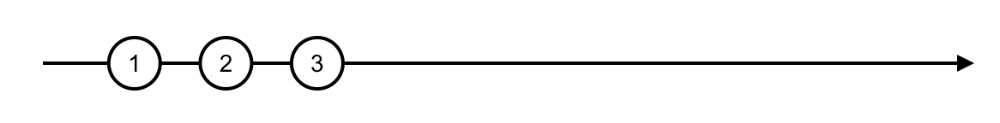
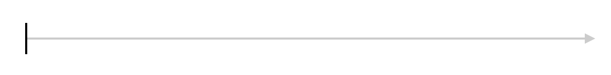

RxJS 提供的创建类操作符覆盖了几乎所有的数据流创建模式，没有必要重复发明轮子

## 创建同步操作流

* 产生哪些数据

* 数据之间先后顺序

### create

```ts
export class Observable<T> implements Subscribable<T> {
  // ...
  static create: Function = <T>(subscribe?: (subscriber: Subscriber<T>) => TeardownLogic) => {
    return new Observable<T>(subscribe);
  }
  // ...
}
```

### of 列举数据

of 产生 Cold Observable

```ts
const oba$ = of(1, 2, 3)
```

### range 指定范围

```ts
const numbers = range(1, 10)
```


range 只能每次递增 1，range(1.5, 3) 吐出 1.5、2.5、3.5

### generate 循环创建

```ts
generate(0, x => x < 10, x => x + 1)
```

### repeat 重复数据

```ts
const oba$ = new Observable((ob: Observer<number>) => {
  console.log('on subscribe')
  setTimeout(() => ob.next(1), 1000)
  setTimeout(() => ob.next(2), 2000)
  setTimeout(() => ob.next(3), 3000)
  setTimeout(() => ob.complete(), 4000)

  return () => console.log('on unsubscribe')
})

oba$
  .pipe(repeat(2))
  .subscribe(console.log, null, () => console.log('on complete'))

// on subscribe
// 1
// 2
// 3
// on unsubscribe
// on subscribe
// 1
// 2
// 3
// on complete
// on unsubscribe
```


如果去掉 `setTimeout(() => ob.complete(), 4000)`

```ts
const oba$ = new Observable((ob: Observer<number>) => {
  console.log('on subscribe')
  setTimeout(() => ob.next(1), 1000)
  setTimeout(() => ob.next(2), 2000)
  setTimeout(() => ob.next(3), 3000)

  return () => console.log('on unsubscribe')
})

oba$
  .pipe(repeat(2))
  .subscribe(console.log, null, () => console.log('on complete'))

// on subscribe
// 1
// 2
// 3
```



所以 repeat 依赖于上游完结的时机

### empty、never、throwError

```ts
empty()
```



```ts
never()
```


```ts
throwError()
```


## 创建异步操作流

相比创建同步操作流，还需要关心数据之间的时间间隔问题

### interval、timer 定时产生数据

都是从 0 开始吐出数据，timer 第一个参数表示开始时间，默认 0，第二个参数同 interval

```ts
timer(1000, 1000) == interval(1000)
```

### from Observable-like to Observable

Observable-like: an Array, an array-like object, a string, a Promise, an iterable object, an Observable-like object

```ts
from('abc') == from(['a', 'b', 'c'])
```

### fromPromise from(promise)

```ts
from(
  new Promise<number>((resolve, reject) => {
    setTimeout(() => {
      console.log('begin resolve')
      resolve(1)
      console.log('end resolve')
    }, 1000)
  })
    .then((res) => {
      console.log(res)
      return 2
    })
).subscribe(console.log)
```

### fromEvent

```ts
// fromEvent.d.ts
import { Observable } from '../Observable';
export interface NodeStyleEventEmitter {
  addListener: (eventName: string | symbol, handler: NodeEventHandler) => this;
  removeListener: (eventName: string | symbol, handler: NodeEventHandler) => this;
}
export declare type NodeEventHandler = (...args: any[]) => void;
export interface NodeCompatibleEventEmitter {
  addListener: (eventName: string, handler: NodeEventHandler) => void | {};
  removeListener: (eventName: string, handler: NodeEventHandler) => void | {};
}
export interface JQueryStyleEventEmitter {
  on: (eventName: string, handler: Function) => void;
  off: (eventName: string, handler: Function) => void;
}
export interface HasEventTargetAddRemove<E> {
  addEventListener(type: string, listener: ((evt: E) => void) | null, options?: boolean | AddEventListenerOptions): void;
  removeEventListener(type: string, listener?: ((evt: E) => void) | null, options?: EventListenerOptions | boolean): void;
}
export declare type EventTargetLike<T> = HasEventTargetAddRemove<T> | NodeStyleEventEmitter | NodeCompatibleEventEmitter | JQueryStyleEventEmitter;
export declare type FromEventTarget<T> = EventTargetLike<T> | ArrayLike<EventTargetLike<T>>;
export interface EventListenerOptions {
  capture?: boolean;
  passive?: boolean;
  once?: boolean;
}
export interface AddEventListenerOptions extends EventListenerOptions {
  once?: boolean;
  passive?: boolean;
}
export declare function fromEvent<T>(target: FromEventTarget<T>, eventName: string): Observable<T>;
/** @deprecated resultSelector no longer supported, pipe to map instead */
export declare function fromEvent<T>(target: FromEventTarget<T>, eventName: string, resultSelector: (...args: any[]) => T): Observable<T>;
export declare function fromEvent<T>(target: FromEventTarget<T>, eventName: string, options: EventListenerOptions): Observable<T>;
/** @deprecated resultSelector no longer supported, pipe to map instead */
export declare function fromEvent<T>(target: FromEventTarget<T>, eventName: string, options: EventListenerOptions, resultSelector: (...args: any[]) => T): Observable<T>;
```

```ts
const eventTarget = new EventTarget()
fromEvent(eventTarget as FromEventTarget<'open'>, 'open')
  .subscribe(console.log)
  // Event {isTrusted: false, constructor: Object}
sleep(1000)
  .then(() => eventTarget.dispatchEvent(new Event('open')))
```

fromEvent 产生 Hot Observable，数据的产生和订阅是无关的，数据的产生完全不受 RxJS 控制

### fromEventPattern

fromEvent 显然不能覆盖所有的 Event，有的 Event 接口是不一致的，fromEventPattern 就是用来适配其他的 Event 接口

```ts
function addClickHandler(handler) {
  document.addEventListener('click', handler)
}

function removeClickHandler(handler) {
  document.removeEventListener('click', handler)
}

const clicks$ = fromEventPattern(
  addClickHandler,
  removeClickHandler,
)
clicks$.subscribe(x => console.log(x))
```

### ajax

ajax:

```ts
const users = ajax({
  url: 'https://httpbin.org/delay/2',
  method: 'POST',
  headers: {
    'Content-Type': 'application/json',
    'rxjs-custom-header': 'Rxjs',
  },
  body: {
    rxjs: 'Hello World!',
  },
}).pipe(
  map(response => console.log('response: ', response)),
  catchError(error => {
    console.log('error: ', error)
    return of(error)
  })
)
```

fetch:

```ts
const data$ = fromFetch('https://api.github.com/users?per_page=5').pipe(
 switchMap(response => {
   if (response.ok) {
     // OK return data
     return response.json();
   } else {
     // Server is returning a status requiring the client to try something else.
     return of({ error: true, message: `Error ${response.status}` })
   }
 }),
 catchError(err => {
   // Network or other error, handle appropriately
   console.error(err)
   return of({ error: true, message: err.message })
 })
)

data$.subscribe({
 next: result => console.log(result),
 complete: () => console.log('done'),
})
```

### repeatWhen

```ts
// export declare function repeatWhen<T>(notifier: (notifications: Observable<any>) => Observable<any>): MonoTypeOperatorFunction<T>
const source = of(1, 2, 3)
// const documentClick$ = fromEvent(document, 'click')

source.pipe(
  // repeatWhen(() => documentClick$)
  repeatWhen(() => interval(1000)),
).subscribe(console.log)
```

根据完结的时机重复，但如果上游不是同步，那完结时机也不确定，那使用 interval 重新订阅的时机也难以确定，这时可以通过 notifier 的参数 notifications，它也是一个 Observable

```ts
const source = of(1, 2, 3)

source.pipe(
  repeatWhen((ob) => ob.pipe(delay(1000))),
).subscribe(console.log)
```

### defer

> Creates the Observable lazily, that is, only when it is subscribed.

```ts
const oba = defer(() => ajax(opts))
```
