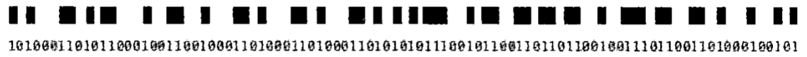
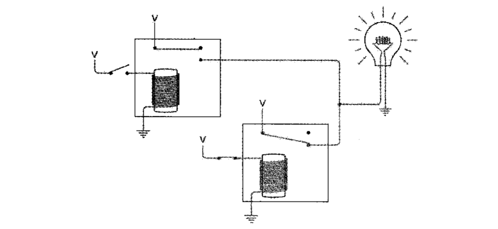
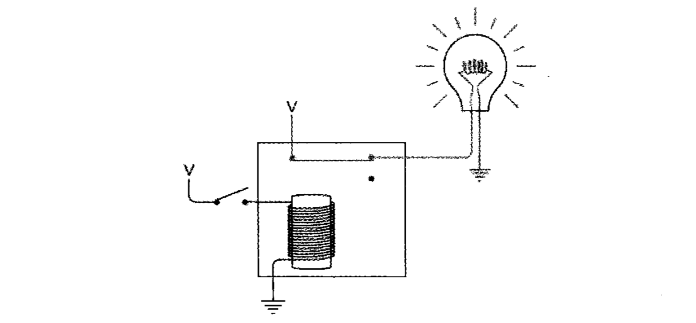
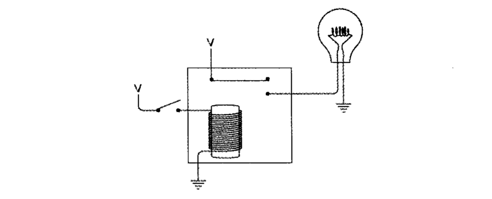

两种不同的事物（`. -`、`0 1`），经过适当的组合，就可以表示所有信息

换挡码：改变作用域内编码的含义，直到作用域结束（代码中的注释 `\* *\`）

逃逸码：改变下一个编码的含义（正则中的 `\.`）

电报系统：

继电器，由电流控制开关，用来转发：

外星人如果一只手有 4 根手指，那他们的数字基数会是 8，会使用 8 进制，计算机世界中有无电流、开关、灯泡亮灭、继电器开闭都可以使用 0、1 表示

比特（英语：Bit，亦称二进制位）指二进制中的一位，是信息的最小单位。Bit 是 Binary digit（二进制数位）的混成词。1 字节（英语：Byte）由 8 比特（英语：bit）组成

扫描条形码：

前三位 101 确定间隙大小

逻辑运算

串联的电路表示 AND，并联的电路表示 OR

与门：

或门：

非：

buffer 缓冲器，用来增强：

// TODO: 12章 准备面试
