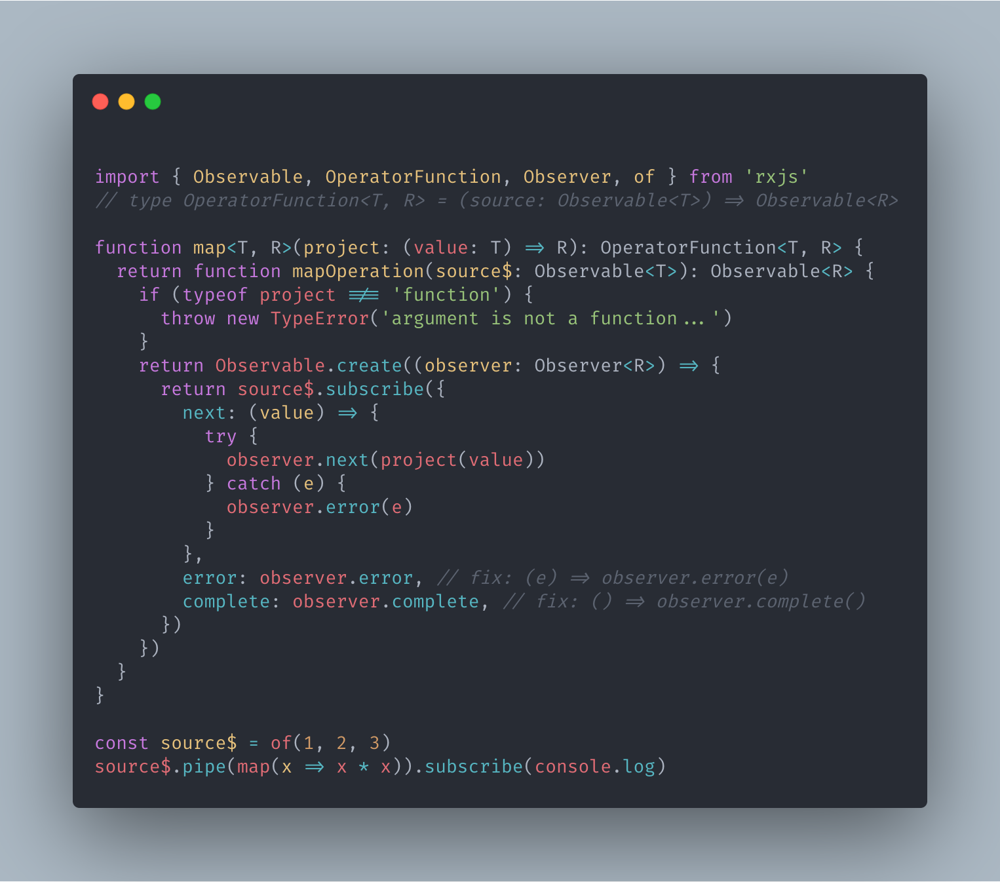
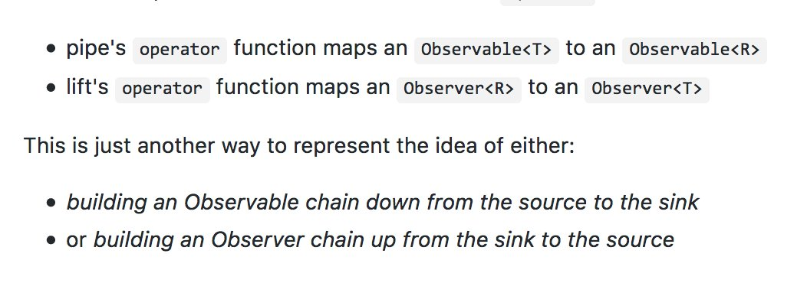

操作符其实就是解决某个具体应用问题的模式。当我们要用 RxJS 解决问题时，首先需要创建 Observable 对象，于是需要创建类操作符；当需要将多个数据流中的数据汇合到一起处理时，需要合并类操作符；当需要筛选去除一些数据时，需要过滤类操作符；当希望把数据流中的数据变化为其他数据时，需要转化类操作符；而对数据流的处理可能引起异常，所以为了让程序更加强壮，我们需要异常处理类操作符；最后，要让一个数据流的数据可以提供给多个观察者，我们需要多播类操作符

## 为什么需要操作符

每个操作符提供的只是一些通用的简单功能，但通过将这些小功能可以组合在一起，就可以用来解决复杂的问题

> 数组和 Observable 在数学概念上都是 Functor

## 分类

* 创建

* 转化

* 合并

* 多播

* 错误处理

* 工具

* 条件分支

* 数学和合计

## 如何实现操作符

根据业务需求封装自定义操作符

### 操作符函数的实现

每个操作符都是一个函数，必须包含以下几点：

* 返回全新的 Observable

* 对上游和下游的订阅和退订的处理

* 处理异常情况

* 及时释放资源

> 有 React Hooks（FP）内味了

map 的实现：

```ts
import { Observable, OperatorFunction, Observer, of } from 'rxjs'
// type OperatorFunction<T, R> = (source: Observable<T>) => Observable<R>

function map<T, R>(project: (value: T) => R): OperatorFunction<T, R> {
  return function mapOperation(source$: Observable<T>): Observable<R> {
    if (typeof project !== 'function') {
      throw new TypeError('argument is not a function...')
    }
    // 返回新的 Observable
    return Observable.create((observer: Observer<R>) => {
      const subscription = source$.subscribe({
        next: (value) => {
          try {
            observer.next(project(value))
          } catch (e) {
            // 处理异常情况
            observer.error(e)
          }
        },
        error: (e) => observer.error(e),
        complete: () => observer.complete(),
      })
      // 对上游和下游的订阅和退订的处理
      return () => {
        subscription.unsubscribe()
      }
    })
  }
}

const source$ = of(1, 2, 3)
source$.pipe(map(x => x * x)).subscribe(console.log)
```

map 并不占资源，所以没有释放，当有利用资源时需要释放，比如 addEventListener

> 
> 不能保证类库内部 this 的指向，JS 中这里的等价代换显然不成立

#### 使用 lift

很多操作符都有实现 lift，功能是把 Observable 对象提升一个层次，赋予更多功能，lift 返回一个新的 Observable 对象



[v6 中曾提议取消掉 lift，但最终留了下来，相关讨论](https://github.com/ReactiveX/rxjs/issues/2911)

```ts
function map<T, R>(project: (value: T) => R): OperatorFunction<T, R> {
  return function mapOperation(source$: Observable<T>): Observable<R> {
    if (typeof project !== "function") {
      throw new TypeError("argument is not a function...")
    }
    return source$.lift((observer: Observer<T>) => ({
      next: (value: T) => {
        try {
          observer.next(project(value) as unknown as T)
        } catch (e) {
          observer.error(e)
        }
      },
      error: (e: any) => observer.error(e),
      complete: () => observer.complete(),
    }))
  }
}
```

### 使用原有操作符

```ts
const toUpperCase = (): OperatorFunction<string, string> =>
  source =>
    source.pipe(
      map(value => value.toUpperCase()),
      catchError(err => of(`Error: ${err}`)))

const oba = of('haha')
oba.pipe(toUpperCase()).subscribe(console.log)
```

### |>

[|> 提案](https://github.com/tc39/proposal-pipeline-operator)

[babel 插件](https://github.com/babel/babel/tree/master/packages/babel-plugin-proposal-pipeline-operator)
