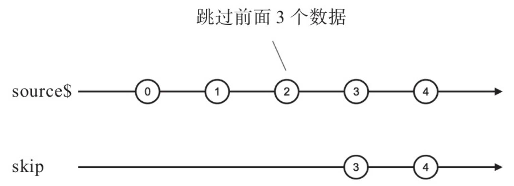
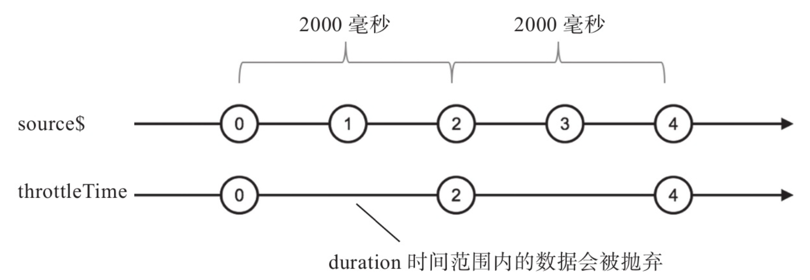
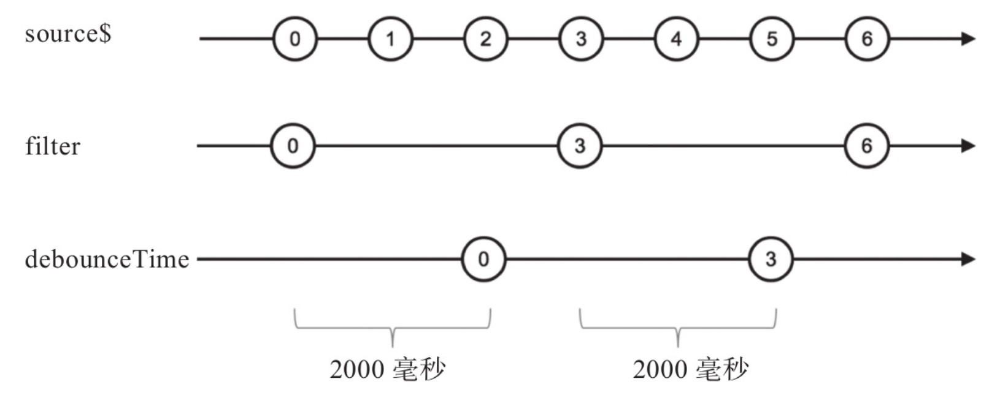
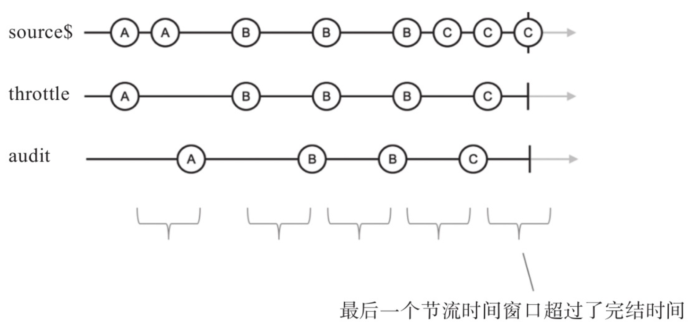

## 过滤类操作符

### filter

```ts
const clicks = fromEvent(document, 'click')
const clicksOnDivs = clicks.pipe(filter(ev => ev.target.tagName === 'DIV'))
clicksOnDivs.subscribe(x => console.log(x))
```

### first、last

### take 限定上游数据数量

* takeLast

  takeLast 只有确定上游数据完结的时候才能产生数据，而且是一次性产生所有数据

* takeWhile

* takeUntil

  > Emits the values emitted by the source Observable until a notifier Observable emits a value.

  repeatWhen 也利用了 notifier 参数
  
  作为 takeUntil 的 notifier 参数如果在吐出数据或者完结之前抛出了错误，那 takeUntil 也会把这个错误抛给下游，从而关闭了上下游之间的通道

### skip

> Returns an Observable that skips the first count items emitted by the source Observable.



### skipWhile skipUntil

类似 takeWhile、takeUntil

## 回压控制

zip 就出现了这种问题

* 有损回压控制（本章）

* 无损回压控制（下一章转化数据）

### throttle(Time)、debounce(Time)





### audit(Time)

可以认为 audit 是做 throttle 类似的工作，不同的是在“节流时间”范围内，throttle 把第一个数据传给下游，audit 是把最后一个数据传给下游



throttle 传了 5 个数据，audit 传了 4 个数据，因为最后一个数据在节流时间范围内完结了，audit 直接 complete

### sample(Time)

sample 表示采样，与 throttle 不同在于连续的隔一段时间吐出数据，而 throttle 可能会断开


虽然不是连续的，但是间隔为那段时间的整数倍

比如对逝去时间的采样：

```ts
const clicks$ = fromEvent(document, 'click')
// 理想情况下可以用 timer(0, 1) 然后加上节流，但是会发现与 timer(0, 4) 是一样的，也就是说浏览器最小的时间间隔是 4 ms，这里 map 目的与节流一样，都是以一定准确性换取性能，但是实现方式却不同
const time$ = timer(0, 10).pipe(map(x => x * 10))
const pastTimeBeforeClick$ = time$.pipe(sample(clicks$))
pastTimeBeforeClick$.subscribe((pastTime) => {
  const text = $('#text')
  text && (text.textContent = `${pastTime} ms`)
})
```

### distinct 根据数据序列做回压控制

* distinct

  只返回从没出现过的数据

  内部维护了一个集合 Set

  第一个参数 Optional function to select which value you want to check as distinct，第二个参数是一个 Observable 对象，每当这个 Observable 对象产生数据时，distinct 就清空 Set，防止存的过多导致了内存泄露

* distinctUntilChanged

  拿到一个数据不是和一个 Set 比较，而是直接和上一个数据比较，也就是说，这个操作符要保存上游产生的上一个数据就足够，当然，也就没有了 distinct 潜在的内存泄露问题

  也有一个可选的 compare 参数

## 其它过滤方法

不一定实用

### ignoreElements

忽略上游产生的所有元素

```ts
oba.pipe(filter(x => false))
```

### elementAt

获取制定下标的那个，没有返回第二个参数（默认值）

### single

检查上游是否只有一个满足对应条件的数据，如果答案为“是”，就向下游传递这个数据；如果答案为“否”，就向下游传递一个异常
