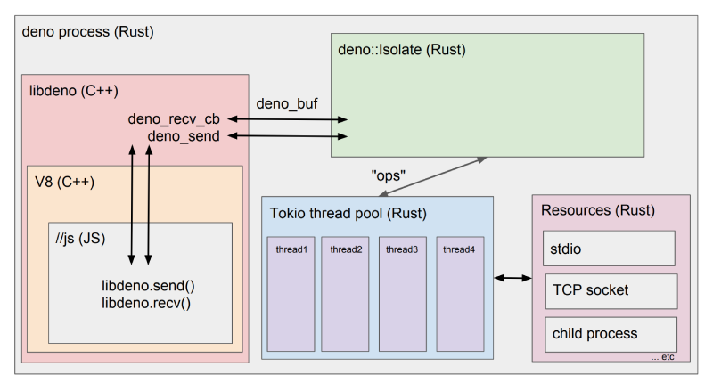
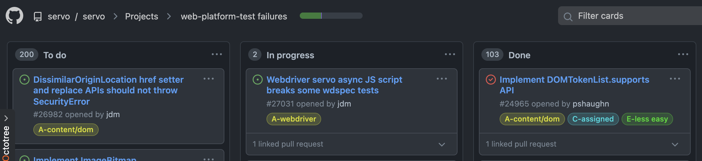

最近在学习 Rust，刚看完异步，想自己从零写点关于 Rust 异步的简单项目来练练手，最好还和前端有关，但是我并没有想到什么合适的项目，build your own x 上也没找到，所以我决定看一看 Deno，最好还能水个 contribute 😉

## Bird's eye view of Deno

Deno 主要分为三个部分：

第一部分是 cli，它包括所有用户使用的 API，像 fmt、repl、run、compile、doc 等。一部分功能是调用的其他项目实现的，cli 这里集成到 deno 中，比如 fmt 底层使用的 dprint、typescript 使用了官方的一份 fock 实现了 transpile with type checking，只 transpile 的话使用了 swc。JS 执行环境相关的 cli 相当于是一个入口，用来对模块、runtime 进行初始化。除此之外大部分的单元测试、集成测试、benchmark 测试也放在这里。

第二部分是 core，主要依赖了 rusty_v8。rusty_v8 是使用 Rust 对 v8 引擎做的一层 binding，基本就是直接调用 v8 的 API，并没有过多的封装，提供好用的封装则是在 core 这里做的；然后著名的事件循环也是 core 这里实现的，但并没有完全实现，熟悉 Rust Async 的同学应该知道 Rust 中的异步 API 实现分为两部分：一部分是实现 Future trait 的 poll 方法，另一部分是实现 executor，core 这里相当于只实现了 poll 方法，executor 可以使用 tokio、smol 等库，core 这里并没有直接依赖 tokio，但其他调用 core 的地方都是用的 tokio 作为 executor 的；最后 core 实现了 Rust 侧和 JS 侧通信的方法：ops，Rust 这里将 JS 要用的 ops 注册上，JS 就可以通过 opSync 进行同步调用或 opAsync 进行异步调用，传递的数据通过 serde_v8 进行序列化与反序列化，可以理解为是一种 RPC。



第三部分是 runtime，这里依赖 core 实现 Deno 的 JS 执行环境和所有有关操作系统的 ops 和 JS 封装，比如 os、fs、http、process 等，其他的 ops 比如 fetch、timers、net、webgpu 等则单独放到了 ext 中，Rust 代码在 cli 中进行注册，通过 JS 进行调用。

## fetch

Deno 中的很多 API 会根据 web 的标准进行实现，所以你的有些代码即可以跑在 Deno 上也可以跑在浏览器上，当然这只是美好的愿景，web 标准并不是那么好实现的，Github 上有专门的 web platform tests，简称 wpt，用来测试是否符合规范，Deno 也只通过了部分测试，Rust 编写的浏览器引擎 Servo 的 wpt 的 TODO 只完成三分之一。



同样 Deno 实现的有些 API 细节上也有些不符标准的，比如 fetch 中对于 http header value 的实现，我的 [PR](https://github.com/denoland/deno/pull/12244) 也是这样来的。

先看一下 [issue](https://github.com/denoland/deno/issues/12236)，简单来说就是 Rust 侧对 header value 进行解析时某些 value 会导致 panic，这个 panic 会导致整个 Deno 的 JsRuntime 挂掉，还是挺严重的，试想下你的 server 本来运行的好好的，结果发了某个 fetch 请求，然后你的 server 就挂了……

先看一下 [fetch 规范中对于合法的 header value 的描述](https://fetch.spec.whatwg.org/#concept-header-value)：

> A value is a byte sequence that matches the following conditions:
> - Has no leading or trailing HTTP tab or space bytes.
> - Contains no 0x00 (NUL) or HTTP newline bytes.

大意就是你的 header value 开头结尾没有空格，[范围在 0x20 (SP) 到 0x7E (~) 之间](https://infra.spec.whatwg.org/#byte-sequence)并且不包含 0x00、0x0A、0x0D 这三个 charCode 对应的字符就是合法的，而且在你添加 headers 时，[根据 append header 的规范](https://fetch.spec.whatwg.org/#concept-headers-append)会对 header value [进行 normalize](https://fetch.spec.whatwg.org/#concept-header-value-normalize)，也就是说

```js
const headers = new Headers()
headers.append("val1", " hah")
headers.append("val2", "hah ")
fetch("xxx", {
  headers: { val: " hha " },
})
```

这样 header value 即使前后有空格也都会给你通过 `normalize` 去头去尾变成合法的 header value，那么问题的原因就锁定在第二条规则，不能包含非法字符。

## hyperium/http

[hyperium/http](https://github.com/hyperium/http) 是 Deno 中 fetch 下层 Rust 实现的 ops 所依赖的 http 库，header value 会通过这个库中的方法来进行解析，JS 侧会根据 fetch 规范对 header value 进行检测，不符合规范的 header value 会 throw error 阻止传给 Rust 侧来发请求。

而 panic 正是因为这个库解析 header value 后 unwrap 导致的，可预期是 JS 侧不会把不合法的 header value 传进来，所以这里 unwrap 应该是安全的。

但是翻开 [hyperium/http 的文档](https://docs.rs/http/0.2.5/http/header/struct.HeaderValue.html#method.from_bytes) 发现：

> If the argument contains invalid header value bytes, an error is returned. Only byte values between 32 and 255 (inclusive) are permitted, excluding byte 127 (DEL).

也就是说 charCode 在 32 到 255 之间，除了 127 都是合法的，这就导致有些字符虽然符合 fetch 规范但是却不符合 hyperium/http 解析 header value 的要求，导致后面 unwrap 造成了 panic。

我也在这个库中也发现了相关的 [issue](https://github.com/hyperium/http/issues/376)，原来 Servo 也是用的这个库也有同样的问题，哈哈。这个库虽然坑了 Deno 和 Servo，但是这个库的实现并没有错，因为它解析规则是按照 [http rfc7230](https://datatracker.ietf.org/doc/html/rfc7230#section-3.2) 来实现的，而 fetch 的 header value 是按照 [http rfc2616](https://datatracker.ietf.org/doc/html/rfc2616#section-4.2) 来定义的，而 rfc2616 也已经被 rfc7230 废弃了，所以是因为规范的差异导致的坑……

我也在[知乎上提了一个问题](https://www.zhihu.com/question/489428152)，想了解更深的原因（两个 RFC 有差异的原因，为啥 fetch 规范不更新），有兴趣的大佬可以答一下～

最后我修了这个 issue 并提交了[我给 Deno 的第一个 PR](https://github.com/denoland/deno/pull/12244)，PR 的内容很简单，就是去掉 unwrap 改为返回这个 Err，这样 ops 中返回的 Err 也会序列化传给 JS 侧，JS 侧则会 throw error 出来，这样用户就可以 catch 到这个 error 而不至于无法处理 panic 而导致整个 runtime 挂掉。后续再补充两个测试，更新下 wpt 的测试结果就成功被 Merge 了。

## 后记

修 issue 的这几天虽然一行 Rust 异步的代码都还没写，但是让我体会到了 Deno 的优良的工作流，对测试的重视，同时在 Discord 看大佬聊天也能学到很多，还有 v8 snapshot 的应用（deno compile），如何实现一个 JS 运行环境，甚至一窥未来的前端 toolchain。很多都是我在接触 Rust 后才有机会学到的，很喜欢 doodlewind 的一句话：

> 只要少量的 C / C++ 配合现代的 JavaScript，就能使传统的 Web 技术栈走出浏览器

同样的，只要少量的底层知识配合前端技术栈，就能使自己走出浏览器，前端工程师同样也是工程师，不能只局限于前端，前端是起点，但不能是终点。

<!-- I have been learning Rust for a while, I wanted to write so staff to make my hands dirty, but there were no good ideas comes in my mind, then I woundered why not contribute some open source project using Rust and related to front end, so I decided to give Deno a look, and try to contribute on it for the best 😉

## Bird's eye view of Deno

The Deno repo is mainly about the runtime, some of the features are using other project, and Deno is just integrating with it. Now the repo is basicly has three parts. -->
