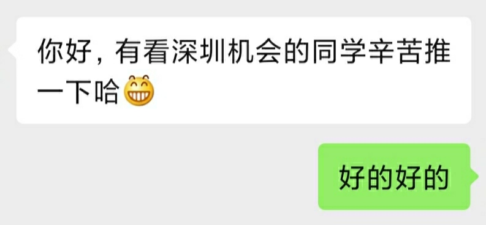

<!-- markdownlint-disable no-duplicate-header -->

## 腾讯 PCG

官网投的，真的太慢了

### 一面

一开始面试官来晚了，另一个人给我两道题让我选一个做，一个是 Promise retry，另一个是处理 CSV 格式字符串整理出里面的数字，我因为写了比较擅长异步，怕选 Promise 翻车，就选了 CSV 处理的，做了大概 20 多分钟（中间卡了一下，问了下问题）然后补上测试又花了大概 5 分钟，才算过。这时差不多半小时过去了，开始问问题，问了项目相关的比较多，有些记不清了

1. 自我介绍
2. 介绍项目（迎新网、重邮帮）
3. 迎新网的优化（字体压缩、图片优化、PWA、动态路由）
4. 迎新网中的 PWA 优化真的有必要吗（确实没必要，所以后面再问我项目就没说过 PWA 了）
5. 重邮帮中的状态管理（小程序用 state 和 context，后台用的 Dva）
6. 重邮帮后台 redux-saga 怎么用的（复杂度不够没用到太多，只用到了 redux-thunk 的程度）
7. 项目中有做线上的性能监控错误监控吗（无……）
8. 有什么想问我的（你们部门是做什么的）

### 二面

面了 20 多分钟，感觉回答得不是很好

1. 自我介绍
2. 问项目
3. 迎新网的优化
4. 项目中怎么调试，移动端怎么调试（F12……）
5. 首屏时间怎么算的，怎么做的性能监控（线上的无，本地用的 lighthouse）
6. 性能监控的原理
7. 前端安全（XSS、CRSF）
8. 计算机安全知道哪些（无……）
9. 项目中有做错误监控吗（没，但是这回简单说了下错误监控的原理）
10. 看过哪些源码，Vue3 对于 Vue2 的优化（只说了响应式，自我介绍的时候说了看过一些源码，但是说的很少而且很浅，肯定坑了）
11. 有什么想问我的（怎么评价，他说”基础的知道，但是原理的不懂“，我感觉没了）

### 三面

Stay turned...

## 360 奇舞团

直接在奇舞周刊公众号上发的招聘上投的

### 一面

1. 看过哪些源码，看完 Vue3 有什么收获（响应式，对比 react hooks 会自动收集依赖的实现；Block Tree，对比 react 静态模版的优化。懂了，这种就使劲往深入的说就行了，答得好就加分，答不好会坑）
2. 判断字符串是不是回文（上周分享会学员正好讲到了，但是我一下没想起怎么做，只想到了栈，就先说了下用栈实现的思路，然后他说再换个别的方法，我想到双指针，然后又说有内置的方法，我说 reverse）
3. WebSocket
4. localStorage、sessionStorage、cookie、session
5. 左固定宽度，右边自适应（flex 没写出来，让我写别的思路，我用的 calc，其他的因为挺久没写 CSS 了就想不起来了）
6. position 的几种属性（static、relative、absolute、fixed、sticky）
7. 事件委托，事件委托的原理（事件冒泡）
8. 技术规划
9. 有什么想问我的（如果我能通过，会去写什么？你们平时在写什么？奇舞团除了已经开源的还有一些其他的未开源的吗？）

### 二面

面试官一上来就跟我说一面面试官对我评价很好，感觉对我比较认可了，所以每个问题都要想一会，问的时候也比较随意，面了一个小时，最后说给我过了，让我等 HR 电话

1. 自我介绍
2. 问重邮帮，遇到什么难点（介绍了一下，没什么难点，就是模块比较多）
3. Dva 的数据流（就是 Redux 那一套，答完我说有看过 Redux 的源码）
4. 聊小程序，小程序的生命周期，用到哪些小程序提供的方法（生命周期只说了一个 onPageShow，解释说项目用的 Taro 写的，很多都在 React 生命周期中做了）
5. React 的生命周期（getDerivedStateFromProps、getSnapshotBeforeUpdate 和错误处理的没说出来，其他的说到了，提了下部分生命周期已经废弃了，想让他后面问我为什么废弃，就可以吹 React Concurrent，结果没问）
6. 小程序生态的看法，如果去了有没有兴趣做小程序相关的（微信做了小程序还是比较多的人去做，但是微信做的很不好，小程序像是阉割版的 Vue；比较感兴趣去写一些小程序底层相关的）
7. 问迎新网，遇到什么难点（介绍了下，然后说优化方面的）
8. 优化的指标，开发者工具 Element 面板有什么作用（我说的是看 Network 面板和首屏时间，他应该想听 [RAIL](https://web.dev/rail/) 相关的，最后也给了我 RAIL 的链接让我下去看看，他也说 Performance 面板可以看到很多性能相关的东西，学到了！）
9. 说一下前端安全，怎么解决
10. Webpack 和项目中的工程化配置（px2vw、ESLint、CI\CD，只是配置过 Webpack，不太了解原理，然后他讲了讲 Webpack 的源码）
11. 做一道变量提升的题（坑了）
12. 做一道异步的题（就是网上出现最多的异步题，可以说一下 Chrome 团队的 PR，但是没说，因为之前的输出记不太清了怕坑）
13. 括号匹配的思路（没让写，我说用栈）
14. 说一下 form 表单提交时候 Content-Type 的作用（form 表单的请求我几乎没用过，但是记得以前写文件上传用过 multipart，就说了下 multipart 的作用）
15. 常见的 HTTP 状态码以及作用
16. 浏览器缓存
17. 到后面基本上他想一道题要挺久的，感觉想不出来了就问我有什么想问的（我如果去了会做什么，他说哪里缺人就去哪个部门，所以现在还不能确定，他们部门是做小程序的）
18. 平时怎么看源码（简单的 Github 上翻翻看下原理，比较大型的就 clone 下来看，遇到一些问题会回退 commit 看看怎么写过来的，或者查一些相关的 issue 和 PR）

### HR 面

Stay turned...

## 字节跳动抖音

找神三元大佬内推的，抖音架构部门

### 一面

问了半个小时就开始问我熟悉什么但是他还没问的，最后一共 40 分钟

1. 自我介绍
2. 输入 URL 到渲染页面发生了什么
3. 浏览器缓存
4. 重排重绘
5. 爬楼梯（递归、缓存加递归、迭代，然后问我递归的时间复杂度，有点尴尬没答上来，然后让我分析了下快排的时间复杂度）
6. 防抖（问到 this 的指向）
7. MySQL、Redis 了解吗（只是使用过，不太了解）
8. 小程序底层运行机制（记不太清了，说的渲染线程和逻辑线程，然后他说不算是线程，我说是进程？然后问我线程和进程的区别）
9. 写过 Webpack 的 Plugin 和 Loader 吗（无）
10. 看过哪些源码，Vue3 的 diff 机制（我说串了说成 Preact 的了，实际上我 Vue3 的 diff 偷懒一直没认真看过，然后问我 key 的作用，为什么单个节点不用加 key）
11. 有什么想问我的

最后问我想不想去深圳，或者身边同学有没有想去深圳的，后面加个微信可以内推，之前本来聊的挺好的问我想不想去深圳，我突然感觉要凉，但是还好过了，那么想去深圳字节的同学可以给我份简历，我可以发给他内推

### 二面

面了一个小时，面完感觉有点悬了

1. 自我介绍
2. 浏览器缓存
3. 强缓存 from disk 和 from memory 区别
4. 缓存策略；LRU（缓存策略我只说上来 LRU，然后问我 LRU 是什么，全称，怎么实现）
5. CDN 是什么，CDN 怎样实现就近访问（DNS 解析可以做，具体不太了解）
6. ES5、ES6 两种方式实现数组去重，ES5 实现的数组元素的数据类型有什么影响（数据类型坑了，引用类型要用 deepEqual 去判断，当时前三道问完有点懵了）
7. 了解的设计模式（观察者、单例、享元）
8. 观察者模式和发布订阅有什么区别（坑了）
9. 实现发布订阅
10. 实现并发控制器（已经有点懵了，差不多写出来了，没写很好）
11. Vue2 的更改数据后同步获取 dom 节点值是新的还是旧的，怎样获取新的（旧的，改变 dom 节点会在微任务里进行，怎样获取新的不太熟悉 Vue2 就没说，说了下 React 的 setState 的做法）
12. Vue2 熟悉那些（不太熟，看过 Vue3 响应式的源码，讲了下 Vue3 响应式）
13. 对于新东西有哪些获取的渠道（GitHub、知乎）
14. Koa2 洋葱模型
15. Koa2 洋葱模型有哪些应用（路由、请求携带参数的检查、鉴权）
16. MySQL、Redis 有什么区别
17. 我自己写过得项目对于 MySQL、Redis 有什么应用；Redis 也需要存到 MySQL 中，怎样保证数据的一致性（经常访问的比如热门用 Redis，个人信息、消息的存储用 MySQL；一致性没答上来）
18. 设计百度搜索框有什么注意的（节流防抖、一个请求发送后取消前一个请求、请求结果的竞态问题）
19. 你觉得你的优势是什么
20. 有没有兴趣做后端或者其他方向的
21. 有兴趣做架构方面的吗，工作时除了技术方面比如一些设计方面的会怎么做
22. 有什么想问的（如果我能去会去做什么，需要接触哪些新的技术栈）

### 三面

面了 15 分钟，一开始做了一道题，后面就是聊天了

1. 自我介绍
2. 看过哪些源码，看过 Vue2 吗
3. 两数之和，但是返回所有结果，时间复杂度
4. 职业规划
5. 平时怎么学前端
6. 能实习多久
7. 你觉得你的优点和缺点是什么
8. 做项目中有什么交流的问题
9. 有什么想问的（如果我能去会去做什么，你们会对我有什么期待、要求）

### HR 面

1. 自我介绍
2. 之前的面试体验，自己发挥的怎样
3. 怎样接触到的前端
4. 怎样学习的前端
5. 学习过程中遇到什么困难
6. 怎么缓解自己的压力
7. 了解字节的工作强度吗
8. 印象深刻的项目，项目中遇到哪些困难，学到了什么
9. 还面了哪些公司
10. 对来字节实习有什么期待
11. 有什么想问的

## 准备

### 自我介绍

我叫 XXX，老家在 XXX，现在在重庆上大学，专业是软件工程，成绩在年级前 10%。在大一接触到前端，加入一个叫红岩网校的学校组织进行学习，然后大二跟着做了几个小项目。比较擅长 JS 基础，异步编程，了解浏览器和 HTTP 协议，平时有看过一些源码。这次面试不管能不能通过都希望有所收获，谢谢

### diff 中 key 的作用，为什么不能用 index 代替

1. 开发者通过 key 暗示同层多个节点之间的顺序，尽可能多的复用节点
2. 保证 state 准确，防止旧的 state 留到新的节点上面

例子：[Codesandebox demo](https://codesandbox.io/s/usage-of-key-tpmo0)、[Understanding React's key prop](https://kentcdodds.com/blog/understanding-reacts-key-prop)

```jsx
// 没有 key 或者使用 index 的情况下
// old.1 - new.2
// old.2 - new 3
// old.3 - null
// 进行 diff
// 1. props 进行修改
//   - 受控 props 进行 diff，如果两个受控 props 相差比较大，性能消耗就比较大
//   - 非受控 props 错乱，同 state
// 2. state 错乱，old.1 的 state 到了 new.2 上面

<ul>
  <li>1</li> {/* state: 1 */}
  <li>2</li> {/* state: 2 */}
  <li>3</li> {/* state: 3 */}
</ul>

<ul>
  <li>2</li> {/* state: 1 */}
  <li>3</li> {/* state: 2 */}
</ul>
```

### diff 算法

- 当旧的是单节点时
  - 新的也是单节点，进行递归的 diff
  - 新的是 null，删掉旧的
  - 新的是多节点，删掉旧的并一一添加新的
- 当旧的是 null 时
  - 新的是单节点，添加新的
  - 新的也是 null，什么都不做
  - 新的是多节点，一一添加新的
- 当旧的是多节点时
  - 新的是单节点，一一移除旧的并添加新的
  - 新的是 null，一一移除旧的
  - 新的也是多节点，通过 diffChildren 处理

diffChildren：

- Preact 和 React15 使用的方式，遍历一遍新 children
  - 移动：遍历时遍历旧 children 找到 type 和 key 都相同的旧节点，进行 diff，并通过 lastIndex 记录找到的旧节点的 index，即记录旧节点原来的位置，这样下一轮就可以通过 index 是否小于 lastIndex 判断是否需要移动节点的情况，如果小于，就 `insertBefore(oldVNode.dom, newChildren[i - 1].dom.nextSibling)` 进行移动
  - 添加：如果没有找到，就添加新节点
  - 删除：找到的旧 VNode 会被打上标记，如果没有打上标记就说明是要移除的
- Vue2 使用 snabbdom 的双端进行比较的方法，上一种由于从前往后进行遍历，在 `1 2 3 -> 3 1 2` 的情况下会发生两次移动，但使用双端遍历可以优化成只移动一次
- Vue3 使用了 inferno 的算法，先把相同的前缀节点和后缀节点进行 diff，然后再处理剩余中间的节点，并通过求最长递增子序列判断出需要移动的节点
