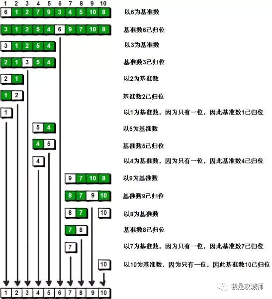
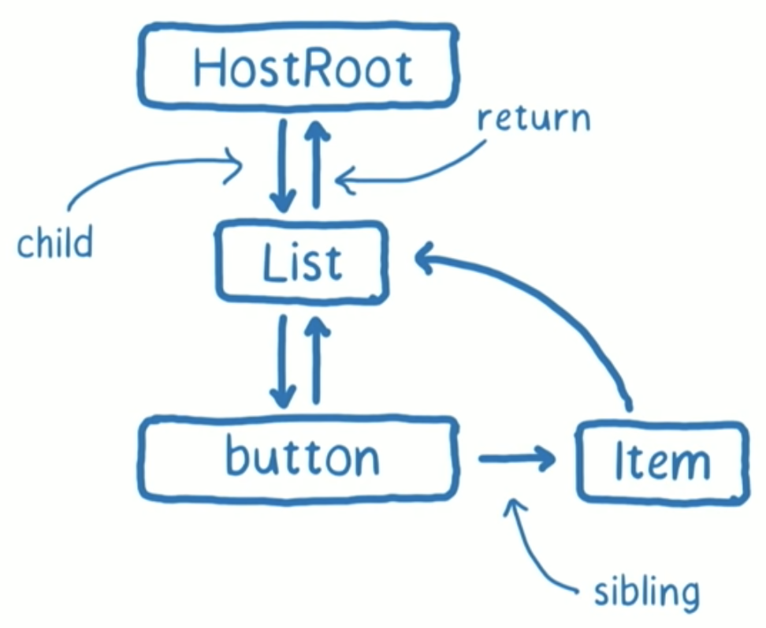

有点可惜了……


## 一面

回看一下真的不难，自己有的地方确实理解不够深，面试官是重邮的学长，很亲切

1. 手写 Promise

    写了一部分，then 返回的 Promise 内部什么时候 resolve 没写上来，之后就没往下写，应该在 push 的 cb 处理

    ```js
    Promise.prototype.then = function (onFulfilled, onRejected) {
      // ...
      if (self.state === PENDING) { // 等待态
        return promise2 = new Promise(function (resolve, reject) {
          // 当异步调用 resolve / rejected 时 将 onFulfilled / onRejected 收集暂存到集合中
          self.onFulfilledCallbacks.push(function (value) {
            try {
              var x = onFulfilled(value)
              resolvePromise(promise2, x, resolve, reject) // 针对不同的 x 进行处理
            } catch (err) {
              reject(err)
            }
          })
          self.onRejectedCallbacks.push(function (reason) {
            try {
              var x = onRejected(reason)
              resolvePromise(promise2, x, resolve, reject)
            } catch (err) {
              reject(err)
            }
          })
        })
      }
    }
    ```

2. 两个有序链表合并成一个新的有序链表

    没写上来，基本思路有了，有的逻辑没理清

    ```js
    function merge(p1, p2) {
      let head1 = p1
      let head2 = p2
      let head = cur = { next: null } // 空的头节点
      while (head1 && head2) {
        if (head1.value > head2.value) {
          cur.next = head2
          cur = cur.next
          head2 = head2.next
        } else {
          cur.next = head1
          cur = cur.next
          head1 = head1.next
        }
      }
      cur.next = head1 ? head1 : head2 // 直接把剩下的赋给 next，省去两个 while
      return head.next // 返回空的头节点的 next
    }
    ```

3. 深拷贝

    最简单的写出来了，之后循环引用那个 map 处理的地方不对，我想着在 get 这处理

    ```js
    function deepClone(obj, map = new Map()) {
      if (map.get(obj)) return obj

      if (typeof obj !== 'object') return obj // 这里没有考虑 null，面试官说用 instanceof 更好点，当时也没反应过来
      let result = Array.isArray(obj) ? [] : {}
      for (const key in obj) {
        if (obj.hasOwnProperty(key)) {
          result[key] = deepClone(obj[key])
          map.set(obj, true) // 应该在 deepClone 之前 set
        }
      }
      return result
    }
    ```

    就是 map 返回的 obj 仍然是之前的 obj，并没有深拷贝，下来才发现应该在 set 处理

    ```js
    function deepClone(obj, map = new WeakMap()) {
      const existobj = map.get(obj)
      if (existobj) return existobj

      if (typeof obj !== 'object') return obj
      let result = Array.isArray(obj) ? [] : {}
      map.set(obj, result) // 应该在这里处理，result 是引用类型
      for (const key in obj) {
        if (obj.hasOwnProperty(key)) {
          result[key] = deepClone(obj[key])
        }
      }
      return result
    }
    ```

4. 谈谈原型链和继承

5. this 指向

6. 手写 bind

7. 快速排序为什么快

    真不知道，上学期有看过各个排序，当时可能能说出点东西，但几个月不看了

    

    第一趟排序过后，顺序变为 `[3,1,2,5,4,6,9,7,10,8]`，那么在下一次的排序中，6 左边的数不会再和右边的数比较，而对于冒泡来说或直接选择 / 插入排序等暴力排序来说，每排一个数都需要和剩下的数进行一次比较，产生了很多无意义的比较

8. 说说栈和队列的区别

9. 链表的特点，链表和数组的区别

## 二面

面试官很厉害，也会对我进行引导，有点像聊天所以我也不太紧张

还是学的不够深入，最好能多写多去实验

1. https 怎么进行加密

    主要是三方面：加密、完整性验证、证书验证，一开始没想到第三点，后来提醒打上来了，之后深入的问 CA 各个级之间如何验证没答上来，相关加密算法也没答上来

2. TLS / SSL 是在哪一层

3. 三次握手，四次挥手

    后面问四次挥手为什么等待 2 MSL 没答上来

4. 跨域，有哪些方式

5. CORS 具体流程

    没说到 OPTIONS，后来提醒了说了下

5. CSSOM 和 DOM 合成的 Render Tree 渲染时会触发回流吗

    这个之前知道有这一步，但是具体怎么触发没想过，就把自己的想法说了一下

    1. 渲染时浏览器会分片渲染，有的间隔很小的就不会（分片这个真不知道）

    2. 后面的 CSS 覆盖了之前的位置大小，造成回流（我答到的）

    3. 出现层级，不造成回流

6. 对于后端发过来的图片，前端用 img 标签怎么相对其父元素居中

    一开始写的 background 方式，然后说是类似子元素在父元素居中，没答对，说是一个用的 object-fit，因为我一般觉得 background 更好操作也就没太注意过这个属性

7. V8 的内存模型

    分栈内存和堆内存，然后讲到执行栈执行上下文，问我函数执行上下文那些内存存在哪，我说的执行栈，提醒我说 this、arguments 这些比较大，我说存到堆里面，然后讲了下词法环境

    然后是 GC，分新生代老生代，然后问我那些会直接进入老生代，我说生命周期长的，提醒我还有体积比较大的，超过新生代 To 空间 25%，后面讲具体怎么回收，老生代中标记清除后什么时候进行内存的排列我没说到，然后告诉我其实大部分时间都是在进行整理

8. 为什么会有变量提升

    真没想过为什么这样设计

9. 用 Vue 还是 React？讲讲 HOC

    我说 React，面试官说那就没什么可说的了…… 😳，在我的认知里 React 才是那个一直挖坑的啊

10. 为什么要用 Redux / Mobx

11. React Hooks 有了还需要 Redux / Mobx 吗？什么时候要用到

    不太清楚，我讲了下 Context 有时候可以替代状态管理，讲了下 unstated-next 是怎么做的

12. 写个 20 个阶梯，每次走 1 或 2 阶，有多少种走法

    想到的是递归，说了下思路，面试官说是动态规划

13. 职业规划

## 面试准备

面向面试学习效率还是挺高的，自己有时会以面试官的角度问自己一些问题，经常对一个点进行深挖

### 谈谈你对 TCP 三次握手和四次挥手的理解

- 三次握手：第一次客户端发送，问服务端能不能通信，服务端回答可以，这是第二次，这次用来告诉客户端：客户端像服务端发送是 OK 的，然后客户端回答收到，这是第三次，这次用来告诉服务端：服务端向客户端发送是 OK 的。所以三次是最少的且安全的次数

- 四次挥手：TCP 是全双工的，就是客户端的输出连接服务端的输入这一条通道，客户端的输入连接服务端的输出这一条通道，当断开时需要先是客户端输出断开，服务端也断开这条通道，然后服务端输出断开，客户端也断开这条通道

### 简单讲解一下 http2 的多路复用

主要是解决 http1.1 中的性能问题，http1.0 中一个请求建立一个 TCP 连接，每次都要进行三次握手四次挥手，如果一个 TCP 连接对应多个 http 请求就需要开启 Connection: Keep-Alive，到了 http1.1 时默认开启 Keep-Alive，解决了多次连接的问题，但是依然有队头阻塞的问题，由于 http1.1 中需要数据有序，所以请求是串行的，必须等下上一个请求接受才能发起下一个请求

而 http2 中的数据会拆分成二进制数据帧，每个二进制帧的头部会标示自己属于哪个流，通过多个流传输到服务端，然后服务端将流中的帧重新组合成完整的数据，所以这些帧是可以交错传输，就可以同时传输多个数据流，**多路复用指的就是一个 TCP 连接有多条流**，这样就解决了队头阻塞的问题

（但 http2 仍然基于 TCP，TCP 为了保证不丢包仍然会有阻塞问题，http3 就基于 UDP 解决了这个问题）

### React 中 setState 什么时候是同步的，什么时候是异步的

在 React 合成事件和生命周期钩子中是异步的，在 setTimeout 和原生事件中是同步的

setState 的异步并不是真正的异步，没有产生宏任务微任务，只是 setState 之后再次访问 state 不会立即得到改变后的 state，表现的像是异步而已，由于有一个 batch 的过程，将多个 setState 合并（类似于 Object.assign）如果使用 setState 的 callback 则可以访问到改变后的 state

### CommonJS 和 ES6 的模块化的差异

- ES6 的是对值得引用，CommomJS 是对值的拷贝（会缓存）

- CommomJS 运行时加载，加载的是一个对象，ES6 的是编译时输出接口，在代码解析时生成的静态定义

对服务器来说由于模块在本地同时启动后不会关会有缓存，同步加载没问题，所以 CommonJS 是同步加载，浏览器由于模块在服务器上，同步加载会阻塞所以不能同步加载，ES6 并没有强行指定同步或异步，但由于 `<script type="module" src="..."></script>` 等同于带有 defer 所以是异步加载的

### script 标签带有 defer 和 async 时的差异

在网络下载时都不会阻塞 HTML 解析，defer 按照加载顺序在 HTML 解析完成后执行脚本，而 async 在加载完成后就会执行，会阻塞 HTML 解析，同时由于脚本加载时间不确定，所以执行也是乱序的

### XSS

恶意代码未经过滤，与网站正常的代码混在一起；浏览器无法分辨哪些脚本是可信的，导致恶意脚本被执行

- 反射型：构造出特殊的 URL（比如 `?type=<script>alert('bad')</script>`），访问后服务端返回 type 的内容到页面上执行

- DOM 型：使用 .innerHTML、.outerHTML、.appendChild、document.write() 等 API 时把不可信的内容插入到了页面，尽量使用 .innerText、.textContent、.setAttribute()

- 存储型：恶意脚本永久存储在目标服务器上

防范：encodeURIComponent 转义 URL 链接、非 URL 将 " ' < > 进行转义、添加 CSP meta 标签或 Response header 控制页面能加载哪些资源、限制内容长度

> `Content-Security-Policy: default-src 'self'`
>
> `<meta http-equiv="Content-Security-Policy" content="form-action 'self';">`

### CSRF

在用户登录 A 网站后诱导其进入 B 网站，B 网站发送 A 网站的请求，会带上 Cookie，B 网站冒充用户完成了攻击

防范：验证码、检测 Referer，但 Referer 可以被修改、token、SameSite Cookie

### HTTPS

> [一次安全可靠的通信——HTTPS原理](https://developers.weixin.qq.com/community/develop/article/doc/000046a5fdc7802a15f7508b556413)

对称加密：加密解密运用同一个密钥（Hacker 在互相告知密钥的时候提前获取密钥）

非对称加密：任何人可以拿公钥加密，自己拿私钥解密（性能差，Hacker 用自己的公钥私钥在中间转发）

认证：CA 制作证书，一方通过发送证书（自己的公钥 + CA 数字签名（CA 的私钥加密公钥解密）），另一方用 CA 的公钥解密 CA 数字签名验证是否有 Hacker 转发（Hacker 虽然不能修改但仍可以破坏数据）

完整性：单向 Hash 算法得到 hash 并发送，另一方验证得到内容的 hash 跟收到的 hash 是否一致验证完整性

https：三次握手 => SSL 握手 => 加密通信并用 hash 验证完整性

SSL 握手：

1. 浏览器发送请求到服务器，包括支持的加密算法列表和随机数 random1

2. 服务器确认加密通信协议版本是否一致，是则回应证书（非对称加密的公钥和 CA 数字签名）、随机数 random2 和选择的加密算法，否则关闭加密通信

3. 浏览器通过已有的 CA 公钥解密 CA 数字签名验证证书是否失效，若失效则给提示决定是否继续连接，若没问题就产生一个随机数 pre-master 并用非对称加密的公钥加密，然后发送给服务器，同时 random1 + random2 + pre-master 生成 master-secret 对称加密的密钥用于后续数据传输

4. 服务端通过非对称加密的私钥解密得到 pre-master，用 random1 + random2 + pre-master 生成 master-secret 得到对称加密的密钥，并响应握手

### BFC

BFC 就是块级格式上下文，是页面盒模型布局中的一种 CSS 渲染模式，相当于一个独立的容器，里面的元素和外部的元素相互不影响，html 根元素、float 浮动、绝对定位、overflow 不为 visiable、display 为弹性布局可以创建 BFC

### 浏览器缓存


缓存位置：

1. Service Worker：运行在浏览器背后的独立线程，是对请求的一种拦截，也因此必须是 https，首先需要注册 SW，install 事件后可以对资源进行缓存，之后 fetch 事件可以判断是否命中缓存，没有命中就可以调用 fetch 获取，可编程的控制缓存哪些文件、如何匹配缓存、如何读取缓存

2. Memory Cache：内存中的缓存，容量小访问快时效短

3. Disk Cache：磁盘中的缓存，强缓存和协商缓存就放到 Disk Cache 和 Memory Cache

4. Push Cache：http2 的，[HTTP/2 push is tougher than I thought](https://jakearchibald.com/2017/h2-push-tougher-than-i-thought/)

强缓存：

1. Cache-Control：http1.1 的

    - public：所有内容都将被缓存（客户端和代理服务器都可缓存）

    - private：所有内容只有客户端可以缓存

    - no-cache：在使用缓存数据时，需要先通过协商缓存确认是否与服务端一致

    - no-store：所有内容都不会被缓存，即不使用强制缓存，也不使用协商缓存

    - max-age：max-age=xxx，xxx 秒后失效

    - s-maxage：max-age用于普通缓存，而s-maxage用于代理缓存。s-maxage的优先级高于max-age

    - max-stale

    - min-fresh

2. Expires：http1.0 受限于本地时间 `Expires: Wed, 22 Oct 2018 08:41:00 GM`

协商缓存：

1. ETag 和 If-None-Match：服务器响应 header 中携带 Etag（根据文件内容生成的唯一标识），下一次请求时会在 header 中的 If-None-Match 携带，服务器根据比较 Etag 判断是否修改（是 200 否 304）

2. Last-Modified 和 If-Modified-Since：response header 携带 Last-Modified（最后修改时间，最小单位 s），下一次 request header 携带 If-Modified-Since，根据修改时间判断（不准确：本地打开文件没修改也会更新，以秒计时在很短时间修改完成）

### 数据埋点

new Image() 支持跨域，不占用 AJAX 请求，不用添加到 DOM 中不阻塞页面

### CDN

尽可能的在各个地方分布机房缓存数据

可以将静态资源尽量使用 CDN 加载，CDN 域名要与主站不同，否则每次请求都会带上主站的 Cookie，平白消耗流量

### React Hooks 解决什么问题

解决了组件之间复用状态逻辑难，之前的解决方案是 HOC 和 render props，很容易就出现很多层的嵌套，调试困难，复杂组件各种生命周期，一个渲染逻辑要在三个地方写，副作用混乱，class 本身 this 指向难理解

### React Hooks 原理

> [brickspert / blog: React Hooks 原理](https://github.com/brickspert/blog/issues/26)

### React Hooks 闭包陷阱

通过 useState 定义的值拿到（useEffect, useCallback, useMemo...）的都不是最新的现象，因为 effect、callback…… 执行时会创建一个闭包，其中拿到的是当前上下文中的值，而不是实时的值

常见解决方法：

1. 添加依赖：有向上的传递性（类似 await 调用 async function），组件 API 设计上不会反应是否 useCallback

2. setState 回调：`setCount(c => c + 1)`

3. useRef：ref 存储最新值，闭包存储快照值（闭包是穷人的对象，对象是穷人的闭包）

    ```js
    for (var i = 0; i < 10; i++) {
      setTimeout(() => console.log('val:', i)) // 拿到的是最新值
    }
    for (var i = 0; i < 10; i++) {
      setTimeout((val => console.log('val:', val)).bind(null, i)) // 拿到的是快照
    }

    const ref = { current: null }
    for (var i = 0; i < 10; i++) { 
      ref.current = i
      setTimeout((val => console.log('val:', ref.current)).bind(null, ref)) // 拿到的是最新值
    }
    for (var i = 0; i < 10; i++) { // 拿到的是快照
      let t = i
      setTimeout(() => console.log("t:", t))
    }
    ```

4. useReducer：useReducer 的 dispatch 的身份永远是稳定的 —— 即使 reducer 函数是定义在组件内部并且依赖 props。将 setCount 的上下文放到 reducer 中

> [React Hooks(二): useCallback 之痛](https://zhuanlan.zhihu.com/p/98554943)
>
> [Hooks FAQ: 如果我的 effect 的依赖频繁变化，我该怎么办？](https://zh-hans.reactjs.org/docs/hooks-faq.html#what-can-i-do-if-my-effect-dependencies-change-too-often)
>
> [写React Hooks前必读](https://zhuanlan.zhihu.com/p/113216415)

### React Fiber

What a fiber do? - It improves perceived performance and responsiveness for complex react applications

What it is? - Fiber is the new reconciliation algorithm for react

What is reconciliation? - 不同于以前的命令式，告诉浏览器 app 从 pervious version 到 next version 要做什么，声明式只需要告诉 React app 的 next version 是什么样，React 处理之间的不同并告诉浏览器怎么做。对于不同平台（Web、Native、VR……）都适用，于是通过 reconciler 找出要做什么，renderer 针对不同平台去做

为了让复杂应用的动画流畅，就需要 60 帧每秒（16ms 每帧），如何实现？

- ❎ Make React itself faster - 并不是说一个实例无法在16毫秒内适应，而是事实是它卡在了这些较大的更新之后，这些更新花的大部分时间在其他函数的 render 的用户代码上，而不是 React 自己的代码

- ✅ Make the updates play together better - 不只是 React 的更新，还有来自浏览器的更新（CSS animation、browser resize……）也会造成阻塞，这是因为浏览器的工作方式（单线程），而之前 reconciler 通过 minimizing and batching DOM changes，而现在 fiber 通过告诉 reconciler **how to split up work and how to prioritize work** 同时让它 **can keep track of how much time is passed**

How do they change the reconciler works?

- How stack reconciler works? - ReactElement, Instance, DOM node constructed layer by layer. React 会依次创建或更新 ReactElement、Instance、DOM node。Reconciler recursively calls mount component or update component until it gets to the bottom to the tree. Performance 面板中会看到执行栈中所有函数的执行上下文都在里面，主线程（JS 引擎）处于面板最下面（执行栈最上面），而如果需要检查要不要做其他事就需要能够到达最上面

- Fiber does that - 主线程可以计算树的一小部分然后回到顶部查看有没有其他的事要做，而 React 通过 Fiber 的数据结构记录树执行到哪了，之前通过 stack 记录树执行到哪，这就是 Fiber Reconciler / Stack Reconciler 名字的由来

Fiber is a plain JavaScript object, 它对 Instance 具有一对一关系 fiber.stateNode = Instance，第一个 fiber 是 HostRoot，对应 ReactDOM.render 的第二个参数



对于之前 Stack Reconciler 是找到当前节点差异后立即更新 DOM，而先不管子节点，Fiber Reconciler 为了保证可以打断当前的 diff 回到顶部查看有无其他事，同时保证 UI 的一致性，引入了 render phase 和 commit phase

- render phase: 只 build 出 workInProgress tree 计算出变化，可被打断让主线程做其他事

    - work loop

        - next unit of work and time remaining

        - clone of current into workInProgress

        - ask shouldComponentUpdate

- commit phase: Make these changes in the DOM，不可被打断，只能执行一次保证 UI 的一致性，引入了

    - virtual dom is apply to dom

How to solve commits got trapped behind other larger commits or lower priority updates? - priority

- Sync // same as stack rec

- Task // before the next tick of event loop

- Animation // before next frame, use requestAnimationFrame

- High // pretty soon, use requestIdleCallback

- Low // minor delays ok, use requestIdleCallback

- Offscreen // prep for display / scroll, use requestIdleCallback

如果有一个高优先级的任务，改变了原来的任务顺序，就需要放弃已执行的 render phase（不再需要），重新执行 render phase


> [如何理解 React Fiber 架构？](https://www.zhihu.com/question/49496872)
>
> [Lin Clark - A Cartoon Intro to Fiber - React Conf 2017](https://www.youtube.com/watch?v=ZCuYPiUIONs&t=945s)

### 网络 4 层 7 层


- 第 7 层：应用层为操作系统或网络应用程序提供访问网络服务的接口。应用层协议的代表包括： HTTP，HTTPS，FTP，TELNET，SSH，SMTP，POP3等。

- 第 6 层：表示层把数据转换为接受者能够兼容并且适合传输的内容，比如数据加密，压缩，格式转换等。

- 第 5 层：会话层负责数据传输中设置和维持网络设备之间的通信连接。管理主机之间的会话进程，还可以利用在数据中插入校验点来实现数据的同步。

- 第 4 层：传输层把传输表头加至数据形成数据包，完成端到端的数据传输。传输表头包含了协议等信息，比如: TCP，UDP 等。

- 第 3 层：网络层负责对子网间的数据包进行寻址和路由选择，还可以实现拥塞控制，网际互联等功能。网络层的协议包括：IP，IPX 等。

- 第 2 层：数据链路层在不可靠的物理介质上提供可靠的传输，主要主要为：物理地址寻址、数据封装成帧、流量控制、数据校验、重发等。

- 第 1 层：物理层在局域网上传送数据帧，负责电脑通信设备与网络媒体之间的互通，包括针脚，电压，线缆规范，集线器，网卡，主机适配等。

4 层：

- 链接层：负责在以太网、WiFi 这样的底层网络上发送原始数据包，使用 MAC 地址来标记网络上的设备

- 网络层：IP 协议就处在这一层，用 IP 地址取代 MAC 地址

- 传输层：这个层次协议的职责是保证数据在 IP 地址标记的两点之间“可靠”地传输

- 应用层：Telnet、SSH、FTP、SMTP、HTTP

### 首屏和白屏

白屏时间：浏览器从响应用户输入网址地址，到浏览器开始显示内容的时间 = 地址栏输入网址后回车 - 浏览器出现第一个元素

首屏时间：浏览器从响应用户输入网络地址，到首屏内容渲染完成的时间 = 地址栏输入网址后回车 - 浏览器第一屏渲染完成

影响白屏时间的因素：网络，服务端性能，前端页面结构设计

影响首屏时间的因素：白屏时间，资源下载执行时间

可以使用 Performance API 获取性能信息，DevTools 中 Performance 面板也可以查看


白屏时间 = performance.timing.domLoading - performance.timing.navigationStart

首屏时间 ~= firstScreenImgs.loadTime - performance.timing.navigationStart（可用首屏所有图片加载完成的时间估算）

> DOMContentLoaded 是指页面元素加载完毕，但是一些资源比如图片还无法看到，但是这个时候页面是可以正常交互的，比如滚动，输入字符等。 jQuery 中经常使用的 $(document).ready() 其实监听的就是 DOMContentLoaded 事件。
>
> load 是指页面上所有的资源（图片，音频，视频等）加载完成。jQuery 中 $(document).load() 监听的是 load 事件。

### UDP TCP 区别

TCP 是一个面向连接、可靠的、基于字节流的传输层协议

面向连接：三次握手

可靠的：精准记录数据是否到达，保证数据按顺序全部到达，当丢包或网络环境不佳时会控制自己发送速度或重发

UDP 是一个面向无连接的传输层协议

面向无连接：只是数据报文的搬运工（在发送端，应用层将数据传递给传输层的 UDP 协议，UDP 只会给数据增加一个 UDP 头标识下是 UDP 协议，然后就传递给网络层了；在接收端，网络层将数据传递给传输层，UDP 只去除 IP 报文头就传递给应用层，不会任何拼接操作）

不可靠性：无连接，不关心对方是否接收，没有拥塞控制，会一直以恒定的速度发送数据

高效：头部开销小

传输方式：一对一，一对多，多对多，多对一

### GET 和 POST 区别

从 RFC 规范上讲：

1. GET 能被缓存 POST 不能被缓存

2. POST 相对安全，GET 请求都包含在 URL 里

3. URL有长度限制，会影响 Get 请求，大多是浏览器和服务器的原因（性能和安全）

4. GET 数据类型只允许 ASCII 字符，POST 没有限制，也允许二进制数据

没有实质区别，只是报文不同：

请求行 GET POST 不一样，本质上是 TCP 连接，没有差别，也就是说，如果我不按规范来也是可以的。我们可以在 URL 上写参数，然后方法使用 POST；也可以在 Body 写参数，然后方法使用 GET。当然，这需要服务端支持

### XHR fetch 怎么取消和 timeout

XHR：`xhr.abort()` 用于取消请求，`xhr.timeout` 可以设置超时时间，`xhr.ontimeout` 事件可以在超时时触发回调

fetch：可以通过 AbortController 来取消请求，可以用 Promise.race 做兼容，超时可以创建一个定时器

```js
const { signal } = new AbortController()
fetch('./data.json', { signal })
```

```js
function abortableFetch(fetcher) {
  let abort = null
  const aborter = new Promise((_, reject) => {
    abort = () => reject()
  })
  const abortable = Promise.race([
    fetcher,
    aborter,
  ])

  abortable.abort = abort
  return abortable
}
```

```js
function timeout(ms, promise) {
  return new Promise(function(resolve, reject) {
    setTimeout(function() {
      reject(new Error("timeout"))
    }, ms)
    promise.then(resolve, reject)
  })
}

timeout(1000, fetch('/hello')).then(/* ... */)
```

### 移动端

屏幕尺寸：手机屏幕左下角到右上角的距离（英尺）

像素：最小单位

分辨率：720p 1080p 2k 4k

逻辑分辨率（设备独立像素）：设备物理分辨率不同，但逻辑分辨率都接近，iPhone5 320x568 iPhone6 375x667 iPhoneX 375x812

设备像素比：物理像素和设备独立像素的比值 dpr

1px 问题：由于 CSS 中 px 是逻辑像素，1px 对应到 dpr=2 的设备上就是 2px

```css
div {
  height: 1px;
  background: #000;
  -webkit-transform: scaleY(0.5);
  -webkit-transform-origin: 0 0;
  overflow: hidden;
}
/* 2倍屏 */
@media only screen and (-webkit-min-device-pixel-ratio: 2.0) {
  .border-bottom::after {
    -webkit-transform: scaleY(0.5);
    transform: scaleY(0.5);
  }
}
/* 3倍屏 */
@media only screen and (-webkit-min-device-pixel-ratio: 3.0) {
  .border-bottom::after {
    -webkit-transform: scaleY(0.33);
    transform: scaleY(0.33);
  }
}
```

### 如何设计无缝轮播

克隆第一个（fakeFirst）和最后一个（fakeLast），分别放在最后一个后面和第一个前面，在最后一个转到 fakeFirst 之后，去掉 transition，然后把位置调到第一个，再添加 transition，第一个转到 fakeLast 也同理

### 垃圾回收

基本类型用栈存储，引用类型用堆存储

- 栈中的内存：JS 的执行栈，当当前执行上下文出栈时自动回收当前上下文所有基本类型的内存

- 堆中的内存：

    1. 分为新生代和老生代，新生代是临时分配的内存，存活时间短，老生代是常驻内存，存活的时间长
  
    2. 新生代分为 From 和 To 两个部分，新分配的对象会被放入 From 空间中，当 From 空间被占满时，新生代 GC 就会启动了。算法会检查 From 空间中存活的对象并复制到 To 空间中，如果有失活的对象就会销毁。当复制完成后将 From 空间和 To 空间互换
  
        > Scavenge 算法将原本 From 空间中散落的内存复制到 To 空间后会变成整齐排列的，有利于后续内存的分配，但缺点在于只能使用新生代中一般内存空间，会进行复制，所以只存放生命周期短的对象，这样的对象一般很少

    3. 如果新生代中的变量在经历过以此 Scavenge 回收后，或 To（闲置）空间的内存占用超过 25% 时会变为老生代，由于空间较大自然不能使用 Scavenge 算法。使用标记清除算法，现对能访问到的内存进行标记，之后清除所有没有标记的内存，然后整理内存碎片（把存活的对象全部往一端靠拢，由于是移动对象，它的执行速度不可能很快，事实上也是整个过程中最耗时间的部分），由于标记需要遍历一边，当占用空间较大时就很消耗性能，耗时很大，可能阻塞，于是改进为增量标记，将标记工作分为小块，在应用逻辑执行的空隙进行（类似于 React Fiber），之后还升级[并发标记](https://v8.dev/blog/concurrent-marking)，允许 GC 标记和 JS 逻辑同时运行

### 性能优化

> [读《前端性能优化原理与实践》](https://ahabhgk.github.io/tags/principles-and-practice-of-front-end-performance-optimization)
>
> [读《高性能 JavaScript》](https://blog.ahabhgk.top/tags/high-performance-java-script)

### 自我介绍

您好，我叫何庚坤，河北石家庄人，现在在重庆上大学，专业是软件工程，成绩在年级前 15%，比较擅长 JS 基础，异步编程，了解浏览器运行机制，http 协议，去年 8 月做了学校 2019 年 PC 端的迎新网，并对其进行性能优化，使其性能有了明显提升，之后学校庆祝国庆，完成国庆省份问答项目，大量使用 React Hooks 进行编写，这次参加实习希望能开阔视野，学到一些在学校学不到的东西，不管能不能通过面试都希望有所收获，谢谢

### 各种手写代码

```js
Array.prototype.iMap = function iMap(fn, context) {
  return this.reduce((acc, cur, index) => [...acc, fn.call(context, cur, index, this)], [])
}

Array.prototype.iReduce = function iReduce(fn, initial) {
  let result = initial ? initial : this[0]
  let start = initial ? 0 : 1
  for (let i = start; i < this.length; i++) {
    result = fn(result, this[i], i, this)
  }
  return result
}

Array.prototype.iFilter = function iFilter(fn, context) {
  return this.reduce((acc, cur, index) => fn.call(context, cur, index, this) ? [...acc, cur] : acc, [])
}

Array.prototype.iFlat = function iFlat(depth = 1) {
  let arr = this
  while (depth && arr.some(Array.isArray)) {
    arr = [].concat(...arr)
    depth -= 1
  }
  return arr
}

Function.prototype.iCall = function iCall(context = window, ...args) {
  const tmpKey = Symbol('tmp')
  context[tmpKey] = this
  const result = context[tmpKey](...args)
  delete context[tmpKey]
  return result
}

Function.prototype.iBind = function iBind(context, ...args) {
  return (...rest) => this.apply(context, [...args, ...rest])
}

Object.iCreate = function iCreate(proto) {
  function Noop() {}
  Noop.prototype = proto
  Noop.prototype.constructor = Noop
  return new Noop
}

function iNew(Constructor, ...args) {
  const instance = Object.create(Constructor.prototype) // 创建 + 绑定原型
  const result = Constructor.apply(instance, args)
  return result instanceof Object ? result : instance
}

function iInstanceof(left, right) {
  const proto = Object.getPrototypeOf(left)
  while (true) {
    if (proto === null) return false
    if (proto === right) return true
    proto = Object.getPrototypeOf(proto)
  }
}

function debounce(fn, delay) {
  let timer = null
  return (...args) => {
    clearTimeout(timer)
    timer = setTimeout(fn, delay, ...args)
  }
}

function throttle(fn, delay) {
  let canRun = true
  return (...args) => {
    if (!canRun) return
    canRun = false
    setTimeout(() => {
      fn(...args)
      canRun = true
    }, delay)
  }
}
```
