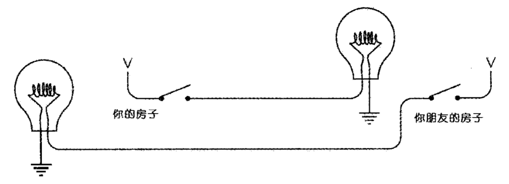
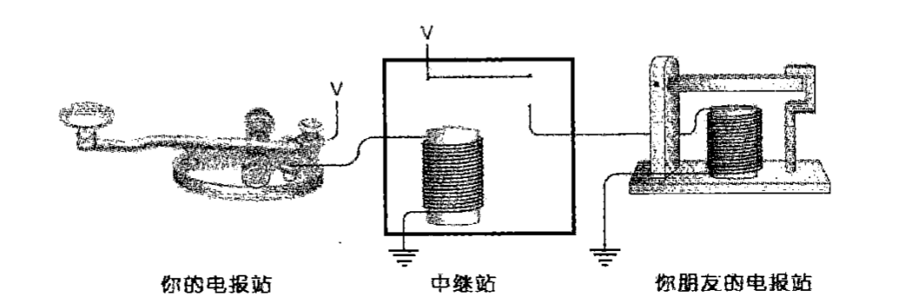
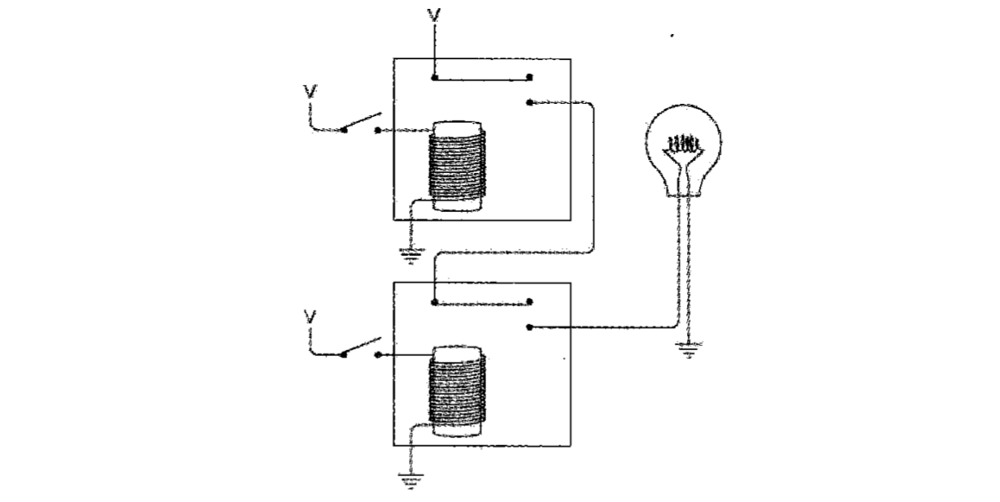

两种不同的事物（`. -`、`0 1`），经过适当的组合，就可以表示所有信息

换挡码：改变作用域内编码的含义，直到作用域结束（代码中的注释 `\* *\`）

逃逸码：改变下一个编码的含义（正则中的 `\.`）

电报系统：

继电器，由电流控制开关，用来转发：

外星人如果一只手有 4 根手指，那他们的数字基数会是 8，会使用 8 进制，计算机世界中有无电流、开关、灯泡亮灭、继电器开闭都可以使用 0、1 表示

比特（英语：Bit，亦称二进制位）指二进制中的一位，是信息的最小单位。Bit 是 Binary digit（二进制数位）的混成词。1 字节（英语：Byte）由 8 比特（英语：bit）组成

扫描条形码：

前三位 101 确定间隙大小

逻辑运算

串联的电路表示 AND，并联的电路表示 OR

与门：

或门：

非：

buffer 缓冲器，用来增强：

// TODO

## 计算机组成原理

运行的程序、程序产生的数据、计算的结果都要存在内存里，CPU 读取内存中的数据计算出结果要写回到内存中，CPU 不能直接插到内存上，就需要主板

主板的芯片组（Chipset）和**总线（Bus）**解决了 CPU 和内存之间如何通信的问题，**总线速度（Bus Speed）**决定了数据能传输得多快

I/O 设备通过主板上的南桥（SouthBridge）芯片组，来控制和 CPU 之间的通信

冯诺伊曼体系中硬件由**运算器、控制器、存储器、输入设备和输出设备**组成

- 控制器：控制指令的执行，指令由代码通过编译器或汇编器得到

- 运算器：ALU（Arithmetic Logic Unit/ALU）算术逻辑单元，从数字电路层面，实现加法、乘法这些基本的运算功能

CPU 时钟可以用来构造寄存器和内存的锁存器和触发器 => 数据通路，连接了整个运算器和控制器，最终组成 CPU => CPU 作为控制器要和 I/O 设备通信，异常和中断发生的机制

- 存储器：CPU 高速缓存、内存、SSD 硬盘和机械硬盘，CPU 与其如何通信，如何通过 DMA 来提升程序性能，如何通过 RAID、Erasure Code、ECC 以及分布式 HDFS 等确保数据的完整性和访问性能
