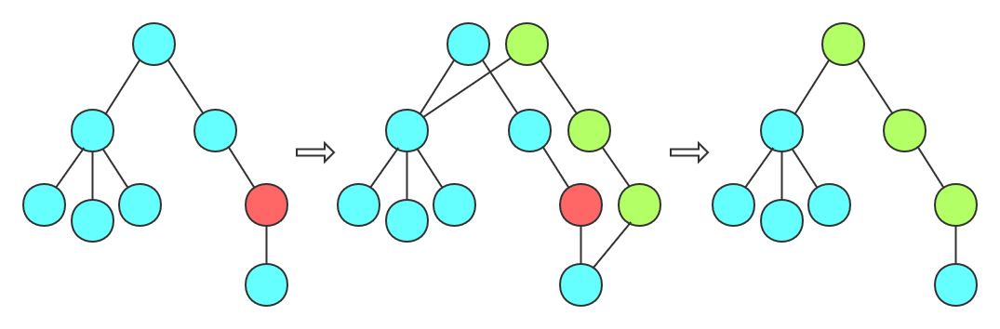
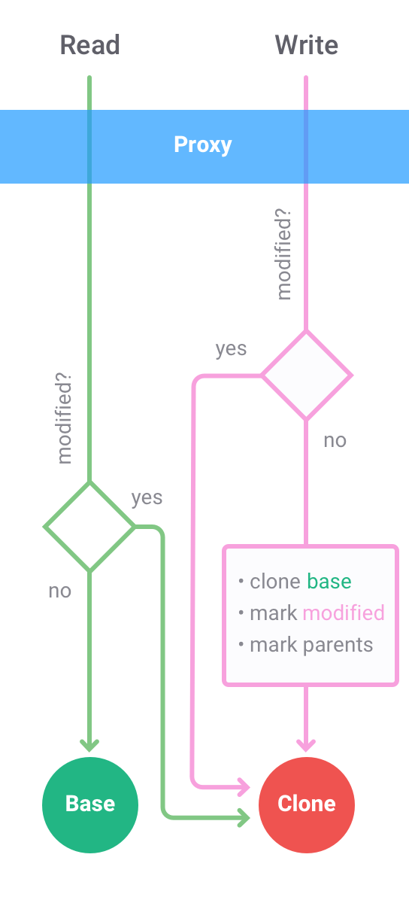

<!-- markdownlint-disable no-inline-html -->

## Table of Contents

```toc
```

## 序

[Immer](https://github.com/immerjs/immer) - Create the next immutable state by mutating the current one

Immer 实现的就是通过 mutate 当前对象创建下一个 immutable 对象，比如我们在使用 React 时经常遇到 `memo` 中的浅比较判断失败导致的不更新或多余更新的问题，就可以通过 immer 解决

```js
const Profile = memo((props) => {
  console.log("render <Profile />");
  return (
    <>
      <div>Name: {props.user.name}</div>
      <div>Age: {props.user.age}</div>
    </>
  );
});

const Blog = memo((props) => {
  console.log("render <Blog />");
  return <div>blog: {props.blog.content}</div>;
});

class User extends Component {
  state = {
    user: {
      name: "Michel",
      age: 33
    },
    blog: {
      content: "hahah..."
    }
  };

  render() {
    return (
      <div>
        <Profile user={this.state.user} />
        <Blog blog={this.state.blog} />
        <button onClick={this.onUpdateAgeByManual0}>onUpdateAgeByManual0</button>
        <button onClick={this.onUpdateAgeByManual1}>onUpdateAgeByManual1</button>
        <button onClick={this.onUpdateAgeByManual2}>onUpdateAgeByManual2</button>
        <button onClick={this.onUpdateAgeByImmer}>onUpdateAgeByImmer</button>
      </div>
    );
  }

  onUpdateAgeByManual0 = () => {
    this.setState((prevState) => {
      prevState.user.age++;
      return {
        user: { ...prevState.user },
        blog: prevState.blog
      };
    });
  };

  onUpdateAgeByManual1 = () => {
    this.setState((prevState) => {
      prevState.user.age++;
      return { ...prevState };
    });
  };

  onUpdateAgeByManual2 = () => {
    this.setState((prevState) => {
      prevState.user.age++;
      return {
        user: { ...prevState.user },
        blog: { ...prevState.blog }
      };
    });
  };

  onUpdateAgeByImmer = () => {
    this.setState(
      produce(this.state, (draft) => {
        draft.user.age += 1;
      })
    );
  };
}
```

可以先猜猜以上三种 onUpdateAgeByManual 分别会怎样更新？

<details>
<summary>Click me to show the answer...</summary>

- onUpdateAgeByManual0：理想的更新状态，只会更新 Profile 组件
- onUpdateAgeByManual1：不会有组件更新，user 对象的引用没变，memo 浅比较后不会触发更新
- onUpdateAgeByManual2：造成多余的组件更新，blog 对象的引用改变，memo 浅比较后会触发 Blog 组件更新
- onUpdateAgeByImmer：同 onUpdateAgeByManual0

</details>

所以 immutable 对象所要保证的就是每次更新需要产生一个新对象。深拷贝就是可以满足的，但如果考虑性能问题的话，就需要**保证对象只是发生改变的属性产生新的引用，其他没发生改变的属性仍然使用旧的引用**，这就是 Immer 所实现的



## 原理

按照[作者的话](https://medium.com/hackernoon/introducing-immer-immutability-the-easy-way-9d73d8f71cb3)来说：

1. Copy on write
2. Proxies

produce 的工作分为三个阶段，分别为创建代理（createDraft）、修改代理（produceDraft）、定稿（finalize），创建代理所做的就是对传入的第一个参数 base 对象进行代理，实现后面修改代理时，也就是传入的回调函数执行时，可以进行 ShallowCopy on write 的操作，最终定稿就是把进行修改的对象的引用指向 ShallowCopy 的对象上面

所以关键原理就是如何实现 ShallowCopy on write 和如何去进行代理

### ShallowCopy on write



ShallowCopy on write 的原理就如上图，接下来举个例子来理解过程

```js
const state = {
  user: {
    name: "Michel",
    age: 33
  },
  blog: {
    content: "hahah..."
  }
};
const nextState = produce(state, (draft) => {
  draft.user.age = draft.user.age + 1;
});
```

对象的结构就像一棵树，基本类型的属性就相当于叶子结点

首先在读的时候，也就是触发对象的 get 操作的时候，会根据值的类型进行不同的返回，如果是基本类型，就说明访问到了叶子结点，直接返回即可；如果是引用类型，就继续为该值创建代理，实现“懒代理”。例子中的 `draft.user.age + 1` 就是进行的读，先读 draft 上的 user，返回是 user 的代理，再读 user 上的 age 属性，返回基本类型 33，再经过加一得到结果 34

第一次创建过代理之后会进行存储，这样再次读的时候，就可以直接返回存储的代理，减少创建代理的开销，同时也是对于代理上的操作进行的存储，不至于每次都创建新的代理导致之前代理上的操作无效。例子中 `draft.user.age =` set 操作之前部分就是相当于再次读取，得到之前的代理

之后在修改的时候就创建浅拷贝，父节点也进行浅拷贝，并在浅拷贝的对象上进行修改，同时 `Object.assign(state.copy, state.drafts)` 把之前的代理再存到浅拷贝对象上，同样是保证之前的操作不失效。例子中 `draft.user.age =` set 操作部分就触发了 user 代理的 set 操作，创建 user 的浅拷贝，再向上创建 draft 的浅拷贝，修改 user 浅拷贝对象的 age 属性

最后定稿（finalize）时就是对对象树进行遍历，如果发现修改了代理，就返回浅拷贝对象；如果没有修改，就仅返回原始的对象

### Proxies

对于如何去进行代理，Immer 使用的是 Proxy API 代理的对象和数组，Map 和 Set 则是创建了 DraftMap 和 DraftSet 重写了 set、get、add、delete、has 等操作实现的，ES5 环境使用的是 defineProperty 进行对象和数组的代理，所以 Proxy API 并不是必须的，仅仅是方便代理对象的操作，我们也可以[指定一些方法实现代理操作](https://juejin.cn/post/6878584121510232071#heading-4)

## 实现

100 行左右的实现可以看 [ahabhgk/simple-immer](https://github.com/ahabhgk/simple-immer)，对 Immer v1.0.0 做了一些简化，原理更加清晰，支持柯里化和异步，难点会有注释，也有比较完善的测试，很容易上手调试

另外由于 Immer 支持柯里化，很容易就能实现 useImmer，可以直接在 Github 上看

打算改一改写作风格，之前三篇讲 Vue3 的文章有大段大段的贴代码，又臭又长，只会催眠吧，以后写的会尽量讲清楚原理，写的精简，除了很精炼的会贴代码，其他时候源码就直接给链接了，有疑难点会通过注释和测试写清楚
